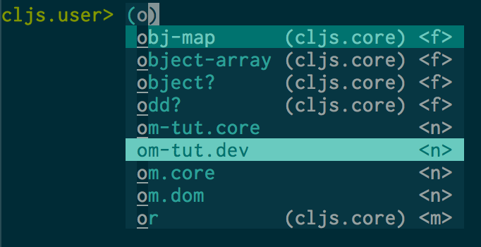

[![License GPL 3][badge-license]](http://www.gnu.org/licenses/gpl-3.0.txt)
[](http://melpa.org/#/cider)
[](http://stable.melpa.org/#/cider)
[](https://travis-ci.org/clojure-emacs/cider)
[](https://www.gratipay.com/bbatsov/)
[](https://www.paypal.com/cgi-bin/webscr?cmd=_s-xclick&hosted_button_id=GRQKNBM6P8VRQ)

<p align="center">
  
</p>

`CIDER` (formerly `nrepl.el`) is the **C**lojure **I**nteractive **D**evelopment **E**nvironment that **R**ocks for Emacs, built on top of
[nREPL](https://github.com/clojure/tools.nrepl), the Clojure networked
REPL server. It's a great alternative to the now deprecated combination
of SLIME + [swank-clojure](https://github.com/technomancy/swank-clojure).

If you're interested in details about CIDER's history and architecture you can
check out the Clojure/conj presentation
[The Evolution of the Emacs tooling for Clojure](https://www.youtube.com/watch?v=4X-1fJm25Ww&list=PLZdCLR02grLoc322bYirANEso3mmzvCiI&index=6).

[](https://gitter.im/clojure-emacs/cider?utm_source=badge&utm_medium=badge&utm_campaign=pr-badge&utm_content=badge)

CIDER packs plenty of features. Here are some of them (in no particular order):

* Powerful REPL
* Interactive code evaluation
* Compilation notes (error and warning highlighting)
* Human-friendly stacktraces
* Smart code completion
* Definition lookup
* Documentation lookup
* Resource lookup
* Apropos
* Debugger
* Value inspector
* Function tracing
* Interactive macroexpansion
* [Grimoire](http://conj.io/) integration
* `clojure.test` integration
* Classpath browser
* Namespace browser
* nREPL session management
* Scratchpad
* Minibuffer code evaluation
* Integration with [company-mode](http://company-mode.github.io/) and [auto-complete-mode](https://github.com/clojure-emacs/ac-cider)


***

- [Installation](#installation)
  - [Prerequisites](#prerequisites)
  - [Installation via package.el](#installation-via-packageel)
- [CIDER nREPL middleware](#cider-nrepl-middleware)
  - [Using Leiningen](#using-leiningen)
  - [Using Boot](#using-boot)
  - [Using embedded nREPL server](#using-embedded-nrepl-server)
- [Configuration](#configuration)
  - [Basic configuration](#basic-configuration)
  - [Running tests](#running-tests)
  - [REPL history](#repl-history)
  - [Minibuffer completion](#minibuffer-completion)
  - [Auto-completion](#auto-completion)
  - [Integration with other modes](#integration-with-other-modes)
- [Basic Usage](#basic-usage)
  - [Setting up a Leiningen or Boot project (optional)](#setting-up-a-leiningen-or-boot-project-optional)
  - [Launch a nREPL server and client from Emacs](#launch-a-nrepl-server-and-client-from-emacs)
  - [Connect to a running nREPL server](#connect-to-a-running-nrepl-server)
  - [Using the cider minor mode](#using-the-cider-minor-mode)
  - [Pretty printing in the REPL](#pretty-printing-in-the-repl)
  - [Limiting printed output in the REPL](#limiting-printed-output-in-the-repl)
  - [ClojureScript usage](#clojurescript-usage)
- [Keyboard shortcuts](#keyboard-shortcuts)
  - [cider-mode](#cider-mode)
  - [cider-repl-mode](#cider-repl-mode)
  - [cider-macroexpansion-mode](#cider-macroexpansion-mode)
  - [cider-inspector-mode](#cider-inspector-mode)
  - [cider-test-report-mode](#cider-test-report-mode)
  - [cider-stacktrace-mode](#cider-stacktrace-mode)
  - [Managing multiple sessions](#managing-multiple-sessions)
- [Requirements](#requirements)
- [Caveats](#caveats)
  - [Var Metadata](#var-metadata)
  - [ClojureScript limitations](#clojurescript-limitations)
  - [Microsoft Windows](#microsoft-windows)
  - [powershell.el](#powershell-el)
- [Troubleshooting](#troubleshooting)
- [Documentation](#documentation)
- [Changelog](#changelog)
- [Team](#team)
- [Release policy](#release-policy)
- [Logo](#logo)
- [Contributing](#contributing)
  - [Discussion](#discussion)
  - [Issues](#issues)
  - [Patches](#patches)
  - [Documentation](#documentation)
  - [Donations](#donations)
  - [Running the tests in batch mode](#running-the-tests-in-batch-mode)
- [License](#license)

## Installation

The canonical way to install CIDER is via `package.el`, but plenty of other
options exist. (see [wiki](https://github.com/clojure-emacs/cider/wiki/Installation)).

### Prerequisites

You'll need to have Emacs installed (preferably the latest stable
release). If you're new to Emacs you might want to read
[this tutorial](http://clojure-doc.org/articles/tutorials/emacs.html),
dedicated to setting up Emacs for Clojure development, first.

#### Upgrading from nrepl.el

Before installing CIDER make sure you've removed the old `nrepl.el`
package and all packages that depend on it. Use only packages updated to work with CIDER!

You'll also need to adjust your config accordingly, as most settings
were renamed in CIDER. Consult the [Configuration](#configuration) section of the
README for more details.

#### Upgrading from clojure-test-mode

CIDER 0.7 ships a replacement for the deprecated `clojure-test-mode` called `cider-test`.
Please, make sure you've uninstalled `clojure-test-mode` if you're using CIDER 0.7 as `clojure-test-mode`
sometimes interferes with CIDER's REPL initialization.

### Installation via package.el

`package.el` is the built-in package manager in Emacs.

`CIDER` is available on all major `package.el` community
maintained repos -
[MELPA Stable](http://stable.melpa.org),
[MELPA](http://melpa.org) and [Marmalade](https://marmalade-repo.org/).

You can install `CIDER` with the following command:

<kbd>M-x package-install [RET] cider [RET]</kbd>

or by adding this bit of Emacs Lisp code to your Emacs initialization file
(`.emacs` or `init.el`):

```el
(unless (package-installed-p 'cider)
  (package-install 'cider))
```

If the installation doesn't work try refreshing the package list:

<kbd>M-x package-refresh-contents [RET]</kbd>

Keep in mind that MELPA packages are built automatically from
the `master` branch, meaning bugs might creep in there from time to
time. Never-the-less, installing from MELPA is the recommended way of
obtaining CIDER, as the `master` branch is normally quite stable and
"stable" (tagged) builds are released somewhat infrequently.

With the most recent builds of Emacs, you can pin CIDER to always use MELPA
Stable (or Marmalade) by adding this to your Emacs initialization:

```el
(add-to-list 'package-pinned-packages '(cider . "melpa-stable") t)
```

**CIDER has deps (e.g. `queue`) that are only available in the
  [GNU ELPA repository](https://elpa.gnu.org/). It's the only repository enabled
  by default and you should not disable it!**

## CIDER nREPL middleware

### Using Leiningen

Much of CIDER's functionality depends on the presence of CIDER's own
[nREPL middleware](https://github.com/clojure-emacs/cider-nrepl).

Use the convenient plugin for defaults, either in your project's
`project.clj` file or in the :user profile in `~/.lein/profiles.clj`.

```clojure
:plugins [[cider/cider-nrepl "x.y.z"]]
```

A minimal `profiles.clj` for CIDER would be:

```clojure
{:user {:plugins [[cider/cider-nrepl "0.9.1"]]}}
```

### Using Boot

Boot users can configure the tool to include the middleware automatically in
all of their projects using a `~/.boot/profile.boot` file like so:

```clojure
(require 'boot.repl)

(swap! boot.repl/*default-dependencies*
       concat '[[cider/cider-nrepl "0.9.1"]])

(swap! boot.repl/*default-middleware*
       conj 'cider.nrepl/cider-middleware)
```

For more information visit [boot-clj wiki](https://github.com/boot-clj/boot/wiki/Cider-REPL).

### Using embedded nREPL server

If you're embedding nREPL in your application you'll have to start the
server with CIDER's own nREPL handler.

```clojure
(ns my-app
  (:require [clojure.tools.nrepl.server :as nrepl-server]
            [cider.nrepl :refer (cider-nrepl-handler)]))

(defn -main
  []
  (nrepl-server/start-server :port 7888 :handler cider-nrepl-handler))
```

It goes without saying that your project should depend on `cider-nrepl`.

***

`x.y.z` should match the version of CIDER you're currently using (say `0.7.1`).
For snapshot releases of CIDER you should use the snapshot of the plugin as well
(say `0.7.1-SNAPSHOT`).

**Note that you need to use at least CIDER 0.7 for the nREPL middleware to work
properly.  Don't use cider-nrepl with CIDER 0.6.**

## Configuration

You can certainly use `CIDER` without configuring it any further,
but here are some ways other folks are adjusting their `CIDER`
experience.

### Basic configuration

* Enable `eldoc` in Clojure buffers:

```el
(add-hook 'cider-mode-hook #'eldoc-mode)
```

* Suppress auto-enabling of `cider-mode` in `clojure-mode` buffers, when starting
  CIDER:

```el
(setq cider-auto-mode nil)
```

By default CIDER will enable `cider-mode` in all `clojure-mode` buffers when the
first CIDER connection is established. It will also add a `clojure-mode` hook to
enable it on newly created `clojure-mode` buffers. The configuration snippet
above allows you to override this (somewhat non-standard) behavior.

* Log communication with the nREPL server (**extremely useful for debugging CIDER problems**):

```el
(setq nrepl-log-messages t)
```

The log will go to the buffer `*nrepl-messages*`.

* You can hide the `*nrepl-connection*` and `*nrepl-server*` buffers
from appearing in some buffer switching commands like
`switch-to-buffer`(<kbd>C-x b</kbd>) like this:

```el
(setq nrepl-hide-special-buffers t)
```

When using `switch-to-buffer`, pressing <kbd>SPC</kbd> after the command will
make the hidden buffers visible. They'll always be visible in
`list-buffers` (<kbd>C-x C-b</kbd>).

* By default, interactive commands that require a symbol will prompt for the
  symbol, with the prompt defaulting to the symbol at point. You can set
  `cider-prompt-for-symbol` to nil to instead try the command with the symbol at
  point first, and only prompt if that fails.

* You can control the <kbd>TAB</kbd> key behavior in the REPL via the
`cider-repl-tab-command` variable.  While the default command
`cider-repl-indent-and-complete-symbol` should be an adequate choice for
most users, it's very easy to switch to another command if you wish
to. For instance if you'd like <kbd>TAB</kbd> to only indent (maybe
because you're used to completing with <kbd>M-TAB</kbd>) use the
following snippet:

```el
(setq cider-repl-tab-command #'indent-for-tab-command)
```

* To prefer local resources to remote (tramp) ones when both are available:

```el
(setq cider-prefer-local-resources t)
```

* Prevent the auto-display of the REPL buffer in a separate window
  after connection is established:

```el
(setq cider-repl-pop-to-buffer-on-connect nil)
```

* Configure whether the error buffer with stacktraces should be automatically
  shown on error:

  - Don't show on error:

    ```el
    (setq cider-show-error-buffer nil)
    ```

   Independently of the value of `cider-show-error-buffer`, the error buffer is
   always generated in the background. Use `cider-visit-error-buffer` to visit
   this buffer.

  - Selective strategies:

    ```el
    (setq cider-show-error-buffer 'except-in-repl) ; or
    (setq cider-show-error-buffer 'only-in-repl)
    ```

* To disable auto-selection of the error buffer when it's displayed:

```el
(setq cider-auto-select-error-buffer nil)
```

* If using the `wrap-stacktrace` middleware from `cider-nrepl`, error buffer
stacktraces may be filtered by default. Valid filter types include `java`,
`clj`, `repl`, `tooling`, and `dup`. Setting this to `nil` will show all
stacktrace frames.

```el
(setq cider-stacktrace-default-filters '(tooling dup))
```

* Error messages may be wrapped for readability. If this value is nil, messages
will not be wrapped; if it is truthy but non-numeric, the default `fill-column`
will be used.

```el
(setq cider-stacktrace-fill-column 80)
```

* The REPL buffer name has the format `*cider-repl project-name*`.
Change the separator from space to something else by overriding `nrepl-buffer-name-separator`.

```el
(setq nrepl-buffer-name-separator "-")
```

* The REPL buffer name can also display the port on which the nREPL server is running.
Buffer name will look like *cider-repl project-name:port*.

```el
(setq nrepl-buffer-name-show-port t)
```

* Make <kbd>C-c C-z</kbd> switch to the CIDER REPL buffer in the current window:

```el
(setq cider-repl-display-in-current-window t)
```

* Prevent <kbd>C-c C-k</kbd> from prompting to save the file corresponding to
  the buffer being loaded, if it's modified:

```el
(setq cider-prompt-save-file-on-load nil)
```

* Change the result prefix for REPL evaluation (by default there's no prefix):

```el
(setq cider-repl-result-prefix ";; => ")
```

And here's the result of that change:

```
user> (+ 1 2)
;; => 3
```

* Change the result prefix for interactive evaluation (by default it's `=> `):

```el
(setq cider-interactive-eval-result-prefix ";; => ")
```

To remove the prefix altogether just set it to an empty string(`""`).

* Normally code you input in the REPL is font-locked with
`cider-repl-input-face` (after you press `RET`) and results are
font-locked with `cider-repl-result-face`. If you want them to be
font-locked as in `clojure-mode` use the following:

```el
(setq cider-repl-use-clojure-font-lock t)
```

* You can control the <kbd>C-c C-z</kbd> key behavior of switching to the REPL buffer
with the `cider-switch-to-repl-command` variable.  While the default command
`cider-switch-to-relevant-repl-buffer` should be an adequate choice for
most users, `cider-switch-to-current-repl-buffer` offers a simpler alternative
where CIDER will not attempt to match the correct REPL buffer based on
underlying project directories:

```el
(setq cider-switch-to-repl-command #'cider-switch-to-current-repl-buffer)
```

* You can configure known endpoints used by the cider command offered via a
completing read. This is useful if you have a list of common host/ports you
want to establish remote nREPL connections to. Using an optional label is
helpful for identifying each host.

```el
(setq cider-known-endpoints '(("host-a" "10.10.10.1" "7888") ("host-b" "7888")))
```

* If you are targeting the JVM and prefer a local copy of the JDK API documentation over Oracle's official copy (e.g., for [JavaSE 8](http://docs.oracle.com/javase/8/docs/api/)), per nREPL's [`javadoc-info` logic (accurate as of 29 Dec 2014)](http://docs.oracle.com/javase/8/docs/api/), you can arrange your project to include the **root** path of the local API doc (i.e., where the `index.html` is located) to be included on your classpath (i.e., where the doc HTML files can be located by `clojure.java.io/resource`). For example, for Leiningen, with the local API path being `/usr/share/doc/java/api/`, put the following line in `project.clj`:

```clj
:dev {:resource-paths ["/usr/share/doc/java/api/"]}
```

**or** the following line in `$HOME/.lein/profiles.clj`:

```clj
:user {:resource-paths ["/usr/share/doc/java/api/"]}
```

More detail can be found [here](https://github.com/clojure-emacs/cider/issues/930).

### Running tests

* If your tests are not following the `some.ns-test` naming convention you can
customize the variable `cider-test-infer-test-ns`. It should be bound to a
function that takes the current ns and returns the matching test ns (which may
be the same as the current ns).

* If you want to view the test report regardless of whether the tests have
passed or failed:

```el
(setq cider-test-show-report-on-success t)
```

### REPL history

* To make the REPL history wrap around when its end is reached:

```el
(setq cider-repl-wrap-history t)
```

* To adjust the maximum number of items kept in the REPL history:

```el
(setq cider-repl-history-size 1000) ; the default is 500
```

* To store the REPL history in a file:

```el
(setq cider-repl-history-file "path/to/file")
```

Note that the history is written to the file when you kill the REPL
buffer (which includes invoking `cider-quit`) or you quit Emacs.

### Minibuffer completion

Out-of-the box `CIDER` uses the standard `completing-read` Emacs mechanism. While it's not
fancy it certainly gets the job done (just press `TAB`). There are, however, ways to improve
upon the standard completion if you wish to.

#### icomplete

`icomplete` is bundled with Emacs and enhances the default minibuffer completion:

```el
(require 'icomplete)
```

#### ido

`ido` is also bundled with Emacs and offers more features than `icomplete`.
If you are using `ido`, be sure to use both `ido-everywhere`
and [`ido-ubiquitous`](https://github.com/DarwinAwardWinner/ido-ubiquitous).
You might also want to install [`ido-flex`](https://github.com/lewang/flx).

### Auto-completion

`CIDER` users are advised to use [`company-mode`](http://company-mode.github.io/) to enable auto-completion
inside of source code and REPL buffers. This can be done globally, like so --

```el
(global-company-mode)
```

-- or through mode-specific hooks:

```el
(add-hook 'cider-repl-mode-hook #'company-mode)
(add-hook 'cider-mode-hook #'company-mode)
```

When `company-mode` is thus enabled, it will receive completion information
from `cider-complete-at-point`, and requires no additional setup or plugins.

#### Migrating from `auto-complete-mode`

* Disable `ac-cider-setup` or `ac-nrepl-setup` from running on `CIDER` hooks

* Remove `cider-mode` and `cider-repl-mode` from the `ac-modes` list

#### Completion annotations

Completion candidates will be annotated by default with an abbreviation
corresponding to their type, and (contextually) their ns. The function used to
format the annotation can be configured by `cider-annotate-completion-function.`
The abbreviations used are configured by `cider-completion-annotations-alist`
and the context in which their namespace is included is configured by
`cider-completion-annotations-include-ns.`

Completion annotations can be disabled by setting
`cider-annotate-completion-candidates` to nil.

<p align="center">
  
</p>

### Integration with other modes

* Enabling `CamelCase` support for editing commands(like
`forward-word`, `backward-word`, etc) in the REPL is quite useful since
we often have to deal with Java class and method names. The built-in
Emacs minor mode `subword-mode` provides such functionality:

```el
(add-hook 'cider-repl-mode-hook #'subword-mode)
```

* The use of [paredit](http://mumble.net/~campbell/emacs/paredit.html)
when editing Clojure (or any other Lisp) code is highly
recommended.  You're probably using it already in your `clojure-mode`
buffers (if you're not you probably should). You might also want to
enable `paredit` in the REPL buffer as well:

```el
(add-hook 'cider-repl-mode-hook #'paredit-mode)
```

* [smartparens](https://github.com/Fuco1/smartparens) is an excellent
  alternative to paredit. Many Clojure hackers have adopted it
  recently and you might want to give it a try as well. To enable
  `smartparens` in the REPL buffer use the following code:

```el
(add-hook 'cider-repl-mode-hook #'smartparens-strict-mode)
```

* [RainbowDelimiters](https://github.com/Fanael/rainbow-delimiters) is a
  minor mode which highlights parentheses, brackets, and braces
  according to their depth. Each successive level is highlighted in a
  different color. This makes it easy to spot matching delimiters,
  orient yourself in the code, and tell which statements are at a
  given depth. Assuming you've already installed RainbowDelimiters you can
  enable it in the REPL like this:

```el
(add-hook 'cider-repl-mode-hook #'rainbow-delimiters-mode)
```

* [auto-complete](http://cx4a.org/software/auto-complete/) is a popular Emacs
  interactive auto-completion framework. [ac-cider](https://github.com/clojure-emacs/ac-cider)
  provides a completion source for auto-complete-mode, including, where CIDER provides it,
  pop-up documentation for completed symbols.

* [eval-sexp-fu](https://github.com/hchbaw/eval-sexp-fu.el) provides some visual
feedback when evaluating expressions. [cider-eval-sexp-fu](https://github.com/clojure-emacs/cider-eval-sexp-fu) provides
CIDER integration for `eval-sexp-fu`.

```el
(require 'cider-eval-sexp-fu)
```

## Basic Usage

The only requirement to use CIDER is to have a nREPL server to
which it may connect. Many Clojurians favour the use of the Leiningen or Boot tools
to start an nREPL server, but the use of Leiningen or Boot is not a prerequisite to use
CIDER (but it *is* required if you want to use the `cider-jack-in` command).

### Setting up a Leiningen or Boot project (optional)

[Leiningen](http://leiningen.org/) is the de facto standard build/project
management tool for Clojure. [Boot](http://boot-clj.com/) is a newer build tool
offering abstractions and libraries to construct more complex build
scenarios. Both have a similar scope to the Maven build tool favoured by Java
developers (and they actually reuse many things from the Maven ecosystem).

CIDER features a command called `cider-jack-in` that will start an nREPL server
for a particular Leiningen or Boot project and connect to it automatically.
This functionality depends on Leiningen 2.x (preferably 2.5+) or Boot
2.0.0+. Older versions are not supported. For Leiningen, follow the installation
instructions on its web site to get it up and running and afterwards create a
project like this:

```
$ lein new demo
```

The two main ways to obtain an nREPL connection are discussed in the following sections of the manual.

### Launch a nREPL server and client from Emacs

Simply open in Emacs a file belonging to your `lein` or `boot` project (like
`foo.clj`) and type <kbd>M-x cider-jack-in</kbd>. This will start a nREPL with
all the deps loaded in, plus a `CIDER` client connected to it.

Alternative you can use <kbd>C-u M-x cider-jack-in</kbd> to specify the name of
a `lein` or `boot` project, without having to visit any file in it.

### Connect to a running nREPL server

You can go to your project's dir in a terminal and type there
(assuming you're using Leiningen that is):

```
$ lein repl
```

Or with Boot:

```
$ boot repl wait
```

Alternatively you can start nREPL either manually or by the facilities provided by your
project build tool (Maven, etc).

After you get your nREPL server running go back to Emacs.
Typing there <kbd>M-x cider-connect</kbd> will allow you to connect to the running nREPL server.

### Using the cider minor mode

`CIDER` comes with a handy minor mode called `cider-mode` (complementing
`clojure-mode`) that allows you to evaluate code in your Clojure source
files and load it directly in the REPL.  A list of all
available commands is available in the `CIDER` menu and in the following
section of this manual.

### Pretty printing in the REPL

Make the REPL always pretty-print the results of your commands. Note
that this will not work correctly with forms such as `(def a 1) (def b2)`
and it expects `clojure.pprint` to have been required already
(the default in more recent versions of Clojure):

<kbd>M-x cider-repl-toggle-pretty-printing</kbd>

### Limiting printed output in the REPL

Accidentally printing large objects can be detrimental to your
productivity. Clojure provides the `*print-length*` var which, if set,
controls how many items of each collection the printer will print. You
can supply a default value for REPL sessions via the `global-vars`
section of your Leiningen project's configuration.

```clojure
:global-vars {*print-length* 100}
```

### ClojureScript usage

ClojureScript support relies on the
[piggieback](https://github.com/cemerick/piggieback) nREPL middleware being
present in your REPL session. Version 0.2.0 or higher is recommended, and the
below examples assume this, but version 0.1.5 is currently also supported.

* Example usage of a non-browser connected Node.js REPL:

  - At the Clojure REPL:

    ```clojure
    (require '[cemerick.piggieback :as piggieback])
    (require '[cljs.repl.node :as node])
    (piggieback/cljs-repl (node/repl-env))
    ```

* Example usage of browser-connected Weasel REPL (requires
e.g. `[weasel "0.6.0"]` in your project's `:dependencies`):

  - At the Clojure REPL:

    ```clojure
    (require '[cemerick.piggieback :as piggieback])
    (require '[weasel.repl.websocket :as weasel])
    (piggieback/cljs-repl (weasel/repl-env :ip "127.0.0.1"
                                           :port 9001))
    ```

  - and in your ClojureScript:

    ```clojure
    (ns my.cljs.core
      (:require [weasel.repl :as repl]))

    (repl/connect "ws://localhost:9001")
    ```

The [clojure-quick-repls](https://github.com/symfrog/clojure-quick-repls)
library provides helper functions to automate REPL creation for both Clojure and
Clojurescript, and will also automatically route requests to the correct REPL
according to the file extension of the current buffer (note that CIDER does not
provide the latter functionality out-of-the-box).

Provided that a Piggieback-enabled ClojureScript environment is active in your
REPL session, code loading and evaluation will work seamlessly regardless of the
presence of the `cider-nrepl` middleware. If the middleware is present then most
other features of CIDER will also be enabled (including code completion,
documentation lookup, the namespace browser, and macroexpansion).

## Keyboard shortcuts

* <kbd>M-x cider-jack-in</kbd>: Launch an nREPL server and a REPL client.
    Prompts for a project root if given a prefix argument.
* <kbd>M-x cider</kbd>: Connect to an already-running nREPL server.

While you're in `clojure-mode`, `cider-jack-in` is bound for
convenience to <kbd>C-c M-j</kbd> and `cider-connect` is bound to <kbd>C-c
M-c</kbd>.

### cider-mode

Keyboard shortcut                    | Description
-------------------------------------|-------------------------------
<kbd>C-x C-e</kbd> <kbd>C-c C-e</kbd>| Evaluate the form preceding point and display the result in the echo area.  If invoked with a prefix argument, insert the result into the current buffer.
<kbd>C-c C-w</kbd>                   | Evaluate the form preceding point and replace it with its result.
<kbd>C-c M-e</kbd>                   | Evaluate the form preceding point and output it result to the REPL buffer.  If invoked with a prefix argument, takes you to the REPL buffer after being invoked.
<kbd>C-c M-p</kbd>                   | Load the form preceding point in the REPL buffer.
<kbd>C-c C-p</kbd>                   | Evaluate the form preceding point and pretty-print the result in a popup buffer.
<kbd>C-c C-f</kbd>                   | Evaluate the top level form under point and pretty-print the result in a popup buffer.
<kbd>C-M-x</kbd> <kbd>C-c C-c</kbd>  | Evaluate the top level form under point and display the result in the echo area.
<kbd>C-u C-M-x</kbd> <kbd>C-u C-c C-c</kbd>  | Debug the top level form under point and walk through its evaluation
<kbd>C-c C-r</kbd>                   | Evaluate the region and display the result in the echo area.
<kbd>C-c C-b</kbd>                   | Interrupt any pending evaluations.
<kbd>C-c C-m</kbd>                   | Invoke `macroexpand-1` on the form at point and display the result in a macroexpansion buffer.  If invoked with a prefix argument, `macroexpand` is used instead of `macroexpand-1`.
<kbd>C-c M-m</kbd>                   | Invoke `clojure.walk/macroexpand-all` on the form at point and display the result in a macroexpansion buffer.
<kbd>C-c C-n</kbd>                   | Eval the ns form.
<kbd>C-c M-n</kbd>                   | Switch the namespace of the REPL buffer to the namespace of the current buffer.
<kbd>C-c C-z</kbd>                   | Switch to the relevant REPL buffer. Use a prefix argument to change the namespace of the REPL buffer to match the currently visited source file.
<kbd>C-u C-u C-c C-z</kbd>           | Switch to the REPL buffer based on a user prompt for a directory.
<kbd>C-c M-d</kbd>                   | Display default REPL connection details, including project directory name, buffer namespace, host and port.
<kbd>C-c M-r</kbd>                   | Rotate and display the default nREPL connection.
<kbd>C-c M-o</kbd>                   | Clear the entire REPL buffer, leaving only a prompt. Useful if you're running the REPL buffer in a side by side buffer.
<kbd>C-c C-k</kbd>                   | Load (eval) the current buffer.
<kbd>C-c C-l</kbd>                   | Load (eval) a Clojure file.
<kbd>C-c C-d d</kbd>                   | Display doc string for the symbol at point.  If invoked with a prefix argument, or no symbol is found at point, prompt for a symbol.
<kbd>C-c C-d j</kbd>                   | Display JavaDoc (in your default browser) for the symbol at point.  If invoked with a prefix argument, or no symbol is found at point, prompt for a symbol.
<kbd>C-c M-i</kbd>                   | Inspect expression. Will act on expression at point if present.
<kbd>C-c M-t v</kbd>                 | Toggle var tracing.
<kbd>C-c M-t n</kbd>                 | Toggle namespace tracing.
<kbd>C-c C-u</kbd>                   | Undefine a symbol. If invoked with a prefix argument, or no symbol is found at point, prompt for a symbol.
<kbd>C-c ,</kbd>                     | Run tests for namespace.
<kbd>C-c C-,</kbd>                   | Re-run test failures/errors for namespace.
<kbd>C-c M-,</kbd>                   | Run test at point.
<kbd>C-c C-t</kbd>                   | Show the test report buffer.
<kbd>M-.</kbd>                       | Jump to the definition of a symbol.  If invoked with a prefix argument, or no symbol is found at point, prompt for a symbol.
<kbd>C-c M-.</kbd>                   | Jump to the resource referenced by the string at point.
<kbd>C-c C-.</kbd>                   | Jump to some namespace on the classpath.
<kbd>M-,</kbd>                       | Return to your pre-jump location.
<kbd>M-TAB</kbd>                     | Complete the symbol at point.
<kbd>C-c C-d r</kbd>                 | Lookup symbol in Grimoire.
<kbd>C-c C-d a</kbd>                 | Apropos search for functions/vars.
<kbd>C-c C-d A</kbd>                 | Apropos search for documentation.

### cider-repl-mode

Keyboard shortcut                    | Description
-------------------------------------|------------------------------
<kbd>RET</kbd>        | Evaluate the current input in Clojure if it is complete. If incomplete, open a new line and indent. If invoked with a prefix argument is given then the input is evaluated without checking for completeness.
<kbd>C-RET</kbd>      | Close any unmatched parenthesis and then evaluate the current input in Clojure.
<kbd>C-j</kbd>        | Open a new line and indent.
<kbd>C-c M-o</kbd>    | Clear the entire REPL buffer, leaving only a prompt.
<kbd>C-c C-o</kbd>    | Remove the output of the previous evaluation from the REPL buffer.
<kbd>C-c C-u</kbd>    | Kill all text from the prompt to the current point.
<kbd>C-c C-b</kbd> <kbd>C-c C-c</kbd>| Interrupt any pending evaluations.
<kbd>C-up</kbd> <kbd>C-down</kbd> | Goto to previous/next input in history.
<kbd>M-p</kbd> <kbd>M-n</kbd> | Search the previous/next item in history using the current input as search pattern. If <kbd>M-p/M-n</kbd> is typed two times in a row, the second invocation uses the same search pattern (even if the current input has changed).
<kbd>M-s</kbd> <kbd>M-r</kbd> | Search forward/reverse through command history with regex.
<kbd>C-c C-n</kbd> <kbd>C-c C-p</kbd> | Move between the current and previous prompts in the REPL buffer. Pressing <kbd>RET</kbd> on a line with old input copies that line to the newest prompt.
<kbd>TAB</kbd> | Complete symbol at point.
<kbd>C-c C-d d</kbd> | Display doc string for the symbol at point.  If invoked with a prefix argument, or no symbol is found at point, prompt for a symbol
<kbd>C-c C-d j</kbd> | Display JavaDoc (in your default browser) for the symbol at point.  If invoked with a prefix argument, or no symbol is found at point, prompt for a symbol.
<kbd>C-c C-d r</kbd> | Lookup symbol in Grimoire.
<kbd>C-c C-d a</kbd> | Apropos search for functions/vars.
<kbd>C-c C-d A</kbd> | Apropos search for documentation.
<kbd>C-c C-z</kbd> | Switch to the previous Clojure buffer. This complements <kbd>C-c C-z</kbd> used in cider-mode.
<kbd>C-c M-i</kbd> | Inspect expression. Will act on expression at point if present.
<kbd>C-c M-n</kbd> | Select a namespace and switch to it.
<kbd>C-c C-.</kbd> | Jump to some namespace on the classpath.
<kbd>C-c M-t v</kbd> | Toggle var tracing.
<kbd>C-c M-t n</kbd> | Toggle namespace tracing.


In the REPL you can also use "shortcut commands" by pressing `,` at the beginning of a REPL line. You'll be presented with a list of commands you can quickly run (like quitting, displaying some info, clearing the REPL, etc). The character used to trigger the shortcuts is configurable via `cider-repl-shortcut-dispatch-char`. Here's how you can change it to `:`:

```el
(setq cider-repl-shortcut-dispatch-char ?\:)
```

### cider-macroexpansion-mode

Keyboard shortcut               | Description
--------------------------------|-------------------------------
<kbd>C-c C-m</kbd>              | Invoke `macroexpand-1` on the form at point and replace the original form with its expansion.  If invoked with a prefix argument, `macroexpand` is used instead of `macroexpand-1`.
<kbd>C-c M-m</kbd>              | Invoke `clojure.walk/macroexpand-all` on the form at point and replace the original form with its expansion.
<kbd>g</kbd>                    | The prior macroexpansion is performed again and the current contents of the macroexpansion buffer are replaced with the new expansion.
<kbd>C-/</kbd> <kbd>C-x u</kbd> | Undo the last inplace expansion performed in the macroexpansion buffer.

### cider-inspector-mode

Keyboard shortcut               | Description
--------------------------------|-------------------------------
<kbd>Tab</kbd> and <kbd>Shift-Tab</kbd> | navigate inspectable sub-objects
<kbd>Return</kbd> | inspect sub-objects
<kbd>l</kbd> | pop to the parent object
<kbd>g</kbd> | refresh the inspector (e.g. if viewing an atom/ref/agent)

### cider-test-report-mode

Keyboard shortcut               | Description
--------------------------------|-------------------------------
<kbd>C-c ,</kbd>                | Run tests for namespace.
<kbd>C-c C-,</kbd>              | Re-run test failures/errors for namespace.
<kbd>C-c M-,</kbd>              | Run test at point.
<kbd>M-p</kbd>                  | Move point to previous test.
<kbd>M-n</kbd>                  | Move point to next test.
<kbd>t</kbd> and <kbd>M-.</kbd> | Jump to test definition.
<kbd>d</kbd>                    | Display diff of actual vs expected.
<kbd>e</kbd>                    | Display test error cause and stacktrace info.

### cider-stacktrace-mode

Keyboard shortcut               | Description
--------------------------------|-------------------------------
<kbd>M-p</kbd> | move point to previous cause
<kbd>M-n</kbd> | move point to next cause
<kbd>M-.</kbd> and <kbd>Return</kbd> | navigate to the source location (if available) for the stacktrace frame
<kbd>Tab</kbd> | Cycle current cause detail
<kbd>0</kbd> and <kbd>S-Tab</kbd> | Cycle all cause detail
<kbd>1</kbd> | Cycle cause #1 detail
<kbd>2</kbd> | Cycle cause #2 detail
<kbd>3</kbd> | Cycle cause #3 detail
<kbd>4</kbd> | Cycle cause #4 detail
<kbd>5</kbd> | Cycle cause #5 detail
<kbd>j</kbd> | toggle display of java frames
<kbd>c</kbd> | toggle display of clj frames
<kbd>r</kbd> | toggle display of repl frames
<kbd>t</kbd> | toggle display of tooling frames (e.g. compiler, nREPL middleware)
<kbd>d</kbd> | toggle display of duplicate frames
<kbd>a</kbd> | toggle display of all frames

### cider-debug
<!-- Technically this is not a mode (yet), but let's not burden the user with that knowledge. -->

`cider-debug` (invoked with <kbd>C-u C-M-x</kbd>) tries to be consistent with
[Edebug](http://www.gnu.org/software/emacs/manual/html_node/elisp/Edebug.html). So
it makes available the following bindings while stepping through code.

Keyboard shortcut               | Description
--------------------------------|-------------------------------
<kbd>n</kbd> | Next step
<kbd>c</kbd> | Continue without stopping
<kbd>o</kbd> | Move out of the current sexp (like `up-list`)
<kbd>i</kbd> | Inject a value into running code
<kbd>e</kbd> | Eval code in current context
<kbd>l</kbd> | List local variables
<kbd>q</kbd> | Quit execution

To uninstrument a form, after having instrumented it with <kbd>C-u C-M-x</kbd>
you just have to evaluate the form again as you'd normally do (e.g. with
<kbd>C-M-x</kbd>).

### Managing multiple sessions

You can connect to multiple nREPL servers using <kbd>M-x
cider-jack-in</kbd> multiple times.  To close the current nREPL
connection, use <kbd>M-x nrepl-close</kbd>. <kbd>M-x cider-quit</kbd>
closes all connections.

CIDER maintains a list of nREPL connections and a single 'default'
connection. When you execute CIDER commands in a Clojure editing
buffer such as to compile a namespace, these commands are executed
against the default connection.

You can display the default nREPL connection using <kbd>C-c M-d</kbd>
and rotate the default connection using <kbd>C-c M-r</kbd>. Another
option for setting the default connection is to execute the command
<kbd>M-x nrepl-make-connection-default</kbd> in the appropriate
REPL buffer.

To switch to the relevant REPL buffer based on the Clojure namespace
in the current Clojure buffer, use: <kbd>C-c C-z</kbd>. You can then
use the same key combination to switch back to the Clojure buffer you
came from.

The single prefix <kbd>C-u C-c C-z</kbd>, will switch you to the
relevant REPL buffer and set the namespace in that buffer based on
namespace in the current Clojure buffer.

To explicitly choose the REPL buffer that <kbd>C-c C-z</kbd> uses
based on project directory, use a double prefix <kbd>C-u C-u C-c
C-z</kbd>. This assumes you have `cider-switch-to-relevant-repl`
mapped to the var `cider-switch-to-repl-command` which is the default
configuration.

To change the designation used for CIDER buffers use <kbd>M-x
cider-change-buffers-designation</kbd>. This changes the CIDER REPL
buffer, nREPL connection buffer and nREPL server buffer. For example
using `cider-change-buffers-designation` with the string "foo" would
change `*cider-repl localhost*` to `*cider-repl foo*`.

## Requirements

* [Leiningen](http://leiningen.org) 2.x (only for `cider-jack-in`)
* [GNU Emacs](http://www.gnu.org/software/emacs/emacs.html) 24.3+.
* [Clojure](http://clojure.org) 1.5.0+

## Caveats

### Var Metadata

Currently var metadata about the location of the var's definition within the
source code (file, line & column) is set only when evaluating the entire source
buffer (<kbd>C-c C-k</kbd>). All other interactive code evaluation commands
(e.g. <kbd>C-c C-e</kbd>) don't set this metadata and you won't be able to use
commands like `find-var` on such vars.  That's a
[limitation of nREPL](http://dev.clojure.org/jira/browse/NREPL-59), that's
beyond CIDER. If you want to see interactive evaluation working properly in
CIDER you'll have to push for the aforementioned nREPL issue to be resolved.

### ClojureScript limitations

Currently, the following features are not supported for ClojureScript
development:

* Grimoire lookup
* Reloading
* Running tests
* Tracing

There is currently no support for both Clojure and ClojureScript evaluation in
the same nREPL session. If Piggieback is active, code evaluation and all
features will assume ClojureScript.

The aforementioned
[clojure-quick-repls](https://github.com/symfrog/clojure-quick-repls) aids this
situation by routing requests to the correct REPL according to the file
extension of the current buffer.

### Microsoft Windows

On Microsoft Windows the JVM default line separator string is `\r\n`
which can appear in Emacs as `^M` characters at the end of lines
printed out by the JVM. One option is to set the
`buffer-display-table` to not show these characters as detailed
[here](http://stackoverflow.com/questions/10098925/m-character-showing-in-clojure-slime-repl/11787550#11787550)
(changing `slime-repl-mode-hook` to
`cider-repl-mode-hook`). Alternatively, setting the system property
`line.separator` to `\n` at JVM startup will stop the carriage return
from being printed and will fix output in all cider buffers. To do so
add `"-Dline.separator=\"\n\""` to `:jvm-opts` in
`~/.lein/profiles.clj`.

### powershell.el

The powershell inferior shell mode truncates CIDER's REPL output when
loaded. As a workaround remove

```el
(require 'powershell)
```

from your Emacs config.

## Troubleshooting

In case you run into issues here are a few tips that can help you diagnose the
problem.

Generally, it's not a bad idea to configure Emacs to spit the backtrace on error
(instead of just logging the error in the `*Messages*` buffer. You can toggle
this behavior by using `M-x toggle-debug-on-error`.

### REPL not starting

Make sure that your `CIDER` version matches your `cider-nrepl` version. Check
the contents of the `*Messages*` buffer for `CIDER`-related errors. You should
also check the nREPL messages passed between CIDER and nREPL in
`*nrepl-messages*`. If you don't see anything useful there it's time to bring
out the big guns.

#### Debugging the REPL init

Emacs features a super powerful built-in
[Emacs Lisp debugger](http://www.gnu.org/software/emacs/manual/html_node/elisp/Edebug.html)
and using it is the best way to diagnose problems of any kind. To debug CIDER's
REPL initialization it's a good idea to hook into one of its entry points. Add a
breakpoint to `cider-make-repl` (`C-u C-M-x`, while its body). Next time you
start CIDER you'll be dropped in the debugger and you can step forward until you
find the problem.

Here's a [great crash course](https://www.youtube.com/watch?v=odkYXXYOxpo) on
using the debugger.

### Missing `*nrepl-messages*` buffer

Check the value of `nrepl-log-messages`. It should be non-nil.

### `cider-debug` complains that it “failed to instrument ...”

In the REPL buffer, issue the following.

    your.namespace> (ns cider.nrepl.middleware.util.instrument)
    cider.nrepl.middleware.util.instrument> (def verbose-debug true)

This will cause cider to print extensive information on the REPL buffer when you try to debug an expression (e.g., with `C-u C-M-x`). [File an issue](https://github.com/clojure-emacs/cider-repl/issues/new) and copy this information.

### Warning saying you have to use nREPL 0.2.7+

CIDER currently requires at least nREPL 0.2.7 to work properly (there were some
nasty bugs in 0.2.6). Unfortunately the latest `leiningen` (2.5.1) pulls in exactly
0.2.6, so you if you're a lein user you'll have to do a bit of manual work. Just
add this to your `profiles.clj`:

```clojure
{:user {:dependencies [[org.clojure/tools.nrepl "0.2.10"]]}}
```

Make sure you add the newer nREPL dependency to the `:dependencies` key instead
of `:plugins` (where `cider-nrepl` Lein plugin resides). That's a pretty common
mistake.

Generally you're advised to use the newest nREPL with CIDER, as bugs get fixed
in pretty much every release.

Note, that running `cider-jack-in` from outside the scope of a project will
result in the **older (0.2.6) nREPL dependency being used** (at least on Leiningen
2.5.1). This is likely a Leiningen bug.

## Documentation

A single-page quick reference PDF for CIDER commands is available [here](doc/cider-refcard.pdf). This PDF can be created manually by running `pdflatex` on [the CIDER refcard LaTeX file](doc/cider-refcard.tex).

## Changelog

An extensive changelog is available [here](CHANGELOG.md).

## Team

* [Bozhidar Batsov](https://github.com/bbatsov) (maintainer)
* [Tim King](https://github.com/kingtim) (original author)
* [Phil Hagelberg](https://github.com/technomancy)
* [Hugo Duncan](https://github.com/hugoduncan)
* [Steve Purcell](https://github.com/purcell)
* [Jeff Valk](https://github.com/jeffvalk)

## Release policy

We’re following [SemVer](http://semver.org/) (as much as one can be
following it when the major version is 0). At this point bumps of the
minor (second) version number are considered major releases and always
include new features or significant changes to existing features. API
compatibility between major releases is not a (big) concern (although we try
to break the API rarely and only for a good reason).

The development cycle for the next major
release starts immediately after the previous one has been
shipped. Bugfix/point releases (if any) address only serious bugs and
never contain new features.

The versions of CIDER and `cider-nrepl` are always kept in sync. If you're tracking the
`master` branch of CIDER, you should also be tracking the `master` branch of `cider-nrepl`.

## Logo

CIDER's logo was created by [@ndr-qef](https://github.com/ndr-qef). You can find the logo in various
formats [here](https://github.com/clojure-emacs/cider/tree/master/logo).

The logo is licensed under a
[Creative Commons Attribution-NonCommercial 4.0 International License](http://creativecommons.org/licenses/by-nc/4.0/deed.en_GB).

## Contributing

### Discussion

For questions, suggestions and support refer to our [official mailing list](https://groups.google.com/forum/#!forum/cider-emacs)
, the Freenode channel `#clojure-emacs`, `#cider` on [slack](https://clojurians.slack.com/) or our [gitter channel](https://gitter.im/clojure-emacs/cider).
Please, don't report issues there, as this makes them harder to track.

### Issues

Report issues and suggest features and improvements on the
[GitHub issue tracker](https://github.com/clojure-emacs/cider/issues). Don't ask
questions on the issue tracker - the mailing list and the IRC channel are the
places for questions.

If you want to file a bug, please clone this repo and provide sufficient details to reproduce the issue. Start by running `make run-cider`.
This will bring up Emacs with only the latest version of CIDER loaded. By starting fresh, with the latest code, we can ensure that the problem at hand isn't already fixed or caused by interactions with other packages.

### Patches

Patches under any form are always welcome! GitHub pull requests are even better! :-)

Before submitting a patch or a pull request make sure all tests are
passing and that your patch is in line with the [contribution
guidelines](CONTRIBUTING.md).

### Documentation

Consider improving and extending the [community wiki](https://github.com/clojure-emacs/cider/wiki).

### Donations

You can support my work on CIDER, clojure-mode and [all my other projects](https://github.com/bbatsov) via [gratipay](https://www.gratipay.com/bbatsov) and PayPal.

[](https://gratipay.com/bbatsov)

[](https://www.paypal.com/cgi-bin/webscr?cmd=_s-xclick&hosted_button_id=GRQKNBM6P8VRQ)

### Running the tests in batch mode

Install [cask](https://github.com/rejeep/cask.el) if you haven't
already, then:

```
$ cd /path/to/cider
$ cask
```

Run all tests with:

```
$ make test
```

(Note: tests may not run correctly inside Emacs' shell-mode buffers. Running
in a terminal is recommended.)

## License

Copyright © 2012-2015 Tim King, Phil Hagelberg, Bozhidar Batsov, Hugo
Duncan, Steve Purcell and
[contributors](https://github.com/clojure-emacs/cider/contributors).

Distributed under the GNU General Public License, version 3

[badge-license]: https://img.shields.io/badge/license-GPL_3-green.svg
