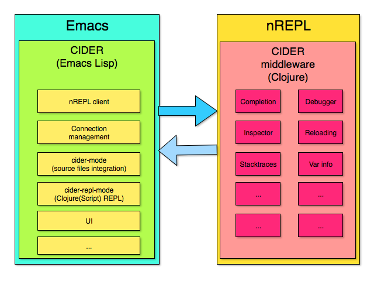

[![License GPL 3][badge-license]](http://www.gnu.org/licenses/gpl-3.0.txt)
[](http://melpa.org/#/cider)
[](http://stable.melpa.org/#/cider)
[](https://travis-ci.org/clojure-emacs/cider)
[](https://www.paypal.com/cgi-bin/webscr?cmd=_s-xclick&hosted_button_id=GRQKNBM6P8VRQ)

<p align="center">
  
</p>

CIDER (formerly *nrepl.el*) is the **C**lojure(Script) **I**nteractive
**D**evelopment **E**nvironment that **R**ocks!

CIDER extends Emacs with support for interactive programming in Clojure. The
features are centered around `cider-mode`, an Emacs minor-mode that complements
`clojure-mode`. While `clojure-mode` supports editing Clojure source files,
`cider-mode` adds support for interacting with a running Clojure process for
compilation, debugging, definition and documentation lookup, running tests and
so on.

CIDER is the successor to the now deprecated combination of using [SLIME][] +
[swank-clojure][] for Clojure development.

If you like the project, please consider [supporting its ongoing development](#donations).

[](https://gitter.im/clojure-emacs/cider?utm_source=badge&utm_medium=badge&utm_campaign=pr-badge&utm_content=badge)

**This documentation tracks the `master` branch of CIDER. Some of
the features and settings discussed here might not be available in
older releases (including the current stable release). Please, consult
the relevant git tag (e.g. v0.10.1) if you need documentation for a
specific CIDER release.**

***

- [Overview](#overview)
- [Installation](#installation)
  - [Prerequisites](#prerequisites)
  - [Installation via package.el](#installation-via-packageel)
  - [Setting up CIDER's nREPL middleware](#setting-up-ciders-nrepl-middleware)
    - [Using Leiningen](#using-leiningen)
    - [Using Boot](#using-boot)
    - [Using embedded nREPL server](#using-embedded-nrepl-server)
- [Basic Usage](#basic-usage)
  - [Setting up a Leiningen or Boot project (optional)](#setting-up-a-leiningen-or-boot-project-optional)
  - [Launch a nREPL server and client from Emacs](#launch-a-nrepl-server-and-client-from-emacs)
  - [Connect to a running nREPL server](#connect-to-a-running-nrepl-server)
  - [Using cider-mode](#using-cider-mode)
  - [Using the REPL](#using-the-repl)
    - [REPL Configuration](#repl-configuration)
      - [REPL history](#repl-history)
  - [ClojureScript usage](#clojurescript-usage)
- [Extended Workflow](#extended-workflow)
  - [Macroexpansion](#macroexpansion)
  - [Value Inspection](#value-inspection)
  - [Running Tests](#running-tests)
  - [Navigating Stacktraces](#navigating-stacktraces)
  - [Debugging](#debugging)
  - [Code reloading](#code-reloading)
  - [Managing multiple connections](#managing-multiple-connections)
- [Configuration](#configuration)
  - [Basic configuration](#basic-configuration)
  - [Overlays](#overlays)
  - [Specifying indentation](#specifying-indentation)
  - [Minibuffer completion](#minibuffer-completion)
  - [Auto-completion](#auto-completion)
  - [Pretty-printing](#pretty-printing)
  - [Integration with other modes](#integration-with-other-modes)
- [Caveats](#caveats)
  - [Var Metadata](#var-metadata)
  - [ClojureScript limitations](#clojurescript-limitations)
  - [Microsoft Windows](#microsoft-windows)
  - [powershell.el](#powershell-el)
- [Troubleshooting](#troubleshooting)
- [Documentation](#documentation)
- [Changelog](#changelog)
- [Team](#team)
- [Release policy](#release-policy)
- [Logo](#logo)
- [Contributing](#contributing)
  - [Discussion](#discussion)
  - [Issues](#issues)
  - [Patches](#patches)
  - [Documentation](#documentation)
  - [Donations](#donations)
  - [Running the tests in batch mode](#running-the-tests-in-batch-mode)
- [License](#license)

## Overview

CIDER aims to provide an interactive development experience similar to the one
you'd get when programming in Emacs Lisp, Common Lisp (with [SLIME][] or [Sly][]),
Scheme (with [Geiser][]) and Smalltalk.

Programmers are expected to program in a very dynamic and incremental manner,
constantly re-evaluating existing Clojure definitions and adding new ones to
their running applications. You never stop/start a Clojure application while
using CIDER - you're constantly interacting with it and changing it.

You can find more details about the typical CIDER workflow in the `Basic Usage`
section. While we're a bit short on video tutorials, you can check out this
[tutorial about SLIME](https://www.youtube.com/watch?v=_B_4vhsmRRI) to get a
feel about what do we mean by an "Interactive Development Environment".
There are plenty of differences between CIDER and SLIME, but the core ideas are
pretty much the same (and SLIME served as the principle inspiration for CIDER).

CIDER's built on top of [nREPL][], the Clojure networked REPL server.

CIDER's basic architecture looks something like this:

<p align="center">
  
</p>

Clojure code gets executed by an nREPL server. CIDER sends requests to the
server and processes its responses. The server's functionality is augmented by
additional nREPL middleware, designed specifically to address the needs of an
interactive development environment like CIDER. Much of the middleware we
developed for CIDER is editor agnostic and is being used by other Clojure dev
environments as well (e.g. [vim-fireplace][] & [CCW][]).

If you're interested in more details about CIDER's history and architecture you
can check out the Clojure/conj presentation
[The Evolution of the Emacs tooling for Clojure](https://www.youtube.com/watch?v=4X-1fJm25Ww&list=PLZdCLR02grLoc322bYirANEso3mmzvCiI&index=6)
and the [Cognicast's episode on CIDER](http://blog.cognitect.com/cognicast/080).
There's also a
[ClojureX 2015 presentation](https://skillsmatter.com/skillscasts/7225-cider-the-journey-so-far-and-the-road-ahead)
dedicated to CIDER 0.9 and 0.10 and the future of the project.

CIDER packs plenty of features. Here are some of them (in no particular order):

* Powerful REPL
* Interactive code evaluation
* Compilation notes (error and warning highlighting)
* Human-friendly stacktraces
* Smart code completion
* Definition lookup
* Documentation lookup
* Resource lookup
* Apropos
* Debugger
* Value inspector
* Function tracing
* Interactive macroexpansion
* Enhanced Clojure font-locking and indentation
* [Grimoire](http://conj.io/) integration
* `clojure.test` integration
* Classpath browser
* Namespace browser
* nREPL session management
* Scratchpad
* Minibuffer code evaluation
* Integration with [company-mode][] and [auto-complete-mode][]
* Support for working with multiple simultaneous nREPL connections


## Installation

The canonical way to install CIDER is via `package.el` (Emacs's built-in package
manager), but plenty of other options exist. (see the
[wiki](https://github.com/clojure-emacs/cider/wiki/Installation)).

### Prerequisites

You'll need to have Emacs installed (preferably the latest stable
release). If you're new to Emacs you might want to read
[this tutorial](http://clojure-doc.org/articles/tutorials/emacs.html),
dedicated to setting up Emacs for Clojure development, first.

CIDER officially supports Emacs 24.3+ and Clojure(Script) 1.7+.
CIDER 0.10 was the final release which supported Clojure 1.5 and 1.6.

You'll also need a recent version of your favorite build tool (Leiningen, Boot
or Gradle) to be able to start CIDER via `cider-jack-in`. Generally it's a good
idea to use their latest stable versions.

#### Upgrading from nrepl.el

Before installing CIDER make sure you've removed the old `nrepl.el`
package and all packages that depend on it. Use only packages updated to work with CIDER!

You'll also need to adjust your config accordingly, as most settings
were renamed in CIDER. Consult the [Configuration](#configuration) section of the
README for more details.

If you were using
[nrepl-ritz](https://github.com/pallet/ritz/tree/develop/nrepl), you'll also
have to remove its plugin and middleware from your `profiles.clj` (or
`project.clj`).

#### Upgrading from clojure-test-mode

CIDER 0.7 introduced a replacement for the deprecated `clojure-test-mode` called
`cider-test`.  Please, make sure you've uninstalled `clojure-test-mode` if
you're using CIDER 0.7 or newer, as `clojure-test-mode` sometimes interferes
with CIDER's REPL initialization.

### Installation via package.el

`package.el` is the built-in package manager in Emacs.

CIDER is available on the two major `package.el` community
maintained repos -
[MELPA Stable](http://stable.melpa.org)
and [MELPA](http://melpa.org).

You can install CIDER with the following command:

<kbd>M-x package-install [RET] cider [RET]</kbd>

or by adding this bit of Emacs Lisp code to your Emacs initialization file
(`.emacs` or `init.el`):

```el
(unless (package-installed-p 'cider)
  (package-install 'cider))
```

If the installation doesn't work try refreshing the package list:

<kbd>M-x package-refresh-contents [RET]</kbd>

Keep in mind that MELPA packages are built automatically from
the `master` branch, meaning bugs might creep in there from time to
time. Never-the-less, installing from MELPA is the recommended way of
obtaining CIDER, as the `master` branch is normally quite stable and
"stable" (tagged) builds are released somewhat infrequently.

With the most recent builds of Emacs, you can pin CIDER to always use MELPA
Stable by adding this to your Emacs initialization:

```el
(add-to-list 'package-pinned-packages '(cider . "melpa-stable") t)
```

**CIDER has deps (e.g. `queue` & `seq`) that are only available in the
  [GNU ELPA repository](https://elpa.gnu.org/). It's the only package repository
  enabled by default in Emacs and you should not disable it!**

### Setting up CIDER's nREPL middleware

Much of CIDER's functionality depends on the presence of CIDER's own
[nREPL middleware][cider-nrepl].

#### Using Leiningen

Use the convenient plugin for defaults, either in your project's
`project.clj` file or in the :repl profile in `~/.lein/profiles.clj`.

```clojure
:plugins [[cider/cider-nrepl "x.y.z"]]
```

A minimal `profiles.clj` for CIDER would be:

```clojure
{:repl {:plugins [[cider/cider-nrepl "0.10.1"]]}}
```

**Be careful not to place this in the `:user` profile, as this way CIDER's
middleware will always get loaded, causing `lein` to start slower.  You really
need it just for `lein repl` and this is what the `:repl` profile is for.**

#### Using Boot

Boot users can configure the tool to include the middleware automatically in
all of their projects using a `~/.boot/profile.boot` file like so:

```clojure
(require 'boot.repl)

(swap! boot.repl/*default-dependencies*
       concat '[[cider/cider-nrepl "0.10.1"]])

(swap! boot.repl/*default-middleware*
       conj 'cider.nrepl/cider-middleware)
```

For more information visit [boot-clj wiki](https://github.com/boot-clj/boot/wiki/Cider-REPL).

#### Using embedded nREPL server

If you're embedding nREPL in your application you'll have to start the
server with CIDER's own nREPL handler.

```clojure
(ns my-app
  (:require [clojure.tools.nrepl.server :as nrepl-server]
            [cider.nrepl :refer (cider-nrepl-handler)]))

(defn -main
  []
  (nrepl-server/start-server :port 7888 :handler cider-nrepl-handler))
```

It goes without saying that your project should depend on `cider-nrepl`.

***

`x.y.z` should match the version of CIDER you're currently using (say `0.7.1`).
For snapshot releases of CIDER you should use the snapshot of the plugin as well
(say `0.7.1-SNAPSHOT`).

**Note that you need to use at least CIDER 0.7 for the nREPL middleware to work
properly.  Don't use cider-nrepl with CIDER 0.6.**

## Basic Usage

The only requirement to use CIDER is to have a nREPL server to
which it may connect. Many Clojurians favour the use of the Leiningen or Boot tools
to start an nREPL server, but the use of Leiningen or Boot is not a prerequisite to use
CIDER (however, it *is* required if you want to use the `cider-jack-in` command).

### Setting up a Leiningen or Boot project (optional)

[Leiningen][] is the de facto standard build/project
management tool for Clojure. [Boot][] is a newer build tool
offering abstractions and libraries to construct more complex build
scenarios. Both have a similar scope to the Maven build tool favoured by Java
developers (and they actually reuse many things from the Maven ecosystem).

CIDER features a command called `cider-jack-in` that will start an nREPL server
for a particular Leiningen or Boot project and connect to it automatically.
This functionality depends on Leiningen 2.5.2+ or Boot
2.0.0+. Older versions are not supported. For Leiningen, follow the installation
instructions on its web site to get it up and running and afterwards create a
project like this:

```
$ lein new demo
```

The two main ways to obtain an nREPL connection are discussed in the following sections of the manual.

### Launch a nREPL server and client from Emacs

Simply open in Emacs a file belonging to your `lein` or `boot` project (like
`foo.clj`) and type <kbd>M-x cider-jack-in</kbd>. This will start a nREPL server with
all the project deps loaded in and CIDER with automatically connect to it.

Alternatively you can use <kbd>C-u M-x cider-jack-in</kbd> to specify the name of
a `lein` or `boot` project, without having to visit any file in it.

In Clojure(Script) buffers the command `cider-jack-in` is bound to <kbd>C-c M-j</kbd>.

### Connect to a running nREPL server

You can go to your project's dir in a terminal and type there
(assuming you're using Leiningen that is):

```
$ lein repl
```

Or with Boot:

```
$ boot repl wait
```

Alternatively you can start nREPL either manually or by the facilities provided by your
project's build tool (Maven, etc).

After you get your nREPL server running go back to Emacs.
Typing there <kbd>M-x cider-connect</kbd> will allow you to connect to the running nREPL server.

In Clojure(Script) buffers the command `cider-connect` is bound to <kbd>C-c M-c</kbd>.

### Using cider-mode

CIDER comes with a handy minor mode called `cider-mode` (complementing
`clojure-mode`) that allows you to evaluate code in your Clojure source
files and load it directly in the REPL.  Here's a list of its keybindings:

Keyboard shortcut                    | Description
-------------------------------------|-------------------------------
<kbd>C-x C-e</kbd> <kbd>C-c C-e</kbd>| Evaluate the form preceding point and display the result in the echo area and/or in an buffer overlay (according to `cider-use-overlays`).  If invoked with a prefix argument, insert the result into the current buffer.
<kbd>C-c C-w</kbd>                   | Evaluate the form preceding point and replace it with its result.
<kbd>C-c M-e</kbd>                   | Evaluate the form preceding point and output it result to the REPL buffer.  If invoked with a prefix argument, takes you to the REPL buffer after being invoked.
<kbd>C-c M-p</kbd>                   | Load the form preceding point in the REPL buffer.
<kbd>C-c C-p</kbd>                   | Evaluate the form preceding point and pretty-print the result in a popup buffer.
<kbd>C-c C-f</kbd>                   | Evaluate the top level form under point and pretty-print the result in a popup buffer.
<kbd>C-M-x</kbd> <kbd>C-c C-c</kbd>  | Evaluate the top level form under point and display the result in the echo area.
<kbd>C-u C-M-x</kbd> <kbd>C-u C-c C-c</kbd>  | Debug the top level form under point and walk through its evaluation
<kbd>C-c C-r</kbd>                   | Evaluate the region and display the result in the echo area.
<kbd>C-c C-b</kbd>                   | Interrupt any pending evaluations.
<kbd>C-c C-m</kbd>                   | Invoke `macroexpand-1` on the form at point and display the result in a macroexpansion buffer.  If invoked with a prefix argument, `macroexpand` is used instead of `macroexpand-1`.
<kbd>C-c M-m</kbd>                   | Invoke `clojure.walk/macroexpand-all` on the form at point and display the result in a macroexpansion buffer.
<kbd>C-c C-n</kbd>                   | Eval the ns form.
<kbd>C-c M-n</kbd>                   | Switch the namespace of the REPL buffer to the namespace of the current buffer.
<kbd>C-c C-z</kbd>                   | Switch to the relevant REPL buffer. Use a prefix argument to change the namespace of the REPL buffer to match the currently visited source file.
<kbd>C-u C-u C-c C-z</kbd>           | Switch to the REPL buffer based on a user prompt for a directory.
<kbd>C-c M-z</kbd>                   | Load (eval) the current buffer and switch to the relevant REPL buffer. Use a prefix argument to change the namespace of the REPL buffer to match the currently visited source file.
<kbd>C-c M-d</kbd>                   | Display default REPL connection details, including project directory name, buffer namespace, host and port.
<kbd>C-c M-r</kbd>                   | Rotate and display the default nREPL connection.
<kbd>C-c C-o</kbd>                   | Clear the last output in the REPL buffer. With a prefix argument it will clear the entire REPL buffer, leaving only a prompt. Useful if you're running the REPL buffer in a side by side buffer.
<kbd>C-c C-k</kbd>                   | Load (eval) the current buffer.
<kbd>C-c C-l</kbd>                   | Load (eval) a Clojure file.
<kbd>C-c C-x</kbd>                   | Reload all modified files on the classpath. If invoked with a prefix argument, reload all files on the classpath. If invoked with a double prefix argument, clear the state of the namespace tracker before reloading.
<kbd>C-c C-d d</kbd>                   | Display doc string for the symbol at point.  If invoked with a prefix argument, or no symbol is found at point, prompt for a symbol.
<kbd>C-c C-d j</kbd>                   | Display JavaDoc (in your default browser) for the symbol at point.  If invoked with a prefix argument, or no symbol is found at point, prompt for a symbol.
<kbd>C-c M-i</kbd>                   | Inspect expression. Will act on expression at point if present.
<kbd>C-c M-t v</kbd>                 | Toggle var tracing.
<kbd>C-c M-t n</kbd>                 | Toggle namespace tracing.
<kbd>C-c C-u</kbd>                   | Undefine a symbol. If invoked with a prefix argument, or no symbol is found at point, prompt for a symbol.
<kbd>C-c ,</kbd>                     | Run tests for namespace.
<kbd>C-c C-,</kbd>                   | Re-run test failures/errors for namespace.
<kbd>C-c M-,</kbd>                   | Run test at point.
<kbd>C-c C-t</kbd>                   | Show the test report buffer.
<kbd>M-.</kbd>                       | Jump to the definition of a symbol.  If invoked with a prefix argument, or no symbol is found at point, prompt for a symbol.
<kbd>C-c M-.</kbd>                   | Jump to the resource referenced by the string at point.
<kbd>C-c C-.</kbd>                   | Jump to some namespace on the classpath.
<kbd>M-,</kbd>                       | Return to your pre-jump location.
<kbd>M-TAB</kbd>                     | Complete the symbol at point.
<kbd>C-c C-d r</kbd>                 | Lookup symbol in Grimoire.
<kbd>C-c C-d a</kbd>                 | Apropos search for functions/vars.
<kbd>C-c C-d A</kbd>                 | Apropos search for documentation.
<kbd>C-c C-q</kbd>                   | Quit the current nREPL connection. With a prefix argument it will quit all connections.

There's no need to memorize this list. In any Clojure buffer with `cider-mode`
active you'll have a CIDER menu available, which lists all the most important
commands and their keybindings. You can also invoke `C-h f RET cider-mode` to
get a list of the keybindings for `cider-mode`.

### Using the REPL

CIDER comes with a powerful REPL, which is quite handy when you want to
experiment with the code you're working on or just explore some stuff (e.g. a
library you're playing with).  The REPL offers a number of advanced features:

* auto-completion
* font-locking (the same as in `clojure-mode`)
* quick access to many CIDER commands (e.g. definition and documentation lookup, tracing, etc)

Here's a list of the keybindings that are available in CIDER's REPL:

Keyboard shortcut                    | Description
-------------------------------------|------------------------------
<kbd>RET</kbd>        | Evaluate the current input in Clojure if it is complete. If incomplete, open a new line and indent. If invoked with a prefix argument is given then the input is evaluated without checking for completeness.
<kbd>C-RET</kbd>      | Close any unmatched parenthesis and then evaluate the current input in Clojure.
<kbd>C-j</kbd>        | Open a new line and indent.
<kbd>C-c C-o</kbd>    | Remove the output of the previous evaluation from the REPL buffer. With a prefix argument it will clear the entire REPL buffer, leaving only a prompt.
<kbd>C-c M-o</kbd>    | Switch between the Clojure and ClojureScript REPLs for the current project.
<kbd>C-c C-u</kbd>    | Kill all text from the prompt to the current point.
<kbd>C-c C-b</kbd> <kbd>C-c C-c</kbd>| Interrupt any pending evaluations.
<kbd>C-up</kbd> <kbd>C-down</kbd> | Goto to previous/next input in history.
<kbd>M-p</kbd> <kbd>M-n</kbd> | Search the previous/next item in history using the current input as search pattern. If <kbd>M-p/M-n</kbd> is typed two times in a row, the second invocation uses the same search pattern (even if the current input has changed).
<kbd>M-s</kbd> <kbd>M-r</kbd> | Search forward/reverse through command history with regex.
<kbd>C-c C-n</kbd> <kbd>C-c C-p</kbd> | Move between the current and previous prompts in the REPL buffer. Pressing <kbd>RET</kbd> on a line with old input copies that line to the newest prompt.
<kbd>C-c C-x</kbd>     | Reload all modified files on the classpath.
<kbd>C-u C-c C-x</kbd> | Reload all files on the classpath.
<kbd>TAB</kbd> | Complete symbol at point.
<kbd>C-c C-d d</kbd> | Display doc string for the symbol at point.  If invoked with a prefix argument, or no symbol is found at point, prompt for a symbol
<kbd>C-c C-d j</kbd> | Display JavaDoc (in your default browser) for the symbol at point.  If invoked with a prefix argument, or no symbol is found at point, prompt for a symbol.
<kbd>C-c C-d r</kbd> | Lookup symbol in Grimoire.
<kbd>C-c C-d a</kbd> | Apropos search for functions/vars.
<kbd>C-c C-d A</kbd> | Apropos search for documentation.
<kbd>C-c C-z</kbd> | Switch to the previous Clojure buffer. This complements <kbd>C-c C-z</kbd> used in cider-mode.
<kbd>C-c M-i</kbd> | Inspect expression. Will act on expression at point if present.
<kbd>C-c M-n</kbd> | Select a namespace and switch to it.
<kbd>C-c C-.</kbd> | Jump to some namespace on the classpath.
<kbd>C-c M-t v</kbd> | Toggle var tracing.
<kbd>C-c M-t n</kbd> | Toggle namespace tracing.
<kbd>C-c C-q</kbd>                   | Quit the current nREPL connection. With a prefix argument it will quit all connections.

There's no need to memorize this list. In any REPL buffer you'll have a `REPL`
menu available, which lists all the most important commands and their
keybindings. You can also invoke `C-h f RET cider-repl-mode` to get a list of the
keybindings for `cider-repl-mode`.

In the REPL you can also use "shortcut commands" by pressing `,` at the
beginning of a REPL line. You'll be presented with a list of commands you can
quickly run (like quitting, displaying some info, clearing the REPL, etc). The
character used to trigger the shortcuts is configurable via
`cider-repl-shortcut-dispatch-char`. Here's how you can change it to `:`:

```el
(setq cider-repl-shortcut-dispatch-char ?\:)
```

#### REPL Configuration

* You can customize the prompt in REPL buffer. To do that you can customize
  `cider-repl-prompt-function` and set it to a function that takes one argument,
  a namespace name. For convenience, three functions are already provided:
  `cider-repl-prompt-lastname`, `cider-repl-prompt-abbreviated`,
  `cider-repl-prompt-default` and by default the last one is being used.
  Prompt for each of them for namespace `leiningen.core.ssl`:

  * `cider-repl-prompt-lastname`:

  ```
  ssl>
  ```

  * `cider-repl-prompt-abbreviated`:

  ```
  l.c.ssl>
  ```

  * `cider-repl-prompt-default`:

  ```
  leiningen.core.ssl>
  ```

  You may, of course, write your own function. For example, in `leiningen` there
  are two namespaces with similar names - `leiningen.classpath` and
  `leiningen.core.classpath`. To make them easily recognizable you can either
  use the default value or you can opt to show only two segments of the
  namespace and still be able to know which is the REPL's current
  namespace. Here is an example function that will do exactly that:

  ```el
  (defun cider-repl-prompt-show-two (namespace)
    "Return a prompt string with the last name in NAMESPACE."
    (let* ((names (reverse (-take 2 (reverse (split-string namespace "\\."))))))
      (concat (car names) "." (cadr names) "> ")))
  ```

* By default, interactive commands that require a symbol will prompt for the
  symbol, with the prompt defaulting to the symbol at point. You can set
  `cider-prompt-for-symbol` to nil to instead try the command with the symbol at
  point first, and only prompt if that fails.

* You can control the <kbd>TAB</kbd> key behavior in the REPL via the
`cider-repl-tab-command` variable.  While the default command
`cider-repl-indent-and-complete-symbol` should be an adequate choice for
most users, it's very easy to switch to another command if you wish
to. For instance if you'd like <kbd>TAB</kbd> to only indent (maybe
because you're used to completing with <kbd>M-TAB</kbd>) use the
following snippet:

```el
(setq cider-repl-tab-command #'indent-for-tab-command)
```

* Change the result prefix for REPL evaluation (by default there's no prefix):

```el
(setq cider-repl-result-prefix ";; => ")
```

And here's the result of that change:

```
user> (+ 1 2)
;; => 3
```

* The REPL buffer name has the format `*cider-repl project-name*`.
Change the separator from space to something else by overriding `nrepl-buffer-name-separator`.

```el
(setq nrepl-buffer-name-separator "-")
```

* The REPL buffer name can also display the port on which the nREPL server is running.
Buffer name will look like `*cider-repl project-name:port*`.

```el
(setq nrepl-buffer-name-show-port t)
```

* Normally code in the REPL is font-locked the same way as in
`clojure-mode`. Before CIDER 0.10 by default REPL input was font-locked with
`cider-repl-input-face` (after you press `RET`) and results were font-locked with
`cider-repl-result-face`. If you want to restore the old behaviour use:

```el
(setq cider-repl-use-clojure-font-lock nil)
```

##### Pretty printing in the REPL

Make the REPL always pretty-print the results of your commands.

<kbd>M-x cider-repl-toggle-pretty-printing</kbd>

##### Limiting printed output in the REPL

Accidentally printing large objects can be detrimental to your
productivity. Clojure provides the `*print-length*` var which, if set,
controls how many items of each collection the printer will print. You
can supply a default value for REPL sessions via the `repl-options`
section of your Leiningen project's configuration.

```clojure
:repl-options {:init (set! *print-length* 50)}
```

##### REPL history

* To make the REPL history wrap around when its end is reached:

```el
(setq cider-repl-wrap-history t)
```

* To adjust the maximum number of items kept in the REPL history:

```el
(setq cider-repl-history-size 1000) ; the default is 500
```

* To store the REPL history in a file:

```el
(setq cider-repl-history-file "path/to/file")
```

Note that the history is written to the file when you kill the REPL
buffer (which includes invoking `cider-quit`) or you quitting Emacs.


### ClojureScript usage

ClojureScript support relies on the
[piggieback][] nREPL middleware being
present in your REPL session.

1. Add the following dependencies to your `project.clj`

   ```clojure
   [com.cemerick/piggieback "0.2.1"]
   [org.clojure/clojure "1.7.0"]
   ```

   as well as the following option:

   ```clojure
   :repl-options {:nrepl-middleware [cemerick.piggieback/wrap-cljs-repl]}
   ```

2. Issue <kbd>M-x</kbd> `customize-variable` <kbd>RET</kbd> `cider-cljs-lein-repl` if
   you'd like to change the REPL used (the default is `rhino`).

3. Open a file in your project and issue <kbd>M-x</kbd>
   `cider-jack-in-clojurescript`. This will start up the nREPL server, and then create
   two REPL buffers for you, one in Clojure and one in ClojureScript. All usual
   CIDER commands will be automatically directed to the appropriate REPL,
   depending on whether you're visiting a `clj` or a `cljs` file.

#### Browser-connected ClojureScript REPL

Using Weasel, you can also have a browser-connected REPL.

1. Add `[weasel "0.7.0"]` to your project's `:dependencies`.

2. Issue <kbd>M-x</kbd> `customize-variable` <kbd>RET</kbd> `cider-cljs-lein-repl`
   and choose the `Weasel` option.

3. Add this to your ClojureScript code:

   ```clojure
   (ns my.cljs.core
     (:require [weasel.repl :as repl]))
   (repl/connect "ws://localhost:9001")
   ```

4. Open a file in your project and issue `M-x cider-jack-in-clojurescript`.

Provided that a Piggieback-enabled ClojureScript environment is active in your
REPL session, code loading and evaluation will work seamlessly regardless of the
presence of the `cider-nrepl` middleware. If the middleware is present then most
other features of CIDER will also be enabled (including code completion,
documentation lookup, the namespace browser, and macroexpansion).

#### Browser-connected ClojureScript REPL in Boot project

1. Add this to your dependencies in `build.boot`:

  ```clojure
  [adzerk/boot-cljs-repl   "0.3.0"]
  [com.cemerick/piggieback "0.2.1"  :scope "test"]
  [weasel                  "0.7.0"  :scope "test"]
  [org.clojure/tools.nrepl "0.2.12" :scope "test"]
  ```

2. Start `boot dev` in a terminal.

3. `M-x cider-connect` to localhost and select the repl process.

4. Execute `(start-repl)` at the prompt: `boot.user> (start-repl)`.

5. Connect to the running server with your browser.

For more information visit [boot-cljs-repl](https://github.com/adzerk-oss/boot-cljs-repl).

## Extended workflow

CIDER packs a ton of extra functionality, besides basic Clojure code
evaluation. Much of the functionality is centered around additional major modes,
which provide you with convenient ways to get something done or inspect
something.

### Macroexpansion

Pressing <kbd>C-c C-m</kbd> after some form in a source buffer or the REPL will
result in a new buffer, showing the macroexpansion of form in question. You'll
have access to additional keybindings in the macroexpansion buffer (which is
internally using `cider-macroexpansion-mode`):

Keyboard shortcut               | Description
--------------------------------|-------------------------------
<kbd>C-c C-m</kbd>              | Invoke `macroexpand-1` on the form at point and replace the original form with its expansion.  If invoked with a prefix argument, `macroexpand` is used instead of `macroexpand-1`.
<kbd>C-c M-m</kbd>              | Invoke `clojure.walk/macroexpand-all` on the form at point and replace the original form with its expansion.
<kbd>g</kbd>                    | The prior macroexpansion is performed again and the current contents of the macroexpansion buffer are replaced with the new expansion.
<kbd>C-/</kbd> <kbd>C-x u</kbd> | Undo the last inplace expansion performed in the macroexpansion buffer.

### Value inspection

Pressing <kbd>C-c C-i</kbd> after some form in a source buffer or the REPL will
result in a new buffer, showing the structure of the result of the form in question. You'll
have access to additional keybindings in the inspector buffer (which is
internally using `cider-inspector-mode`):

Keyboard shortcut                       | Description
----------------------------------------|-------------------------------
<kbd>Tab</kbd> and <kbd>Shift-Tab</kbd> | Navigate inspectable sub-objects
<kbd>Return</kbd>                       | Inspect sub-objects
<kbd>l</kbd>                            | Pop to the parent object
<kbd>g</kbd>                            | Refresh the inspector (e.g. if viewing an atom/ref/agent)
<kbd>SPC</kbd>                          | Jump to next page in paginated view
<kbd>M-SPC</kbd>                        | Jump to previous page in paginated view
<kbd>s</kbd>                            | Set a new page size in paginated view

### Running tests

You can run `clojure.test` tests pretty quickly in CIDER. Pressing <kbd>C-c
,</kbd> in a source buffer will run the tests for the namespace you're currently
in. CIDER is smart enough to figure out the namespace containing the tests.

In the buffer displaying the test execution results you'll have a bit of
additional functionality at your disposal.

Keyboard shortcut               | Description
--------------------------------|-------------------------------
<kbd>C-c ,</kbd>                | Run tests for namespace.
<kbd>C-c C-,</kbd>              | Re-run test failures/errors for namespace.
<kbd>C-c M-,</kbd>              | Run test at point.
<kbd>M-p</kbd>                  | Move point to previous test.
<kbd>M-n</kbd>                  | Move point to next test.
<kbd>t</kbd> and <kbd>M-.</kbd> | Jump to test definition.
<kbd>d</kbd>                    | Display diff of actual vs expected.
<kbd>e</kbd>                    | Display test error cause and stacktrace info.

Certain aspects of the test execution behavior are configurable:

* If your tests are not following the `some.ns-test` naming convention you can
customize the variable `cider-test-infer-test-ns`. It should be bound to a
function that takes the current ns and returns the matching test ns (which may
be the same as the current ns).

* If you want to view the test report regardless of whether the tests have
passed or failed:

```el
(setq cider-test-show-report-on-success t)
```

### Navigating stacktraces

CIDER comes with a powerful solution to the problem of verbose Clojure
stacktraces.  Stacktraces are presented in a special major mode
(`cider-stacktrace-mode`), which gives you the possibility to filter out certain
stack frames and some handy ways to navigate causes.  You'll also be able to go
to the code in question with a single keystroke.

Keyboard shortcut               | Description
--------------------------------|-------------------------------
<kbd>M-p</kbd> | Move point to previous cause
<kbd>M-n</kbd> | Move point to next cause
<kbd>M-.</kbd> and <kbd>Return</kbd> | Navigate to the source location (if available) for the stacktrace frame
<kbd>Tab</kbd> | Cycle current cause detail
<kbd>0</kbd> and <kbd>S-Tab</kbd> | Cycle all cause detail
<kbd>1</kbd> | Cycle cause #1 detail
<kbd>2</kbd> | Cycle cause #2 detail
<kbd>3</kbd> | Cycle cause #3 detail
<kbd>4</kbd> | Cycle cause #4 detail
<kbd>5</kbd> | Cycle cause #5 detail
<kbd>j</kbd> | Toggle display of java frames
<kbd>c</kbd> | Toggle display of clj frames
<kbd>r</kbd> | Toggle display of repl frames
<kbd>t</kbd> | Toggle display of tooling frames (e.g. compiler, nREPL middleware)
<kbd>d</kbd> | Toggle display of duplicate frames
<kbd>a</kbd> | Toggle display of all frames

* Error buffer stacktraces may be filtered by default. Valid filter types
include `java`, `clj`, `repl`, `tooling`, and `dup`. Setting this to `nil` will
show all stacktrace frames.

```el
(setq cider-stacktrace-default-filters '(tooling dup))
```

* Error messages may be wrapped for readability. If this value is nil, messages
will not be wrapped; if it is truthy but non-numeric, the default `fill-column`
will be used.

```el
(setq cider-stacktrace-fill-column 80)
```

### Debugging

The debugger can be invoked in several ways, the simplest one is to type
<kbd>C-u C-M-x</kbd>. This will take the current top-level form, place as many
breakpoints inside it as possible (instrument it), and then evaluate it a
normal. Whenever a breakpoint is reached, you'll be shown the value and asked
for input (see below). Note that if the current form is a `defn`, it will stay
instrumented, so the debugger will be triggered every time the function is
called. To uninstrument `defn` (or similar forms), you just have to evaluate it
again as you'd normally do (e.g. with <kbd>C-M-x</kbd>).

Another way to trigger the debugger is by placing breakpoints yourself. Just
write `#break` before a form, and the debugger will popup every time that form is
evaluated. For instance, if you hit <kbd>C-M-x</kbd> on the following, a
breakpoint is triggered every time `(inspector msg)` is evaluated.

```clojure
(defn eval-msg [{:keys [inspect] :as msg}]
  (if inspect
    #break (inspector msg)
    msg))
```

Instead of `#break` you can also write `#dbg` before a form, this will not only
breakpoint the form but also everything inside it. In the example above, this
places a breakpoint around `(inspector msg)` and another around `msg`. If you've
been paying attention, you may have noticed that the first option (<kbd>C-u
C-M-x</kbd>) is a quick way of evaluating the current top-level form with `#dbg`
in front.

At any point, you can bring up a list of all currently instrumented `def`s with
the command `cider-browse-instrumented-defs`. Protocols and types can be
instrumented as well, but they will not be listed by this command.

#### Keys

`cider-debug` tries to be consistent with
[Edebug](http://www.gnu.org/software/emacs/manual/html_node/elisp/Edebug.html). So
it makes available the following bindings while stepping through code.

Keyboard shortcut               | Description
--------------------------------|-------------------------------
<kbd>n</kbd> | Next step
<kbd>c</kbd> | Continue without stopping
<kbd>o</kbd> | Move out of the current sexp (like `up-list`)
<kbd>i</kbd> | Inject a value into running code
<kbd>e</kbd> | Eval code in current context
<kbd>l</kbd> | Inspect local variables
<kbd>q</kbd> | Quit execution

In addition, all the usual evaluation commands (such as <kbd>C-x C-e</kbd> or
<kbd>C-c M-:</kbd>) will use the current lexical context (local variables) while
the debugger is active.

### Code reloading

`cider-refresh` wraps
[clojure.tools.namespace](https://github.com/clojure/tools.namespace), and as
such the same
[benefits](https://github.com/clojure/tools.namespace#reloading-code-motivation)
and
[caveats](https://github.com/clojure/tools.namespace#reloading-code-preparing-your-application)
regarding writing reloadable code also apply.

Calling `cider-refresh` will cause all modified Clojure files on the classpath
to be reloaded. You can also provide a single prefix argument to reload all
Clojure files on the classpath unconditionally, or a double prefix argument to
first clear the state of the namespace tracker before reloading.

The above three operations are analogous to
[`clojure.tools.namespace.repl/refresh`](http://clojure.github.io/tools.namespace/#clojure.tools.namespace.repl/refresh),
[`clojure.tools.namespace.repl/refresh-all`](http://clojure.github.io/tools.namespace/#clojure.tools.namespace.repl/refresh-all)
and
[`clojure.tools.namespace.repl/clear`](http://clojure.github.io/tools.namespace/#clojure.tools.namespace.repl/clear)
(followed by a normal refresh), respectively.

* You can define Clojure functions to be called before reloading, and after a
  successful reload, when using `cider-refresh`:

```el
(setq cider-refresh-before-fn "user/stop-system!"
      cider-refresh-after-fn "user/start-system!")
```

* These must be set to the namespace-qualified names of vars bound to functions
  of no arguments. The functions must be synchronous (blocking), and are
  expected to be side-effecting - they will always be executed serially, without
  retries.

* By default, messages regarding the status of the in-progress reload will be
  displayed in the echo area after you call `cider-refresh`. The same
  information will also be recorded in the `*cider-refresh-log*` buffer, along
  with anything printed to `*out*` or `*err*` by `cider-refresh-before-fn` and
  `cider-refresh-start-fn`.

* You can make the `*cider-refresh-log*` buffer display automatically after you
  call `cider-refresh` by setting the `cider-refresh-show-log-buffer` variable
  to a non-nil value (this will also prevent any related messages from also
  being displayed in the echo area):

```el
(setq cider-refresh-show-log-buffer t)
```

### Managing multiple connections

You can connect to multiple nREPL servers using <kbd>M-x cider-jack-in</kbd> (or
`cider-connect`) multiple times.  To close the current nREPL connection, use
<kbd>M-x cider-quit</kbd>.

CIDER maintains a list of nREPL connections and a single 'default'
connection. When you execute CIDER commands in a Clojure editing buffer such as
to compile a namespace, these commands are executed against a specific
connection. This is controlled by the variable `cider-request-dispatch` - when
it's set to `'dynamic` (the default), CIDER will try to infer which connection
to use from the current project and currently visited file; when `'static`
dispatch is used all requests will always be routed to the default connection
(this was the default behavior in CIDER before 0.10).

You can display the current nREPL connection using <kbd>C-c M-d</kbd>
and rotate the default connection using <kbd>C-c M-r</kbd>. Another
option for setting the default connection is to execute the command
<kbd>M-x cider-make-connection-default</kbd> in the appropriate
REPL buffer.

To switch to the relevant REPL buffer based on the Clojure namespace
in the current Clojure buffer, use: <kbd>C-c C-z</kbd>. You can then
use the same key combination to switch back to the Clojure buffer you
came from.

The single prefix <kbd>C-u C-c C-z</kbd>, will switch you to the
relevant REPL buffer and set the namespace in that buffer based on
namespace in the current Clojure buffer.

To change the designation used for CIDER buffers use <kbd>M-x
cider-change-buffers-designation</kbd>. This changes the CIDER REPL
buffer, nREPL connection buffer and nREPL server buffer. For example
using `cider-change-buffers-designation` with the string "foo" would
change `*cider-repl localhost*` to `*cider-repl foo*`.

## Configuration

You can certainly use CIDER without configuring it any further,
but here are some ways other folks are adjusting their CIDER
experience.

### Basic configuration

* Enable `eldoc` in Clojure buffers:

```el
(add-hook 'cider-mode-hook #'eldoc-mode)
```

* Suppress auto-enabling of `cider-mode` in `clojure-mode` buffers, when starting
  CIDER:

```el
(setq cider-auto-mode nil)
```

By default CIDER will enable `cider-mode` in all `clojure-mode` buffers when the
first CIDER connection is established. It will also add a `clojure-mode` hook to
enable it on newly created `clojure-mode` buffers. The configuration snippet
above allows you to override this (somewhat non-standard) behavior.

* Don't log communication with the nREPL server:

```el
(setq nrepl-log-messages nil)
```

Basically, this will dispose of the buffer `*nrepl-messages*`. The communication
log is invaluable for debugging CIDER issues, so you're generally advised to keep
it around.

* You can hide the `*nrepl-connection*` and `*nrepl-server*` buffers
from appearing in some buffer switching commands like
`switch-to-buffer`(<kbd>C-x b</kbd>) like this:

```el
(setq nrepl-hide-special-buffers t)
```

When using `switch-to-buffer`, pressing <kbd>SPC</kbd> after the command will
make the hidden buffers visible. They'll always be visible in
`list-buffers` (<kbd>C-x C-b</kbd>).

* To prefer local resources to remote (tramp) ones when both are available:

```el
(setq cider-prefer-local-resources t)
```

* Prevent the auto-display of the REPL buffer in a separate window
  after connection is established:

```el
(setq cider-repl-pop-to-buffer-on-connect nil)
```

* Configure whether the error buffer with stacktraces should be automatically
  shown on error:

  - Don't show on error:

    ```el
    (setq cider-show-error-buffer nil)
    ```

   Independently of the value of `cider-show-error-buffer`, the error buffer is
   always generated in the background. Use `cider-visit-error-buffer` to visit
   this buffer.

  - Selective strategies:

    ```el
    (setq cider-show-error-buffer 'except-in-repl) ; or
    (setq cider-show-error-buffer 'only-in-repl)
    ```

* To disable auto-selection of the error buffer when it's displayed:

```el
(setq cider-auto-select-error-buffer nil)
```

* Make <kbd>C-c C-z</kbd> switch to the CIDER REPL buffer in the current window:

```el
(setq cider-repl-display-in-current-window t)
```

* Prevent <kbd>C-c C-k</kbd> from prompting to save the file corresponding to
  the buffer being loaded, if it's modified:

```el
;; Don't prompt and don't save
(setq cider-prompt-save-file-on-load nil)
;; Just save without prompting
(setq cider-prompt-save-file-on-load 'always-save)
```

* Change the result prefix for interactive evaluation (by default it's `=> `):

```el
(setq cider-interactive-eval-result-prefix ";; => ")
```

To remove the prefix altogether just set it to an empty string(`""`).

* CIDER can syntax highlight symbols that are known to be defined. By default,
  this is done on symbols from the `clojure.core` namespace as well as macros
  from any namespace. If you'd like CIDER to also colorize usages of functions
  and variables from any namespace, do:

```el
(setq cider-font-lock-dynamically '(macro core function var))
```

* You can configure known endpoints used by the cider command offered via a
completing read. This is useful if you have a list of common host/ports you
want to establish remote nREPL connections to. Using an optional label is
helpful for identifying each host.

```el
(setq cider-known-endpoints '(("host-a" "10.10.10.1" "7888") ("host-b" "7888")))
```

* If you are targeting the JVM and prefer a local copy of the JDK API
  documentation over Oracle's official copy (e.g., for
  [JavaSE 8](http://docs.oracle.com/javase/8/docs/api/)), per nREPL's
  [`javadoc-info` logic (accurate as of 29 Dec 2014)](http://docs.oracle.com/javase/8/docs/api/),
  you can arrange your project to include the **root** path of the local API doc
  (i.e., where the `index.html` is located) to be included on your classpath
  (i.e., where the doc HTML files can be located by
  `clojure.java.io/resource`). For example, for Leiningen, with the local API
  path being `/usr/share/doc/java/api/`, put the following line in
  `project.clj`:

```clj
:dev {:resource-paths ["/usr/share/doc/java/api/"]}
```

**or** the following line in `$HOME/.lein/profiles.clj`:

```clj
:user {:resource-paths ["/usr/share/doc/java/api/"]}
```

More detail can be found [here](https://github.com/clojure-emacs/cider/issues/930).

### Overlays

When you evaluate code in Clojure files, the result is displayed in the buffer
itself, in an overlay right after the evaluated code.  If you want this overlay
to be font-locked (syntax-highlighted) like Clojure code, set the following
variable.

```el
(setq cider-overlays-use-font-lock t)
```

You can disable overlays entirely (and display results in the echo-area at the
bottom) with the `cider-use-overlays` variable.

```el
(setq cider-use-overlays nil)
```

### Specifying indentation

It is common for macros to require special indentation mechanisms. This is most
common in macros that start with `do`, `def`, or `with-`.  CIDER has some
heuristics to detect these macros, but it also lets you explicitly specify how
a macro should be indented.

Here's a simple example of how someone would specify the indent spec for a macro
they've written (using an example in core):

```clj
(defmacro with-in-str
  "[DOCSTRING]"
  {:style/indent 1}
  [s & body]
  ...cut for brevity...)
```

And here's a more complex one:

```clj
(defmacro letfn
  "[DOCSTRING]"
  {:style/indent [1 [[:defn]] :form]}
  [fnspecs & body]
  ...cut for brevity...)
```

Don't worry if this looks intimidating. For most macros the indent spec should
be either just a number, or one of the keywords `:defn` or `:form`. A full
description of the spec is provided in [Indent-Spec.md](doc/Indent-Spec.md).

### Minibuffer completion

Out-of-the box CIDER uses the standard `completing-read` Emacs mechanism. While
it's not fancy it certainly gets the job done (just press `TAB`). There are,
however, ways to improve upon the standard completion if you wish to.

#### icomplete

`icomplete` is bundled with Emacs and enhances the default minibuffer completion:

```el
(require 'icomplete)
```

#### ido

`ido` is also bundled with Emacs and offers more features than `icomplete`.
If you are using `ido`, be sure to use both `ido-everywhere`
and [`ido-ubiquitous`](https://github.com/DarwinAwardWinner/ido-ubiquitous).
You might also want to install [`ido-flex`](https://github.com/lewang/flx).

### Auto-completion

CIDER users are advised to use [`company-mode`](http://company-mode.github.io/)
to enable auto-completion inside of source code and REPL buffers.  To install
`company-mode` do:

`M-x package-install <RET> company <RET>`

After installation, company can be turned on  globally, like so --

```el
(global-company-mode)
```

-- or through mode-specific hooks:

```el
(add-hook 'cider-repl-mode-hook #'company-mode)
(add-hook 'cider-mode-hook #'company-mode)
```

When `company-mode` is thus enabled, it will receive completion information
from `cider-complete-at-point`, and requires no additional setup or plugins.

If you'd prefer to trigger completions manually you can add this to you config:

```el
(setq company-idle-delay nil) ; never start completions automatically
(global-set-key (kbd "M-TAB") #'company-complete) ; use M-TAB, a.k.a. C-M-i, as manual trigger
```

To make `TAB` complete, without losing the ability to manually indent, you can
add this to your config:

```el
(global-set-key (kbd "TAB") #'company-indent-or-complete-common)
```

`company-indent-or-complete-common` is available only in `company-mode` 0.9+ (at
the time of this writing it's still in development).

#### Migrating from `auto-complete-mode`

* Disable `ac-cider-setup` or `ac-nrepl-setup` from running on CIDER hooks

* Remove `cider-mode` and `cider-repl-mode` from the `ac-modes` list

#### Completion annotations

Completion candidates will be annotated by default with an abbreviation
corresponding to their type, and (contextually) their ns. The function used to
format the annotation can be configured by `cider-annotate-completion-function.`
The abbreviations used are configured by `cider-completion-annotations-alist`
and the context in which their namespace is included is configured by
`cider-completion-annotations-include-ns.`

Completion annotations can be disabled by setting
`cider-annotate-completion-candidates` to nil.

<p align="center">
  
</p>

### Pretty-printing

You can configure the function used by CIDER for pretty-printing evaluation
results and other data using the `cider-pprint-fn` option.

This can be one of three values (defaults to `fipp`):

- `fipp` to use the
  [Fast Idiomatic Pretty-Printer](https://github.com/brandonbloom/fipp). This is
  approximately 5-10x faster than `clojure.core/pprint`.

- `puget` to use [Puget](https://github.com/greglook/puget), which builds on
  Fipp to provide a
  [canonical serialization](https://github.com/greglook/puget#canonical-representation)
  of data, at a slight performance cost.

- `pprint` to use the built-in `clojure.pprint/pprint`.

Alternatively, `cider-pprint-fn` can be set to the namespace-qualified name of a
Clojure function that takes a single argument and will pretty-print the value of
said argument to `*out*`.

``` el
(setq cider-pprint-fn "user/my-pprint")
```

This function must be resolvable by CIDER at the time it is called (i.e. its
containing namespace must have already been required).

CIDER will bind `*print-length*`, `*print-level*`, `*print-meta*`, and
`clojure.pprint/*print-right-margin*` when calling the pretty-printing
function - the function you provide is expected to respect these options.

### Integration with other modes

* Enabling `CamelCase` support for editing commands(like
`forward-word`, `backward-word`, etc) in the REPL is quite useful since
we often have to deal with Java class and method names. The built-in
Emacs minor mode `subword-mode` provides such functionality:

```el
(add-hook 'cider-repl-mode-hook #'subword-mode)
```

* The use of [paredit](http://mumble.net/~campbell/emacs/paredit.html)
when editing Clojure (or any other Lisp) code is highly
recommended.  You're probably using it already in your `clojure-mode`
buffers (if you're not you probably should). You might also want to
enable `paredit` in the REPL buffer as well:

```el
(add-hook 'cider-repl-mode-hook #'paredit-mode)
```

* [smartparens](https://github.com/Fuco1/smartparens) is an excellent
  alternative to paredit. Many Clojure hackers have adopted it
  recently and you might want to give it a try as well. To enable
  `smartparens` in the REPL buffer use the following code:

```el
(add-hook 'cider-repl-mode-hook #'smartparens-strict-mode)
```

* [RainbowDelimiters](https://github.com/Fanael/rainbow-delimiters) is a
  minor mode which highlights parentheses, brackets, and braces
  according to their depth. Each successive level is highlighted in a
  different color. This makes it easy to spot matching delimiters,
  orient yourself in the code, and tell which statements are at a
  given depth. Assuming you've already installed RainbowDelimiters you can
  enable it in the REPL like this:

```el
(add-hook 'cider-repl-mode-hook #'rainbow-delimiters-mode)
```

* [auto-complete](http://cx4a.org/software/auto-complete/) is a popular Emacs
  interactive auto-completion framework. [ac-cider](https://github.com/clojure-emacs/ac-cider)
  provides a completion source for auto-complete-mode, including, where CIDER provides it,
  pop-up documentation for completed symbols.

* [eval-sexp-fu](https://github.com/hchbaw/eval-sexp-fu.el) provides some visual
feedback when evaluating expressions. [cider-eval-sexp-fu](https://github.com/clojure-emacs/cider-eval-sexp-fu) provides
CIDER integration for `eval-sexp-fu`.

```el
(require 'cider-eval-sexp-fu)
```

## Caveats

### ClojureScript limitations

Currently, the following features are not supported for ClojureScript
development:

* Grimoire lookup
* Reloading
* Running tests
* Tracing
* Debugging (check out [this ticket](https://github.com/clojure-emacs/cider/issues/1416) dedicated to porting the debugger to ClojureScript)

There is currently no support for both Clojure and ClojureScript evaluation in
the same nREPL session. If Piggieback is active, code evaluation and all
features will assume ClojureScript.

#### Var Metadata

Currently var metadata about the location of the var's definition within the
ClojureScript source code (file, line & column) is set only when evaluating the
entire source buffer (<kbd>C-c C-k</kbd>). All other interactive code evaluation
commands (e.g. <kbd>C-c C-e</kbd>) don't set this metadata and you won't be able
to use commands like `find-var` on such vars.  This is a limitation of nREPL and
piggieback, that's beyond CIDER. You can find some discussions on the subject
[here](http://dev.clojure.org/jira/browse/NREPL-59) and
[here](https://github.com/clojure-emacs/cider/issues/830).

### Microsoft Windows

On Microsoft Windows the JVM default line separator string is `\r\n`
which can appear in Emacs as `^M` characters at the end of lines
printed out by the JVM. One option is to set the
`buffer-display-table` to not show these characters as detailed
[here](http://stackoverflow.com/questions/10098925/m-character-showing-in-clojure-slime-repl/11787550#11787550)
(changing `slime-repl-mode-hook` to
`cider-repl-mode-hook`). Alternatively, setting the system property
`line.separator` to `\n` at JVM startup will stop the carriage return
from being printed and will fix output in all cider buffers. To do so
add `"-Dline.separator=\"\n\""` to `:jvm-opts` in
`~/.lein/profiles.clj`.

### powershell.el

The powershell inferior shell mode truncates CIDER's REPL output when
loaded. As a workaround remove

```el
(require 'powershell)
```

from your Emacs config.

## Troubleshooting

In case you run into issues here are a few tips that can help you diagnose the
problem.

Generally, it's not a bad idea to configure Emacs to spit the backtrace on error
(instead of just logging the error in the `*Messages*` buffer. You can toggle
this behavior by using `M-x toggle-debug-on-error`.

### REPL not starting

Make sure that your CIDER version matches your `cider-nrepl` version. Check
the contents of the `*Messages*` buffer for CIDER-related errors. You should
also check the nREPL messages passed between CIDER and nREPL in
`*nrepl-messages*`. If you don't see anything useful there it's time to bring
out the big guns.

#### Debugging the REPL init

Emacs features a super powerful built-in
[Emacs Lisp debugger](http://www.gnu.org/software/emacs/manual/html_node/elisp/Edebug.html)
and using it is the best way to diagnose problems of any kind. To debug CIDER's
REPL initialization it's a good idea to hook into one of its entry points. Add a
breakpoint to `cider-make-repl` (`C-u C-M-x`, while in its body). Next time you
start CIDER you'll be dropped in the debugger and you can step forward until you
find the problem.

Here's a [great crash course](https://www.youtube.com/watch?v=odkYXXYOxpo) on
using the debugger.

### Missing `*nrepl-messages*` buffer

Check the value of `nrepl-log-messages`. It should be non-nil.

### `cider-debug` complains that it “failed to instrument ...”

In the REPL buffer, issue the following.

    your.namespace> (ns cider.nrepl.middleware.util.instrument)
    cider.nrepl.middleware.util.instrument> (def verbose-debug true)

This will cause cider to print extensive information on the REPL buffer when you
try to debug an expression (e.g., with `C-u
C-M-x`). [File an issue](https://github.com/clojure-emacs/cider-repl/issues/new)
and copy this information.

### Warning saying you have to use nREPL 0.2.12+

CIDER currently requires at least nREPL 0.2.12 to work properly (there were some
nasty bugs in older version and no support tracking where some var was defined
in the source code). Leiningen users can add this to their `profiles.clj` to
force the proper dependency:

```clojure
{:repl {:dependencies [[org.clojure/tools.nrepl "0.2.12"]]}}
```

Make sure you add the newer nREPL dependency to the `:dependencies` key instead
of `:plugins` (where `cider-nrepl` Lein plugin resides). That's a pretty common
mistake.

Generally you're advised to use the newest nREPL with CIDER, as bugs get fixed
in pretty much every release.

Note, that running `cider-jack-in` from outside the scope of a project will
result in the **older (0.2.6) nREPL dependency being used** (at least on Leiningen
2.5.1). This is likely a Leiningen bug.

### Missing clojure-... function after CIDER update

Most likely you've updated CIDER, without updating `clojure-mode` as well.

CIDER depends on `clojure-mode` and you should always update them together, as
the latest CIDER version might depend on functionality present only in the latest
`clojure-mode` version.

### I upgraded CIDER using `package.el` and it broke

The built-in package manager isn't perfect and sometimes it messes up.  If you
just updated and encountered an error you should try the following before
opening an issue: Go into the `.emacs.d/elpa` directory, delete any folders
related to CIDER, restart emacs and then re-install the missing packages.  Note
that the order here matters.

### I upgraded CIDER using `package.el` and nothing changed

Emacs doesn't load the new files, it only installs them on disk.  To see the
effect of changes you have to restart emacs.

## Documentation

A single-page quick reference PDF for CIDER commands is available
[here](doc/cider-refcard.pdf). This PDF can be created manually by running
`pdflatex` on [the CIDER refcard LaTeX file](doc/cider-refcard.tex).

## Changelog

An extensive changelog is available [here](CHANGELOG.md).

## Team

* [Bozhidar Batsov](https://github.com/bbatsov) (maintainer)
* [Tim King](https://github.com/kingtim) (original author)
* [Phil Hagelberg](https://github.com/technomancy)
* [Hugo Duncan](https://github.com/hugoduncan)
* [Steve Purcell](https://github.com/purcell)
* [Jeff Valk](https://github.com/jeffvalk)
* [Michael Griffiths](https://github.com/cichli)
* [Lars Andersen](https://github.com/expez)
* [Artur Malabarba](https://github.com/malabarba)

## Release policy

We’re following [SemVer](http://semver.org/) (as much as one can be
following it when the major version is 0). At this point bumps of the
minor (second) version number are considered major releases and always
include new features or significant changes to existing features. API
compatibility between major releases is not a (big) concern (although we try
to break the API rarely and only for a good reason).

The development cycle for the next major
release starts immediately after the previous one has been
shipped. Bugfix/point releases (if any) address only serious bugs and
never contain new features.

The versions of CIDER and `cider-nrepl` are always kept in sync. If you're
tracking the `master` branch of CIDER, you should also be tracking the `master`
branch of `cider-nrepl`.

## Logo

CIDER's logo was created by [@ndr-qef](https://github.com/ndr-qef). You can find
the logo in various formats
[here](https://github.com/clojure-emacs/cider/tree/master/logo).

The logo is licensed under a
[Creative Commons Attribution-NonCommercial 4.0 International License](http://creativecommons.org/licenses/by-nc/4.0/deed.en_GB).

## Contributing

### Discussion

For questions, suggestions and support refer to our
[official mailing list](https://groups.google.com/forum/#!forum/cider-emacs) ,
the Freenode channel `#clojure-emacs`, `#cider` on
[slack](https://clojurians.slack.com/) or our
[gitter channel](https://gitter.im/clojure-emacs/cider). StackOverflow users
should use the [cider](http://stackoverflow.com/questions/tagged/cider) tag
(ideally combined with the tags `emacs` and `clojure`).

Please, don't report
issues there, as this makes them harder to track.

### Issues

Report issues and suggest features and improvements on the
[GitHub issue tracker](https://github.com/clojure-emacs/cider/issues). Don't ask
questions on the issue tracker - the mailing list and the IRC channel are the
places for questions.

If you want to file a bug, please clone this repo and provide sufficient details
to reproduce the issue. Start by running `make run-cider`.  This will bring up
Emacs with only the latest version of CIDER loaded. By starting fresh, with the
latest code, we can ensure that the problem at hand isn't already fixed or
caused by interactions with other packages.

### Patches

Patches in any form are always welcome! GitHub pull requests are even better! :-)

Before submitting a patch or a pull request make sure all tests are
passing and that your patch is in line with the [contribution
guidelines](CONTRIBUTING.md).

### Documentation

Consider improving and extending the [community wiki](https://github.com/clojure-emacs/cider/wiki).

### Donations

You can support my work on CIDER, clojure-mode and inf-clojure via
[Salt](https://salt.bountysource.com/teams/cider),
[Gratipay](https://www.gratipay.com/cider) and PayPal.

[](https://gratipay.com/cider)

[](https://www.paypal.com/cgi-bin/webscr?cmd=_s-xclick&hosted_button_id=GRQKNBM6P8VRQ)

### Running the tests in batch mode

Install [cask](https://github.com/cask/cask) if you haven't
already, then:

```
$ cd /path/to/cider
$ cask
```

Run all tests with:

```
$ make test
```

(Note: tests may not run correctly inside Emacs' `shell-mode` buffers. Running
them in a terminal is recommended.)

You can also check for the presence of byte-compilation warnings in batch mode:

```
$ make test-bytecomp
```

## License

Copyright © 2012-2016 Tim King, Phil Hagelberg, Bozhidar Batsov, Hugo
Duncan, Steve Purcell and
[contributors](https://github.com/clojure-emacs/cider/contributors).

Distributed under the GNU General Public License, version 3

[badge-license]: https://img.shields.io/badge/license-GPL_3-green.svg
[nREPL]: https://github.com/clojure/tools.nrepl
[SLIME]: https://github.com/slime/slime
[swank-clojure]: https://github.com/technomancy/swank-clojure
[Sly]: https://github.com/capitaomorte/sly
[Geiser]: https://github.com/jaor/geiser
[company-mode]: http://company-mode.github.io/
[auto-complete-mode]: https://github.com/clojure-emacs/ac-cider
[leiningen]: http://leiningen.org/
[boot]: http://boot-clj.com/
[piggieback]: https://github.com/cemerick/piggieback
[vim-fireplace]: https://github.com/tpope/vim-fireplace
[CCW]: https://github.com/laurentpetit/ccw
[cider-nrepl]: https://github.com/clojure-emacs/cider-nrepl
