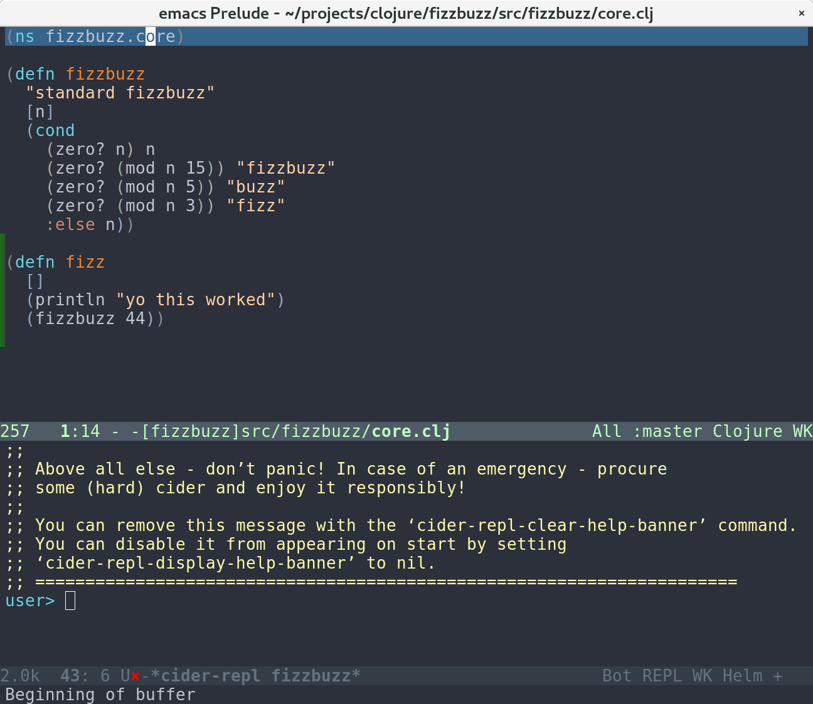
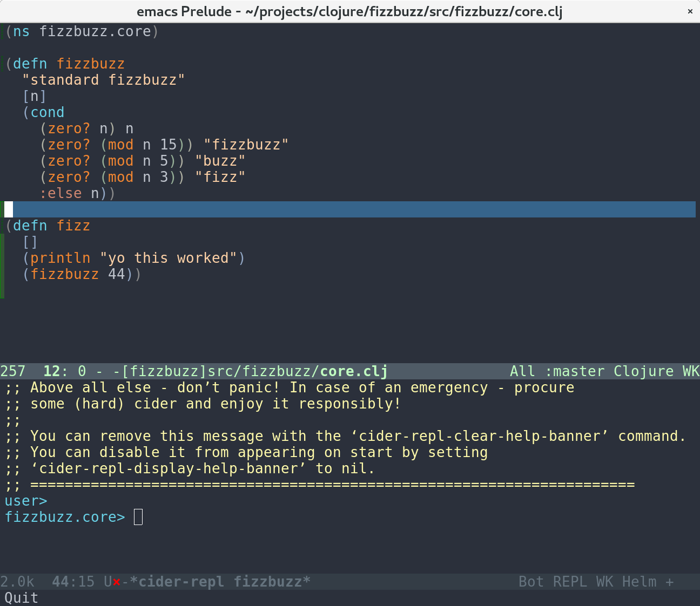
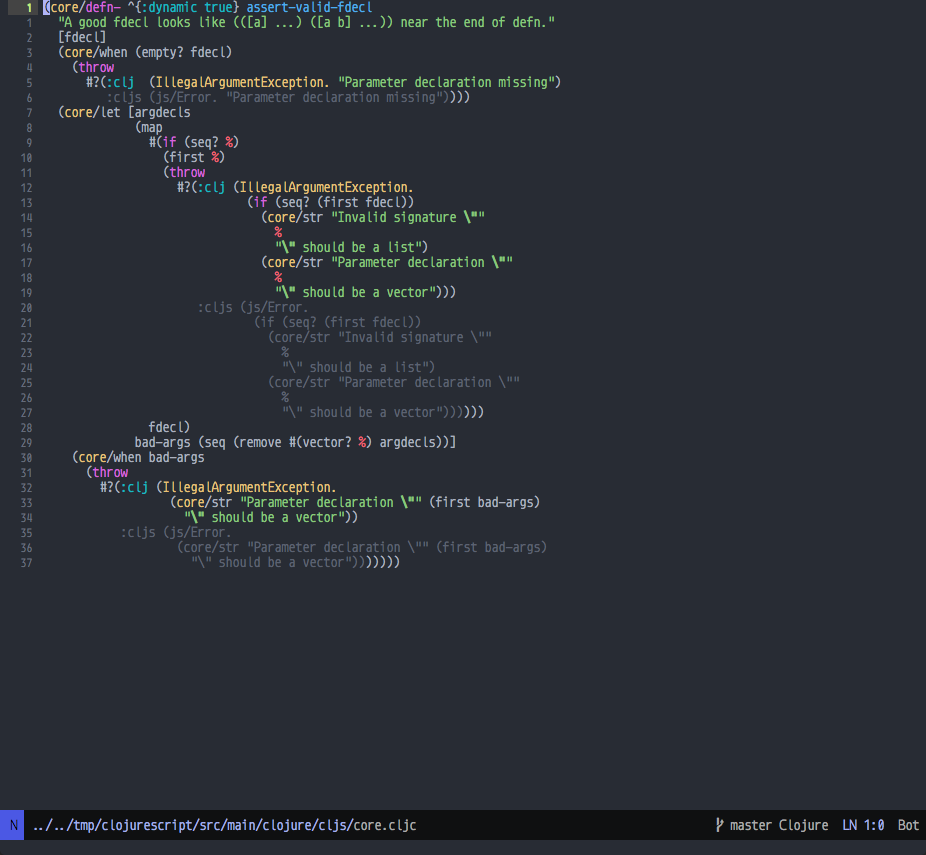
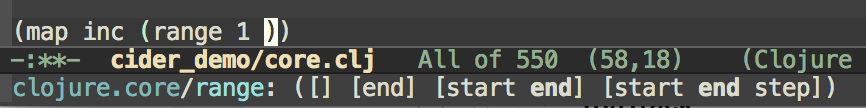

Like Emacs itself, almost every part of CIDER is configurable. The
CIDER developers have tried to implement some reasonable defaults that
should work for a large portion of the Clojure community, but we know
that there is nothing approaching a "one size fits all" development
environment and we've tried to create points of customization that can
account for many different peoples' preferences. In this way, you
should be able to make CIDER as comfortable as possible for **you**.

You can see every single customizable configuration option with the command
<kbd>M-x customize-group RET cider</kbd>.

This section doesn't describe every possible customization that CIDER
offers, but here are some of the most popular.

## Basic Configuration

### Disable Automatic cider-mode in clojure-mode Buffers

By default, CIDER enables `cider-mode` in all `clojure-mode` buffers
after it establishes the first CIDER connection. It will also add a
`clojure-mode` hook to enable `cider-mode` on newly-created `clojure-mode`
buffers. You can override this behavior, however:

```el
(setq cider-auto-mode nil)
```

### Disable Symbol Confirmation

By default, CIDER prompts you for a symbol when it executes
interactive commands that require a symbol (e.g. `cider-doc`). The
default symbol will be the one at point. If you set
`cider-prompt-for-symbol` to `nil`, CIDER will try the symbol at point
first, and only prompt if that fails (this was the behavior in older
CIDER releases).

```el
(setq cider-prompt-for-symbol nil)
```

### Log nREPL Communications

If you want to see all communications between CIDER and the nREPL
server:

```el
(setq nrepl-log-messages t)
```

CIDER will then create buffers named `*nrepl-messages conn-name*` for
each connection.

The communication log is tremendously valuable for
debugging CIDER-to-nREPL problems and we recommend you enable it when
you are facing such issues.

### Hide Special nREPL Buffers

If you're finding that `*nrepl-connection*` and `*nrepl-server*`
buffers are cluttering up your development environment, you can
suppress them from appearing in some buffer switching commands like
`switch-to-buffer`(<kbd>C-x b</kbd>):

```el
(setq nrepl-hide-special-buffers t)
```

If you need to make the hidden buffers appear When using
`switch-to-buffer`, type <kbd>SPC</kbd> after issing the command. The
hidden buffers will always be visible in `list-buffers` (<kbd>C-x
C-b</kbd>).

### Prefer Local Resources Over Remote Resources

To prefer local resources to remote resources (tramp) when both are available:

```el
(setq cider-prefer-local-resources t)
```

### Auto-Save Clojure Buffers on Load

Normally, CIDER prompts you to save a modified Clojure buffer when you
type <kbd>C-c C-k</kbd> (`cider-load-buffer`).  You can change this
behaviour by adjusting `cider-save-file-on-load`.

Don't prompt and don't save:

```el
(setq cider-save-file-on-load nil)
```

Just save without prompting:

```el
(setq cider-save-file-on-load t)
```

### Change the Result Prefix for Interactive Evaluation

Change the result prefix for interactive evaluation (not the REPL
prefix). By default the prefix is `=> `.

```el
(setq cider-eval-result-prefix ";; => ")
```

To remove the prefix altogether, just set it to the empty string (`""`).

### Use a Local Copy of the JDK API Documentation

If you are targeting the JVM and prefer a local copy of the JDK API
documentation over Oracle's official copy (e.g., for
[JavaSE 8](http://docs.oracle.com/javase/8/docs/api/)), per nREPL's
[`javadoc-info` logic (accurate as of 29 Dec 2014)](http://docs.oracle.com/javase/8/docs/api/),
you can arrange your project to include the **root** path of the local API doc
(i.e., where the `index.html` is located) to be included on your classpath
(i.e., where the doc HTML files can be located by
`clojure.java.io/resource`). For example, for Leiningen, with the local API
path being `/usr/share/doc/java/api/`, put the following line in
`project.clj`:

```clojure
:dev {:resource-paths ["/usr/share/doc/java/api/"]}
```

**or** the following line in `$HOME/.lein/profiles.clj`:

```clojure
:user {:resource-paths ["/usr/share/doc/java/api/"]}
```

More details can be found [here](https://github.com/clojure-emacs/cider/issues/930).

### Use a Local Copy of the Java Source Code

When an exception is thrown, e.g. when eval-ing `(. clojure.lang.RT foo)`, a
stack trace pops up. Some places of the stack trace link to Clojure files,
others to Java files. By default, you can click the Clojure file links to
navigate there. If you configure `cider-jdk-src-paths`, you can also click the
Java file links to navigate there.

On Windows and macOS the JDK source code is bundled with the JDK. On Windows its
typical location is `C:\Program Files\Java\{jdk-version}\src.zip`
and on macOS its `/Library/Java/JavaVirtualMachines/{jdk-version}/Contents/Home/src.zip`.

On Linux distributions usually the source code is distributed as a separate package.
Here's how do get the JDK 8 source on Ubuntu:

    sudo apt install openjdk-8-source

The zip is installed to `/usr/lib/jvm/openjdk-8/src.zip`.

You can download Clojure Java source code from
[here](https://repo1.maven.org/maven2/org/clojure/clojure/1.8.0/clojure-1.8.0-sources.jar).

Extract both and configure e.g. like so:

    (setq cider-jdk-src-paths '("~/java/clojure-1.8.0-sources"
                                "~/java/openjvm-8-src"))

It's possible to use `jar` or `zip` files `cider-jdk-src-paths`, but extracting
them is better since you get features like `ag` or `dired-jump`.

### Filter out namespaces in certain namespace-related commands

You can hide all nREPL middleware details from `cider-browse-ns*` and `cider-apropos*`
commands by customizing the variable `cider-filter-regexps`. It should be a list of
regexps matching the pattern of namespaces you want to filter out.

Its default value is `'("^cider.nrepl" "^refactor-nrepl" "^clojure.tools.nrepl" "^nrepl")`,
the most commonly used middleware collections/packages.

An important thing to note is that this list of regexps is passed on to the middleware
without any pre-processing. So, the regexps have to be in Clojure format (with twice the number of backslashes)
and not Emacs Lisp. For example, to achieve the above effect, you could also set `cider-filter-regexps` to `'(".*nrepl")`.

To customize `cider-filter-regexps`, you could use the Emacs customize UI,
with <kbd>M-x</kbd> `customize-variable` <kbd>RET</kbd> `cider-filter-regexps`.

Or by including a similar snippet along with the other CIDER configuration.

```el
(setq cider-filter-regexps '(".*nrepl"))
```

### Truncate long lines in special buffers

By default contents of CIDER's special buffers such as `*cider-test-report*`
or `*cider-doc*` are line truncated. You can set
`cider-special-mode-truncate-lines` to `nil` to make those buffers use word
wrapping instead of line truncating.

**This variable should be set before loading CIDER** (which means before
`require`-ing it or autoloading it).

``` el
(setq cider-special-mode-truncate-lines nil)
```

## Syntax highlighting

### Dynamic syntax highlighting

CIDER can syntax highlight symbols that are known to be defined. By default,
this is done on symbols from the `clojure.core` namespace, as well as macros
from any namespace. If you'd like CIDER to also colorize usages of functions
and variables from any namespace, do:

```el
(setq cider-font-lock-dynamically '(macro core function var))
```

Here's how code looks without dynamic syntax highlighting.



And here's how to the code looks when it's turned on.



### Syntax highlighting for reader conditionals

By default CIDER will apply font-locking to unused reader conditional
expressions depending on the buffer CIDER connection type.



You can disable this behavior by adjusting `cider-font-lock-reader-conditionals`:

```el
(setq cider-font-lock-reader-conditionals nil)
```

### Customizing CIDER faces

CIDER defines a few custom faces that you might want to adjust (although normally your color theme
should take care of them):

* `cider-deprecated-face` - used for syntax highlighting deprecated vars
* `cider-instrumented-face` - used for syntax highlighting instrumented for debugging vars
* `cider-traced-face` - used for syntax highlighting traced vars
* `cider-reader-conditional-face` - used for syntax highlighting inactive reader conditional branches

## Configuring eldoc

* Enable `eldoc` in Clojure buffers:

```el
(add-hook 'cider-mode-hook #'eldoc-mode)
```



* CIDER also would show the eldoc for the symbol at point. So in `(map inc ...)`
when the cursor is over `inc` its eldoc would be displayed. You can turn off this
behaviour by:

```el
(setq cider-eldoc-display-for-symbol-at-point nil)
```

* CIDER respects the value of `eldoc-echo-area-use-multiline-p` when
displaying documentation in the minibuffer. You can customize this variable to change
its behaviour.

| eldoc-echo-area-use-multiline-p | Behaviour |
| ------------- | ------------- |
| `t`  | Never attempt to truncate messages. Complete symbol name and function arglist or variable documentation will be displayed even if echo area must be resized to fit.|
| `nil`  | Messages are always truncated to fit in a single line of display in the echo area.  |
| `truncate-sym-name-if-fit` or anything non-nil | Symbol name may be truncated if it will enable the function arglist or documentation string to fit on a single line. Otherwise, behavior is just like `t` case. |

* CIDER will try to add expected function arguments based on the current context
(for example for the `datomic.api/q` function where it will show the expected
inputs of the query at point), if the variable `cider-eldoc-display-context-dependent-info`
is non-nil:

```el
(setq cider-eldoc-display-context-dependent-info t)
```

## Overlays

When you evaluate code in Clojure files, the result is displayed in the buffer
itself, in an overlay right after the evaluated code.  If you want this overlay
to be font-locked (syntax-highlighted) like Clojure code, set the following
variable.

```el
(setq cider-overlays-use-font-lock t)
```

You can disable overlays entirely (and display results in the echo-area at the
bottom) with the `cider-use-overlays` variable.

```el
(setq cider-use-overlays nil)
```

## Specifying indentation

It is common for macros to require special indentation mechanisms. This is most
common in macros that start with `do`, `def`, or `with-`.  CIDER has some
heuristics to detect these macros, but it also lets you explicitly specify how
a macro should be indented.

Here's a simple example of how someone would specify the indent spec for a macro
they've written (using an example in core):

```clojure
(defmacro with-in-str
  "[DOCSTRING]"
  {:style/indent 1}
  [s & body]
  ...cut for brevity...)
```

And here's a more complex one:

```clojure
(defmacro letfn
  "[DOCSTRING]"
  {:style/indent [1 [[:defn]] :form]}
  [fnspecs & body]
  ...cut for brevity...)
```

Don't worry if this looks intimidating. For most macros the indent spec should
be either just a number, or one of the keywords `:defn` or `:form`. A full
description of the spec is provided in the
[indent spec section of the manual](indent_spec.md).

If you *don't* want to use this feature, you can disable it by setting
`cider-dynamic-indentation` to `nil` in your Emacs init file.

```el
(setq cider-dynamic-indentation nil)
```

## Minibuffer completion

Out-of-the box CIDER uses the standard `completing-read` Emacs mechanism. While
it's not fancy it certainly gets the job done (just press <kbd>TAB</kbd>). There
are, however, ways to improve upon the standard completion if you wish to.

### icomplete

`icomplete` is bundled with Emacs and enhances the default minibuffer completion:

```el
(require 'icomplete)
```

You can learn more about `icomplete`
[here](https://www.gnu.org/software/emacs/manual/html_node/emacs/Icomplete.html).

### ido

`ido` is also bundled with Emacs and offers more features than `icomplete`.
If you are using `ido`, be sure to use both `ido-everywhere`
and [`ido-completing-read+`](https://github.com/DarwinAwardWinner/ido-completing-read-plus).
You might also want to install [`ido-flex`](https://github.com/lewang/flx).

### ivy (recommended)

If you're fine with installing a third-party package for enhanced minibuffer
completion you can't go wrong with the modern and versatile
[ivy](http://oremacs.com/2015/04/16/ivy-mode/).

## Pretty-printing

You can configure the function used by CIDER for pretty-printing evaluation
results and other data using the `cider-pprint-fn` option.

This can be one of three values (defaults to `pprint`):

- `pprint` to use the built-in `clojure.pprint/pprint`.

- `fipp` to use the
  [Fast Idiomatic Pretty-Printer](https://github.com/brandonbloom/fipp). This is
  approximately 5-10x faster than `clojure.core/pprint`.

- `puget` to use [Puget](https://github.com/greglook/puget), which builds on
  Fipp to provide a
  [canonical serialization](https://github.com/greglook/puget#canonical-representation)
  of data, at a slight performance cost.

Alternatively, `cider-pprint-fn` can be set to the namespace-qualified name of a
Clojure function that takes a single argument and will pretty-print the value of
said argument to `*out*`.

``` el
(setq cider-pprint-fn "user/my-pprint")
```

This function must be resolvable by CIDER at the time it is called (i.e. its
containing namespace must have already been required).

CIDER will bind `*print-length*`, `*print-level*`, `*print-meta*`, and
`clojure.pprint/*print-right-margin*` when calling the pretty-printing
function - the function you provide is expected to respect these options.
