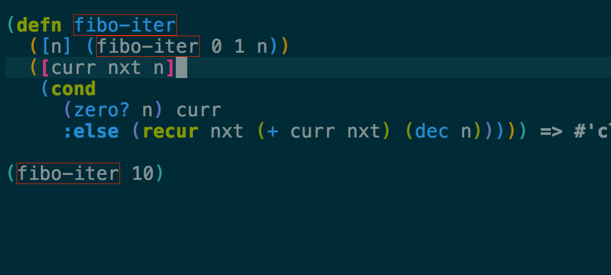

CIDER ships with a powerful interactive Clojure debugger inspired by Emacs's own
[Edebug][]. You're going to love it!



### Debugging

The debugger can be invoked in several ways, the simplest one is to type
<kbd>C-u C-M-x</kbd>. This will take the current top-level form, place as many
breakpoints inside it as possible (instrument it), and then evaluate it a
normal. Whenever a breakpoint is reached, you'll be shown the value and asked
for input (see below). Note that if the current form is a `defn`, it will stay
instrumented, so the debugger will be triggered every time the function is
called. To uninstrument `defn` (or similar forms), you just have to evaluate it
again as you'd normally do (e.g. with <kbd>C-M-x</kbd>).

Another way to trigger the debugger is by placing breakpoints yourself. Just
write `#break` before a form, and the debugger will popup every time that form is
evaluated. For instance, if you hit <kbd>C-M-x</kbd> on the following, a
breakpoint is triggered every time `(inspector msg)` is evaluated.

```clojure
(defn eval-msg [{:keys [inspect] :as msg}]
  (if inspect
    #break (inspector msg)
    msg))
```

Instead of `#break` you can also write `#dbg` before a form, this will not only
breakpoint the form but also everything inside it. In the example above, this
places a breakpoint around `(inspector msg)` and another around `msg`. If you've
been paying attention, you may have noticed that the first option (<kbd>C-u
C-M-x</kbd>) is a quick way of evaluating the current top-level form with `#dbg`
in front.

At any point, you can bring up a list of all currently instrumented `def`s with
the command `cider-browse-instrumented-defs`. Protocols and types can be
instrumented as well, but they will not be listed by this command.

#### Keys

`cider-debug` tries to be consistent with
[Edebug][]. So
it makes available the following bindings while stepping through code.

Keyboard shortcut               | Description
--------------------------------|-------------------------------
<kbd>n</kbd> | Next step
<kbd>c</kbd> | Continue without stopping
<kbd>o</kbd> | Move out of the current sexp (like `up-list`)
<kbd>i</kbd> | Inject a value into running code
<kbd>e</kbd> | Eval code in current context
<kbd>l</kbd> | Inspect local variables
<kbd>s</kbd> | Show the current stack
<kbd>h</kbd> | Skip all sexps up to “here” (current position). Move the cursor before doing this.
<kbd>q</kbd> | Quit execution

In addition, all the usual evaluation commands (such as <kbd>C-x C-e</kbd> or
<kbd>C-c M-:</kbd>) will use the current lexical context (local variables) while
the debugger is active.

#### Internal Details

*This section explains a bit of the inner workings of the debugger. It is mostly
to help those who are interested in contributing, and doesn't teach anything
about usage.*

The CIDER debugger works in several steps:

1. First it walks through the user's code, adding metadata to forms and symbols
   that identify their position (coordinate) in the code.
2. Then it macroexpands everything to get rid of macros.
3. Then it walks through the code again, instrumenting it. That involves a few things.
   - It understands all existing special forms, and takes care not to instrument
     where it's not supposed to. For instance, the arglist of a `fn*` or the
     left-side of a `let`-binding.
   - Wherever it finds the previously-injected metadata (if that place is valid
     for instrumentation) it wraps the form/symbol in a macro called
     `breakpoint-if-interesting`.
4. When the resulting code actually gets evaluated by the Clojure compiler, the
   `breakpoint-if-interesting` macro will be expanded.  This macro decides
   whether the return value of the form/symbol in question is actually something
   the user wants to see (see below). If it is, the form/symbol gets wrapped in
   the `breakpoint` macro, otherwise it's returned as is.
5. The `breakpoint` macro takes that coordinate information that was provided in
   step `1.` and sends it over to Emacs (the front-end). It also sends the return
   value of the form and a prompt of available commands. Emacs then uses this
   information to show the value of actual code forms and prompt for the next
   action.


A few example of forms that don't have interesting return values (and so are not wrapped in a `breakpoint`):
- In `(fn [x] (inc x))` the return value is a function object and carries no
  information. Note that this is not the same as the return value when you
  **call** this function (which **is** interesting). Also, even those this form
  is not wrapped in a breakpoint, the forms inside it **are** (`(inc x)` and
  `x`).
- Similarly, in a form like `(map inc (range 10))`, the symbol `inc` points to a
  function in `clojure.core`. That's also irrelevant (unless it's being shadowed
  by a local, but the debugger can identify that).

[Edebug]: http://www.gnu.org/software/emacs/manual/html_node/elisp/Edebug.html
