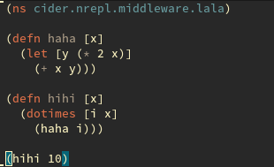

CIDER packs a ton of extra functionality, besides basic Clojure code
evaluation. Much of the functionality is centered around additional major modes,
which provide you with convenient ways to get something done or inspect
something.

### Evaluating Clojure code in the minibuffer

You can evaluate Clojure code in the minibuffer from pretty much everywhere
by using `M-x cider-read-and-eval` (bound in `cider-mode` buffers to `C-c C-:`).
`TAB` completion will work in the minibuffer, just as in a REPL/source buffer.

You can also enable `eldoc-mode` in the minibuffer by adding the following to your
config:

```el
(add-hook 'eval-expression-minibuffer-setup-hook #'eldoc-mode)
```

You can also enable `paredit` or `smartparens` for minibuffer evaluations:

```el
(add-hook 'eval-expression-minibuffer-setup-hook #'paredit-mode)
```

### Macroexpansion

Pressing <kbd>C-c C-m</kbd> after some form in a source buffer or the REPL will
result in a new buffer, showing the macroexpansion of form in question. You'll
have access to additional keybindings in the macroexpansion buffer (which is
internally using `cider-macroexpansion-mode`):

Keyboard shortcut               | Description
--------------------------------|-------------------------------
<kbd>C-c C-m</kbd>              | Invoke `macroexpand-1` on the form at point and replace the original form with its expansion.  If invoked with a prefix argument, `macroexpand` is used instead of `macroexpand-1`.
<kbd>C-c M-m</kbd>              | Invoke `clojure.walk/macroexpand-all` on the form at point and replace the original form with its expansion.
<kbd>g</kbd>                    | The prior macroexpansion is performed again and the current contents of the macroexpansion buffer are replaced with the new expansion.
<kbd>C-/</kbd> <br/> <kbd>C-x u</kbd> | Undo the last inplace expansion performed in the macroexpansion buffer.

### Value inspection

Pressing <kbd>C-c M-i</kbd> after some form in a source buffer or the REPL will
result in a new buffer, showing the structure of the result of the form in question.
You can also use <kbd>C-u C-c M-i</kbd> to inspect the result of the current top-level
form and <kbd>C-u C-u C-c M-i</kbd> to read an expression from the minibuffer and
inspect its result.

You'll have access to additional keybindings in the inspector buffer (which is
internally using `cider-inspector-mode`):

Keyboard shortcut                       | Description
----------------------------------------|-------------------------------
<kbd>Tab</kbd> or <kbd>Shift-Tab</kbd>  | Navigate inspectable sub-objects
<kbd>Return</kbd>                       | Inspect sub-objects
<kbd>l</kbd>                            | Pop to the parent object
<kbd>g</kbd>                            | Refresh the inspector (e.g. if viewing an atom/ref/agent)
<kbd>SPC</kbd>                          | Jump to next page in paginated view
<kbd>M-SPC</kbd>                        | Jump to previous page in paginated view
<kbd>s</kbd>                            | Set a new page size in paginated view

### Running tests

You can run `clojure.test` tests pretty quickly in CIDER. Pressing <kbd>C-c C-t
n</kbd> or <kbd>C-c C-t C-n</kbd> in a source buffer or a REPL buffer will run
the tests for the namespace you're currently in. CIDER is smart enough to figure
out the namespace containing the tests. You can also run all loaded tests with
<kbd>C-c C-t l</kbd> or <kbd>C-c C-t C-l</kbd> and all tests within a project
with <kbd>C-c C-t p</kbd> or <kbd>C-c C-t C-p</kbd> (note that this will loaded
**all** namespaces in your project). Using <kbd>C-c C-t t</kbd> or <kbd>C-c C-t
C-t</kbd>, you can execute only the test a point.

All test commands are available in REPL buffers as well. There you can also use
<kbd>,</kbd> there to invoke some of the testing commands.

In the buffer displaying the test execution results (`*cider-test-results*`)
you'll have a bit of additional functionality at your disposal.

Keyboard shortcut               | Description
--------------------------------|-------------------------------
<kbd>C-c C-t t</kbd> <br/> <kbd>C-c C-t C-t</kbd> | Run test at point.
<kbd>C-c C-t n</kbd> <br/> <kbd>C-c C-t C-n</kbd> | Run tests for current namespace.
<kbd>C-c C-t l</kbd> <br/> <kbd>C-c C-t C-l</kbd> | Run tests for all loaded namespaces.
<kbd>C-c C-t p</kbd> <br/> <kbd>C-c C-t C-p</kbd> | Run tests for all project namespaces. This loads the additional namespaces.
<kbd>C-c C-t r</kbd> <br/> <kbd>C-c C-t C-r</kbd> | Re-run test failures/errors.
<kbd>M-p</kbd>                  | Move point to previous test.
<kbd>M-n</kbd>                  | Move point to next test.
<kbd>t</kbd> or <kbd>M-.</kbd>  | Jump to test definition.
<kbd>d</kbd>                    | Display diff of actual vs expected.
<kbd>e</kbd>                    | Display test error cause and stacktrace info.

Certain aspects of the test execution behavior are configurable:

* If your tests are not following the `some.ns-test` naming convention you can
customize the variable `cider-test-infer-test-ns`. It should be bound to a
function that takes the current namespace and returns the matching test
namespace (which may be the same as the current namespace).

* If you want to view the test report regardless of whether the tests have
passed or failed:

```el
(setq cider-test-show-report-on-success t)
```

#### Running tests automatically (test-driven development)

CIDER provides a minor-mode that automatically runs all tests for a namespace
whenever you load a file (with <kbd>C-c C-k</kbd>). You can toggle it
manually with <kbd>M-x</kbd> `cider-auto-test-mode`, or you can use:

```el
(cider-auto-test-mode 1)
```

This is completely equivalent to manually typing <kbd>C-c C-t C-n</kbd> every
time you load a Clojure buffer. Also, as described above before, CIDER is smart
enough to figure out the namespace containing the tests.

#### Using cider-test with alternative test libraries

The `clojure.test` machinery is designed to be pluggable. Any test library
can implement it if so desired, and therefore leverage `cider-test`. For
instance, [test.check](https://github.com/clojure/test.check/) does this, and
`cider-test` handles `defspec` just like `deftest`.

As a test framework author, supporting the built-in `clojure.test` machinery
(and hence `cider-test`) is pretty straightforward:

1. Assoc each test fn as `:test` metadata on some var. These are what get run.
2. Implement the `clojure.test/report` multimethod to capture the test results.

The `test.check` library is a good example here. It was also designed completely
independently of `clojure.test`. It just adds compatibility in this
[namespace](https://github.com/clojure/test.check/blob/24f74b83f1c7a032f98efdcc1db9d74b3a6a794d/src/main/clojure/clojure/test/check/clojure_test.cljc).

### Navigating stacktraces

CIDER comes with a powerful solution to the problem of verbose Clojure
stacktraces.  Stacktraces are presented in a special major mode
(`cider-stacktrace-mode`), which gives you the possibility to filter out certain
stack frames and some handy ways to navigate causes.  You'll also be able to go
to the code in question with a single keystroke.

Keyboard shortcut                    | Description
-------------------------------------|-------------------------------
<kbd>M-p</kbd>                       | Move point to previous cause
<kbd>M-n</kbd>                       | Move point to next cause
<kbd>M-.</kbd> or <kbd>Return</kbd>  | Navigate to the source location (if available) for the stacktrace frame
<kbd>Tab</kbd>                       | Cycle current cause detail
<kbd>0</kbd> or <kbd>S-Tab</kbd>     | Cycle all cause detail
<kbd>1</kbd>                         | Cycle cause #1 detail
<kbd>2</kbd>                         | Cycle cause #2 detail
<kbd>3</kbd>                         | Cycle cause #3 detail
<kbd>4</kbd>                         | Cycle cause #4 detail
<kbd>5</kbd>                         | Cycle cause #5 detail
<kbd>j</kbd>                         | Toggle display of java frames
<kbd>c</kbd>                         | Toggle display of clj frames
<kbd>r</kbd>                         | Toggle display of repl frames
<kbd>t</kbd>                         | Toggle display of tooling frames (e.g. compiler, nREPL middleware)
<kbd>d</kbd>                         | Toggle display of duplicate frames
<kbd>a</kbd>                         | Toggle display of all frames

You can configure whether the error buffer with stacktraces should be automatically
shown on error. By default it will be displayed, but you can change this:

```el
(setq cider-show-error-buffer nil)
```

Independently of the value of `cider-show-error-buffer`, the error buffer is
always generated in the background. Use `cider-visit-error-buffer` to visit
this buffer.

There are two more selective strategies for the error buffer:

```el
(setq cider-show-error-buffer 'except-in-repl) ; or
(setq cider-show-error-buffer 'only-in-repl)
```

* To disable auto-selection of the error buffer when it's displayed:

```el
(setq cider-auto-select-error-buffer nil)
```

* Error buffer stacktraces may be filtered by default. Valid filter types
include `java`, `clj`, `repl`, `tooling`, and `dup`. Setting this to `nil` will
show all stacktrace frames.

```el
(setq cider-stacktrace-default-filters '(tooling dup))
```

* Error messages may be wrapped for readability. If this value is nil, messages
will not be wrapped; if it is truthy but non-numeric, the default `fill-column`
will be used.

```el
(setq cider-stacktrace-fill-column 80)
```

### Enlighten (display local values)

This feature displays the value of locals in realtime, as your code is being
executed. This is somewhat akin to one of the features of the Light Table
editor.

- To turn it on, issue `M-x cider-enlighten-mode`.
- To use it, evaluate your functions one at a time (e.g., use `C-M-x` or `C-x C-e`, because `C-c C-k` won't work).

That's it! Once your code executes, the regular old buffer on the left will turn
into the brilliant show of lights on the right.

<p align="center">
  
  
</p>

To stop displaying the locals you'll have to disable `cider-enlighten-mode`
and reevaluate the definitions you had instrumented previously.

You can also trigger this on specific functions (without having to turn on the
minor mode) by writing `#light` before the `(def` and reevaluating it.

### Debugging

The debugger can be invoked in several ways, the simplest one is to type
<kbd>C-u C-M-x</kbd>. This will take the current top-level form, place as many
breakpoints inside it as possible (instrument it), and then evaluate it a
normal. Whenever a breakpoint is reached, you'll be shown the value and asked
for input (see below). Note that if the current form is a `defn`, it will stay
instrumented, so the debugger will be triggered every time the function is
called. To uninstrument `defn` (or similar forms), you just have to evaluate it
again as you'd normally do (e.g. with <kbd>C-M-x</kbd>).

Another way to trigger the debugger is by placing breakpoints yourself. Just
write `#break` before a form, and the debugger will popup every time that form is
evaluated. For instance, if you hit <kbd>C-M-x</kbd> on the following, a
breakpoint is triggered every time `(inspector msg)` is evaluated.

```clojure
(defn eval-msg [{:keys [inspect] :as msg}]
  (if inspect
    #break (inspector msg)
    msg))
```

Instead of `#break` you can also write `#dbg` before a form, this will not only
breakpoint the form but also everything inside it. In the example above, this
places a breakpoint around `(inspector msg)` and another around `msg`. If you've
been paying attention, you may have noticed that the first option (<kbd>C-u
C-M-x</kbd>) is a quick way of evaluating the current top-level form with `#dbg`
in front.

At any point, you can bring up a list of all currently instrumented `def`s with
the command `cider-browse-instrumented-defs`. Protocols and types can be
instrumented as well, but they will not be listed by this command.

#### Keys

`cider-debug` tries to be consistent with
[Edebug](http://www.gnu.org/software/emacs/manual/html_node/elisp/Edebug.html). So
it makes available the following bindings while stepping through code.

Keyboard shortcut               | Description
--------------------------------|-------------------------------
<kbd>n</kbd> | Next step
<kbd>c</kbd> | Continue without stopping
<kbd>o</kbd> | Move out of the current sexp (like `up-list`)
<kbd>i</kbd> | Inject a value into running code
<kbd>e</kbd> | Eval code in current context
<kbd>l</kbd> | Inspect local variables
<kbd>s</kbd> | Show the current stack
<kbd>h</kbd> | Skip all sexps up to “here” (current position). Move the cursor before doing this.
<kbd>q</kbd> | Quit execution

In addition, all the usual evaluation commands (such as <kbd>C-x C-e</kbd> or
<kbd>C-c M-:</kbd>) will use the current lexical context (local variables) while
the debugger is active.

### Code reloading

`cider-refresh` wraps
[clojure.tools.namespace](https://github.com/clojure/tools.namespace), and as
such the same
[benefits](https://github.com/clojure/tools.namespace#reloading-code-motivation)
and
[caveats](https://github.com/clojure/tools.namespace#reloading-code-preparing-your-application)
regarding writing reloadable code also apply.

Calling `cider-refresh` will cause all modified Clojure files on the classpath
to be reloaded. You can also provide a single prefix argument to reload all
Clojure files on the classpath unconditionally, or a double prefix argument to
first clear the state of the namespace tracker before reloading.

The above three operations are analogous to
[`clojure.tools.namespace.repl/refresh`](http://clojure.github.io/tools.namespace/#clojure.tools.namespace.repl/refresh),
[`clojure.tools.namespace.repl/refresh-all`](http://clojure.github.io/tools.namespace/#clojure.tools.namespace.repl/refresh-all)
and
[`clojure.tools.namespace.repl/clear`](http://clojure.github.io/tools.namespace/#clojure.tools.namespace.repl/clear)
(followed by a normal refresh), respectively.

* You can define Clojure functions to be called before reloading, and after a
  successful reload, when using `cider-refresh`:

```el
(setq cider-refresh-before-fn "user/stop-system!"
      cider-refresh-after-fn "user/start-system!")
```

* These must be set to the namespace-qualified names of vars bound to functions
  of no arguments. The functions must be synchronous (blocking), and are
  expected to be side-effecting - they will always be executed serially, without
  retries.

* By default, messages regarding the status of the in-progress reload will be
  displayed in the echo area after you call `cider-refresh`. The same
  information will also be recorded in the `*cider-refresh-log*` buffer, along
  with anything printed to `*out*` or `*err*` by `cider-refresh-before-fn` and
  `cider-refresh-start-fn`.

* You can make the `*cider-refresh-log*` buffer display automatically after you
  call `cider-refresh` by setting the `cider-refresh-show-log-buffer` variable
  to a non-nil value (this will also prevent any related messages from also
  being displayed in the echo area):

```el
(setq cider-refresh-show-log-buffer t)
```

### Managing multiple connections

You can connect to multiple nREPL servers using <kbd>M-x cider-jack-in</kbd> (or
`cider-connect`) multiple times.  To close the current nREPL connection, use
<kbd>M-x cider-quit</kbd>.

CIDER maintains a list of nREPL connections and a single 'default'
connection. When you execute CIDER commands in a Clojure editing buffer such as
to compile a namespace, these commands are executed against a specific
connection. This is controlled by the variable `cider-request-dispatch` - when
it's set to `'dynamic` (the default), CIDER will try to infer which connection
to use from the current project and currently visited file; when `'static`
dispatch is used all requests will always be routed to the default connection
(this was the default behavior in CIDER before 0.10).

You can display the current nREPL connection using <kbd>C-c M-d</kbd>
and rotate the default connection using <kbd>C-c M-r</kbd>. Another
option for setting the default connection is to execute the command
<kbd>M-x cider-make-connection-default</kbd> in the appropriate
REPL buffer.

To switch to the relevant REPL buffer based on the Clojure namespace
in the current Clojure buffer, use: <kbd>C-c C-z</kbd>. You can then
use the same key combination to switch back to the Clojure buffer you
came from.

The single prefix <kbd>C-u C-c C-z</kbd>, will switch you to the
relevant REPL buffer and set the namespace in that buffer based on
namespace in the current Clojure buffer.

To change the designation used for CIDER buffers use <kbd>M-x
cider-change-buffers-designation</kbd>. This changes the CIDER REPL
buffer, nREPL connection buffer and nREPL server buffer. For example
using `cider-change-buffers-designation` with the string "foo" would
change `*cider-repl localhost*` to `*cider-repl foo*`.
