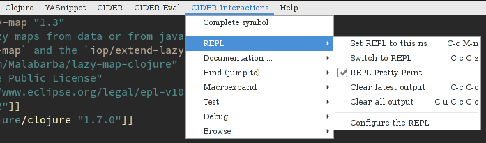
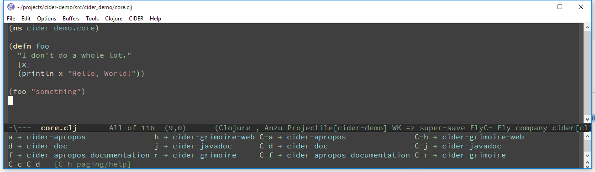

# Interactive Programming

## Overview

Traditional programming languages and development environments often
use a [Edit, Compile, Run
Cycle](http://wiki.c2.com/?EditCompileLinkRun). In this environment,
the programmer modifies the code, compiles it, and then runs it to see
if it does what she wants. The program is then terminated, and the
programmer goes back to editing the program further. This cycle is
repeated over and over until the program behavior conforms to what the
programmer desires. While modern IDEs have optimized this process to
be quick and relatively painless, it's still a slow way to work.

Clojure and CIDER offer a better way to work called *interactive
programming*. Indeed, this idea is at the very heart of CIDER.

Using CIDER's interactive programming environment, a programmer works
in a very dynamic and incremental manner. Instead of repeatedly
editing, compiling, and restarting an application, the programmer
starts the application once and then adds and updates individual
Clojure defintions as the program continues to run. Using the CIDER
REPL, the programmer can access the value of different definitions and
invoke program functions with test data, immediately seeing the
result. This methodology is far more efficient than the typical Edit,
Compile, and Run Cycle because the program continues to run and keeps
its state intact while the programmer interacts with it. Indeed, some
Clojure programmers have been known to keep a CIDER session running
for weeks or even months as they continue to write code.

CIDER's interactive programming environment is partially implemented
using an Emacs minor mode called `cider-mode`. `cider-mode`
complements `clojure-mode` and allows you to evaluate Clojure code
from your source file buffers and send it directly to your running
program through the CIDER REPL. Using the functions offered by
`cider-mode` will improve your productivity and make you a more
efficient Clojure programmer.

## Using cider-mode

Here's a list of `cider-mode`'s keybindings:

 Command                                      | Keyboard shortcut                   | Description
----------------------------------------------|-------------------------------------|-------------------------------
`cider-eval-last-sexp`                        |<kbd>C-x C-e</kbd>   <kbd>C-c C-e</kbd>| Evaluate the form preceding point and display the result in the echo area and/or in an buffer overlay (according to `cider-use-overlays`).  If invoked with a prefix argument, insert the result into the current buffer.
`cider-eval-last-sexp-and-replace`            |<kbd>C-c C-v w</kbd>                 | Evaluate the form preceding point and replace it with its result.
`cider-eval-last-sexp-to-repl`                |<kbd>C-c M-e</kbd>                   | Evaluate the form preceding point and output it result to the REPL buffer.  If invoked with a prefix argument, takes you to the REPL buffer after being invoked.
`cider-insert-last-sexp-in-repl`              |<kbd>C-c M-p</kbd>                   | Load the form preceding point in the REPL buffer.
`cider-pprint-eval-last-sexp`                 |<kbd>C-c C-v C-f e</kbd>                   | Evaluate the form preceding point and pretty-print the result in a popup buffer. If invoked with a prefix argument, insert the result into the current buffer as a comment.
`cider-pprint-eval-defun-at-point`            |<kbd>C-c C-v C-f d</kbd>                   | Evaluate the top level form under point and pretty-print the result in a popup buffer. If invoked with a prefix argument, insert the result into the current buffer as a comment.
`cider-eval-defun-at-point`                   |<kbd>C-M-x</kbd>   <kbd>C-c C-c</kbd>  | Evaluate the top level form under point and display the result in the echo area.
`cider-eval-sexp-at-point`                    |<kbd>C-c C-v v</kbd>                 | Evaluate the form around point.
`cider-eval-defun-at-point`                   |<kbd>C-u C-M-x</kbd>   <kbd>C-u C-c C-c</kbd>  | Debug the top level form under point and walk through its evaluation
`cider-eval-defun-up-to-point`                |<kbd>C-c C-v z</kbd>                 | Evaluate the preceding top-level form up to the point.
`cider-eval-region`                           |<kbd>C-c C-v r</kbd>                 | Evaluate the region and display the result in the echo area.
`cider-interrupt`                             |<kbd>C-c C-b</kbd>                   | Interrupt any pending evaluations.
`cider-macroexpand-1`                         |<kbd>C-c C-m</kbd>                   | Invoke `macroexpand-1` on the form at point and display the result in a macroexpansion buffer.  If invoked with a prefix argument, `macroexpand` is used instead of `macroexpand-1`.
`cider-macroexpand-all`                       |<kbd>C-c M-m</kbd>                   | Invoke `clojure.walk/macroexpand-all` on the form at point and display the result in a macroexpansion buffer.
`cider-eval-ns-form`                          |<kbd>C-c C-v n</kbd>                 | Eval the ns form.
`cider-repl-set-ns`                           |<kbd>C-c M-n (M-)n</kbd>                   | Switch the namespace of the REPL buffer to the namespace of the current buffer.
`cider-switch-to-repl-buffer`                 |<kbd>C-c C-z</kbd>                   | Switch to the relevant REPL buffer. Use a prefix argument to change the namespace of the REPL buffer to match the currently visited source file.
`cider-switch-to-repl-buffer`                 |<kbd>C-u C-u C-c C-z</kbd>           | Switch to the REPL buffer based on a user prompt for a directory.
`cider-load-buffer-and-switch-to-repl-buffer` |<kbd>C-c M-z</kbd>                   | Load (eval) the current buffer and switch to the relevant REPL buffer. Use a prefix argument to change the namespace of the REPL buffer to match the currently visited source file.
`cider-describe-connection`            |<kbd>C-c M-d</kbd>                   | Display default REPL connection details, including project directory name, buffer namespace, host and port.
`cider-find-and-clear-repl-output`            |<kbd>C-c C-o</kbd>                   | Clear the last output in the REPL buffer. With a prefix argument it will clear the entire REPL buffer, leaving only a prompt. Useful if you're running the REPL buffer in a side by side buffer.
`cider-load-buffer`                           |<kbd>C-c C-k</kbd>                   | Load (eval) the current buffer.
`cider-load-file`                             |<kbd>C-c C-l</kbd>                   | Load (eval) a Clojure file.
`cider-load-all-files`                        |<kbd>C-c C-M-l</kbd>                 | Load (eval) all Clojure files below a directory.
`cider-ns-refresh`                            |<kbd>C-c M-n (M-)r</kbd>                   | Reload all modified files on the classpath. If invoked with a prefix argument, reload all files on the classpath. If invoked with a double prefix argument, clear the state of the namespace tracker before reloading.
`cider-doc`                                   |<kbd>C-c C-d d</kbd>   <kbd>C-c C-d C-d</kbd> | Display doc string for the symbol at point.  If invoked with a prefix argument, or no symbol is found at point, prompt for a symbol.
`cider-javadoc`                               |<kbd>C-c C-d j</kbd>   <kbd>C-c C-d C-j</kbd> | Display JavaDoc (in your default browser) for the symbol at point.  If invoked with a prefix argument, or no symbol is found at point, prompt for a symbol.
`cider-grimoire`                              |<kbd>C-c C-d r</kbd>   <kbd>C-c C-d C-r</kbd> | Lookup symbol in Grimoire.
`cider-grimoire-web`                          |<kbd>C-c C-d w</kbd>   <kbd>C-c C-d C-w</kbd> | Open the grimoire documentation for symbol in a web browser.
`cider-apropos`                               |<kbd>C-c C-d a</kbd>   <kbd>C-c C-d C-a</kbd> | Apropos search for functions/vars.
`cider-apropos-documentation`                 |<kbd>C-c C-d f</kbd>   <kbd>C-c C-d C-f</kbd> | Apropos search for documentation.
`cider-apropos-documentation-select`          |<kbd>C-c C-d e</kbd>   <kbd>C-c C-d C-e</kbd> | Apropos search for documentation & select.
`cider-inspect`                               |<kbd>C-c M-i</kbd>                   | Inspect expression. Will act on expression at point if present.
`cider-toggle-trace-var`                      |<kbd>C-c M-t v</kbd>                 | Toggle var tracing.
`cider-toggle-trace-ns`                       |<kbd>C-c M-t n</kbd>                 | Toggle namespace tracing.
`cider-undef`                                 |<kbd>C-c C-u</kbd>                   | Undefine a symbol. If invoked with a prefix argument, or no symbol is found at point, prompt for a symbol.
`cider-test-run-test`                         |<kbd>C-c C-t t</kbd>   <kbd>C-c C-t C-t</kbd> | Run test at point.
`cider-test-rerun-test`                       |<kbd>C-c C-t a</kbd>   <kbd>C-c C-t C-a</kbd> | Re-run the last test you ran.
`cider-test-run-ns-tests`                     |<kbd>C-c C-t n</kbd>   <kbd>C-c C-t C-n</kbd> | Run tests for current namespace.
`cider-test-run-loaded-tests`                 |<kbd>C-c C-t l</kbd>   <kbd>C-c C-t C-l</kbd> | Run tests for all loaded namespaces.
`cider-test-run-project-tests`                |<kbd>C-c C-t p</kbd>   <kbd>C-c C-t C-p</kbd> | Run tests for all project namespaces. This loads the additional namespaces.
`cider-test-rerun-failed-tests`               |<kbd>C-c C-t r</kbd>   <kbd>C-c C-t C-r</kbd> | Re-run test failures/errors.
`cider-test-show-report`                      |<kbd>C-c C-t b</kbd>   <kbd>C-c C-t C-b</kbd> | Show the test report buffer.
`cider-find-var`                              |<kbd>M-.</kbd>                       | Jump to the definition of a symbol.  If invoked with a prefix argument, or no symbol is found at point, prompt for a symbol.
`cider-find-dwim-at-mouse`                    |<kbd>mouse-5</kbd> or <kbd>mouse-9</kbd>   | Jump to the definition of a symbol using mouse.
`xref-pop-marker-stack`                       |<kbd>mouse-4</kbd> or <kbd>mouse-8</kbd>   | Jump back to where `cider-find-dwim-at-mouse` was invoked.
`cider-find-resource`                         |<kbd>C-c M-.</kbd>                   | Jump to the resource referenced by the string at point.
`cider-find-ns`                               |<kbd>C-c C-.</kbd>                   | Jump to some namespace on the classpath.
`cider-pop-back`                              |<kbd>M-,</kbd>                       | Return to your pre-jump location.
`complete-symbol`                             |<kbd>M-TAB</kbd>                     | Complete the symbol at point.
`cider-quit`                                  |<kbd>C-c C-q</kbd>                   | Quit the current nREPL connection.

!!! Tip

    There's no need to memorize this list. If you're in a Clojure buffer with `cider-mode`
    active you'll have a CIDER menu available. The menu lists all the most important
    commands and their keybindings. You can also invoke `C-h f RET cider-mode` to
    get a list of the keybindings for `cider-mode`.

!!! Tip

    An even better solution would be to install [which-key][], which will
    automatically show you a list of available keybindings as you start typing some
    keys. This will simplify your interactions with CIDER quite a lot,
    especially in
    the beginning. Here's what you'd see if you typed <kbd>C-c C-d</kbd> in a
    Clojure buffer:

!!! Tip

    `cider-find-var` has built-in support for [AVFS][].  AVFS is an a virtual
    file system which allows seamless navigation within archives as if they were
    normal directories. When AVFS is mounted, `cider-find-var` automatically
    opens `jar` and `zip` files inside AVFS folder instead of attempting to
    uncompress the archive.

    On Linux-based systems, AVFS is available through the standard
    package managers. For example, on Debian derivatives:

       `sudo apt-get install avfs`

    Once installed, you can put `mountavfs` in a place where it will
    be invoked
    automatically during the startup (`.bash_profile`, for
    instance). You can also initialize the
    `avfsd` daemon directly like this:

      `/usr/bin/avfsd -o allow_root -o intr -o sync_read .avfs`

    [AVFS][] is not available on Windows but can be installed on MacOS with [some
    effort](http://blog.breadncup.com/tag/sunrise-commander/). Some other uses of
    [AVFS][] in Emacs include
    [dired-avfs](https://github.com/Fuco1/dired-hacks#dired-avfs) and
    [sunrise-commander](https://www.emacswiki.org/emacs/Sunrise_Commander_Tips#toc12).

[which-key]: https://github.com/justbur/emacs-which-key
[AVFS]: http://avf.sourceforge.net
