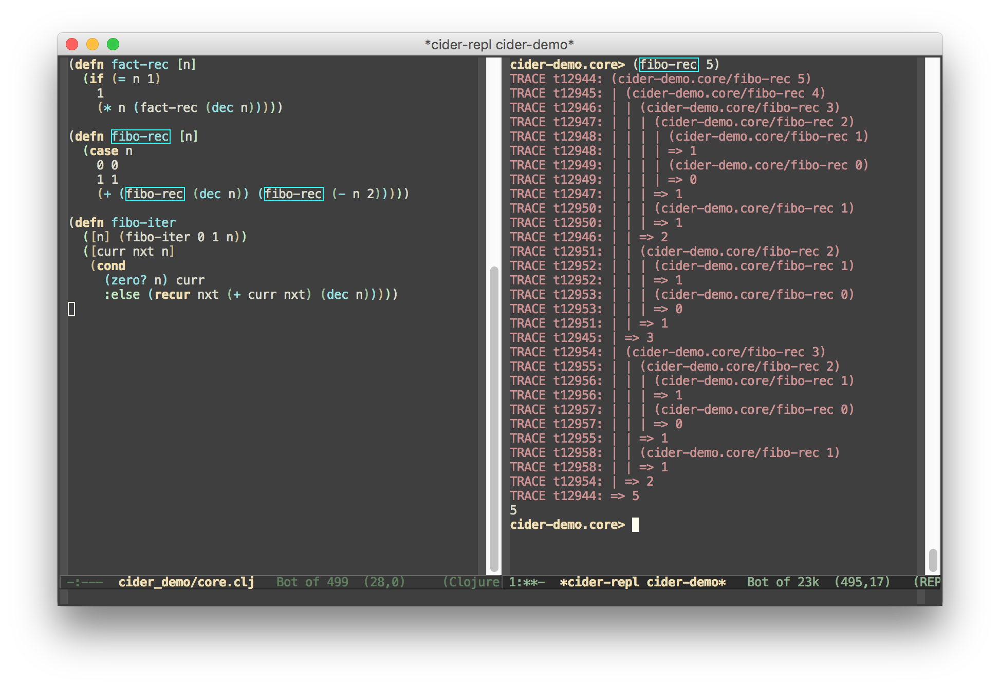
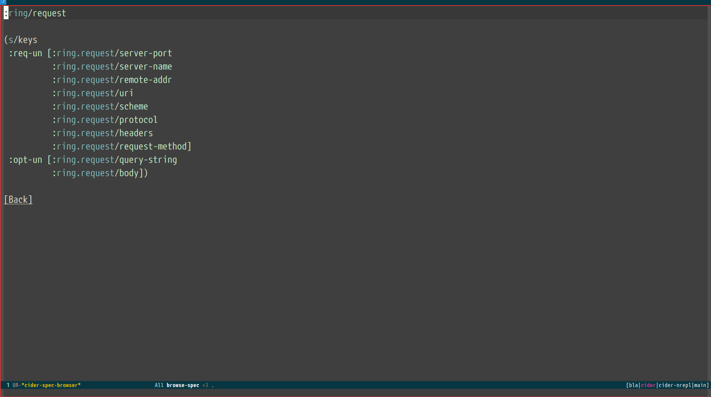
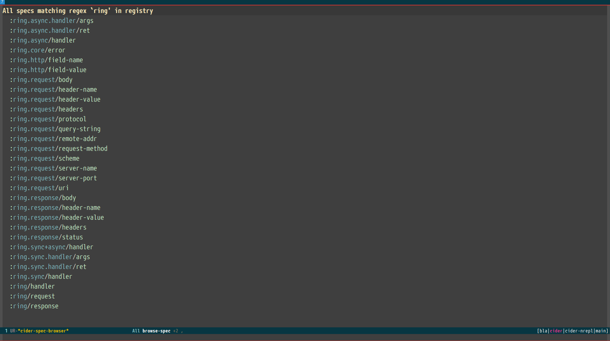
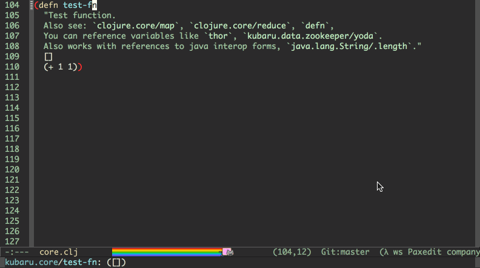

CIDER packs a ton of extra functionality, besides basic Clojure code
evaluation. Much of the functionality is centered around additional major modes,
which provide you with convenient ways to get something done or inspect
something.

## Evaluating Clojure code in the minibuffer

You can evaluate Clojure code in the minibuffer from pretty much everywhere by
using <kbd>M-x</kbd> `cider-read-and-eval` (bound in `cider-mode` buffers to
<kbd>C-c M-:</kbd>).  <kbd>TAB</kbd> completion will work in the minibuffer,
just as in a REPL/source buffer.

Pressing <kbd>C-c C-v .</kbd> in a Clojure buffer will insert the defun
at point into the minibuffer for evaluation. This way you can pass arguments
to the function and evaluate it and see the result in the minibuffer.

You can also enable `eldoc-mode` in the minibuffer by adding the following to your
config:

```el
(add-hook 'eval-expression-minibuffer-setup-hook #'eldoc-mode)
```

You can also enable `paredit` or `smartparens` for minibuffer evaluations:

```el
(add-hook 'eval-expression-minibuffer-setup-hook #'paredit-mode)
```

## Using a scratchpad

CIDER provides a simple way to create a Clojure scratchpad via the
<kbd>M-x</kbd> `cider-scratch` command. It provides a great way to
play around with some code, without having to create source files
or pollute the REPL buffer.

In many ways the CIDER scratchpad is similar to Emacs's own `*scratch*` buffer.

## Macroexpansion

Pressing <kbd>C-c C-m</kbd> after some form in a source buffer or the REPL will
result in a new buffer, showing the macroexpansion of the form in
question. You'll have access to additional keybindings in the macroexpansion
buffer (which is internally using `cider-macroexpansion-mode`):

Keyboard shortcut                 | Description
----------------------------------|-------------------------------
<kbd>m</kbd>                      | Invoke `macroexpand-1` on the form at point and replace the original form with its expansion.  If invoked with a prefix argument, `macroexpand` is used instead of `macroexpand-1`.
<kbd>a</kbd>                      | Invoke `clojure.walk/macroexpand-all` on the form at point and replace the original form with its expansion.
<kbd>g</kbd>                      | The prior macroexpansion is performed again and the current contents of the macroexpansion buffer are replaced with the new expansion.
<kbd>C-/</kbd> <br/> <kbd>u</kbd> | Undo the last inplace expansion performed in the macroexpansion buffer.

## Value inspection

Pressing <kbd>C-c M-i</kbd> after some form in a source buffer or the REPL will
result in a new buffer, showing the structure of the result of the form in question.
You can also use <kbd>C-u C-c M-i</kbd> to inspect the result of the current top-level
form and <kbd>C-u C-u C-c M-i</kbd> to read an expression from the minibuffer and
inspect its result.

You'll have access to additional keybindings in the inspector buffer (which is
internally using `cider-inspector-mode`):

Keyboard shortcut                       | Description
----------------------------------------|-------------------------------
<kbd>Tab</kbd> or <kbd>Shift-Tab</kbd>  | Navigate inspectable sub-objects
<kbd>Return</kbd>                       | Inspect sub-objects
<kbd>l</kbd>                            | Pop to the parent object
<kbd>g</kbd>                            | Refresh the inspector (e.g. if viewing an atom/ref/agent)
<kbd>SPC</kbd>                          | Jump to next page in paginated view
<kbd>M-SPC</kbd>                        | Jump to previous page in paginated view
<kbd>s</kbd>                            | Set a new page size in paginated view

## Enlighten (display local values)

This feature displays the value of locals in realtime, as your code is being
executed. This is somewhat akin to one of the features of the Light Table
editor.

- To turn it on, issue <kbd>M-x</kbd> `cider-enlighten-mode`.
- To use it, evaluate your functions one at a time (e.g., use <kbd>C-M-x</kbd> or
<kbd>C-x  C-e</kbd>, because <kbd>C-c C-k</kbd> won't work).

That's it! Once your code executes, the regular old buffer on the left will turn
into the brilliant show of lights on the right.

<p align="center">
  
  
</p>

To stop displaying the locals you'll have to disable `cider-enlighten-mode`
and reevaluate the definitions you had instrumented previously.

You can also trigger this on specific functions (without having to turn on the
minor mode) by writing `#light` before the `(def` and reevaluating it.

## Code reloading

`cider-refresh` wraps
[clojure.tools.namespace](https://github.com/clojure/tools.namespace), and as
such the same
[benefits](https://github.com/clojure/tools.namespace#reloading-code-motivation)
and
[caveats](https://github.com/clojure/tools.namespace#reloading-code-preparing-your-application)
regarding writing reloadable code also apply.

Calling `cider-refresh` will cause all modified Clojure files on the classpath
to be reloaded. You can also provide a single prefix argument to reload all
Clojure files on the classpath unconditionally, or a double prefix argument to
first clear the state of the namespace tracker before reloading.

The above three operations are analogous to
[`clojure.tools.namespace.repl/refresh`](http://clojure.github.io/tools.namespace/#clojure.tools.namespace.repl/refresh),
[`clojure.tools.namespace.repl/refresh-all`](http://clojure.github.io/tools.namespace/#clojure.tools.namespace.repl/refresh-all)
and
[`clojure.tools.namespace.repl/clear`](http://clojure.github.io/tools.namespace/#clojure.tools.namespace.repl/clear)
(followed by a normal refresh), respectively.

* You can define Clojure functions to be called before reloading, and after a
  successful reload, when using `cider-refresh`:

```el
(setq cider-refresh-before-fn "user/stop-system!"
      cider-refresh-after-fn "user/start-system!")
```

* These must be set to the namespace-qualified names of vars bound to functions
  of no arguments. The functions must be synchronous (blocking), and are
  expected to be side-effecting - they will always be executed serially, without
  retries.

* By default, messages regarding the status of the in-progress reload will be
  displayed in the echo area after you call `cider-refresh`. The same
  information will also be recorded in the `*cider-refresh-log*` buffer, along
  with anything printed to `*out*` or `*err*` by `cider-refresh-before-fn` and
  `cider-refresh-start-fn`.

* You can make the `*cider-refresh-log*` buffer display automatically after you
  call `cider-refresh` by setting the `cider-refresh-show-log-buffer` variable
  to a non-nil value (this will also prevent any related messages from also
  being displayed in the echo area):

```el
(setq cider-refresh-show-log-buffer t)
```

* By default, all modified Clojure buffers are prompted to be saved. This
  behaviour can be customized using `cider-save-files-on-cider-refresh`.

## Tracing function execution

You can trace the results produced by functions using <kbd>C-c M-t v</kbd>.  The
command will prompt you for the name of the function you want to trace.
Evaluating the command again for the same function will result in the function
being untraced.



You can also use <kbd>C-c M-t n</kbd> to toggle tracing on and off for an entire
namespace.

## Classpath browser

You can easily browse the items on your classpath with the command
<kbd>M-x</kbd> `cider-classpath`.

Here you can see it in action:


Press <kbd>RET</kbd> on a classpath entry to navigate into it.

## Namespace browser

You can browse the contents of any loaded namespace with the command
<kbd>M-x</kbd> `cider-browse-ns`.  The command will prompt you for the namespace
to browse.


You can also browse all available namespaces with <kbd>M-x</kbd>
`cider-browse-ns-all`.

There are a bunch of useful keybindings that are defined in browser buffers.

Keyboard shortcut               | Description
--------------------------------|-------------------------------
<kbd>d</kbd>                    | Display documentation for item at point.
<kbd>RET</kbd>                  | Browse ns or display documentation for item at point.
<kbd>s</kbd>                    | Go to definition for item at point.
<kbd>^</kbd>                    | Browse all namespaces.
<kbd>n</kbd>                    | Go to next line.
<kbd>p</kbd>                    | Go to previous line.

## Spec browser

If you are using  Clojure 1.9.0-alpha16 or newer you can browse the Clojure specs registry.

If you know what you are looking for, you can type <kbd>M-x</kbd> `cider-browse-spec`.
It will prompt you for a spec name to browse to, hit <kbd>RET</kbd> and you will find yourself
at the spec browser.



You can also type the command <kbd>M-x</kbd> `cider-browse-spec-all`. This command will prompt you for 
a regex you can use to filter out the specs you are interested in, and will also take you to the spec browser. 



Once in the browser you can use your mouse or the keybindings below to navigate deeper into sub specs.

Keyboard shortcut               | Description
--------------------------------|-------------------------------
<kbd>RET</kbd>                  | Browse the spec at point.
<kbd>^</kbd>                    | Go up in the navigation stack.
<kbd>n</kbd>                    | Go to next spec.
<kbd>p</kbd>                    | Go to previous spec.
<kbd>e</kbd>                    | Generate an example for the current browser spec.

If your project contains a version of `org.clojure/test.check`, you can type <kbd>e</kbd> when browsing 
a spec to generate and print an example of it.


## Documentation buffers include "See Also" references

You can add references to other vars by including their names in `` ` `` in the docstring.
If the var is in another namespace, then you'll have to include the full
namespace qualified name in the docstring. If you want to use some other delimiter instead
of the backticks, you'll have to update the value of `cider-doc-xref-regexp` to match that.
The first group of the regexp should always match the var name.

As an example, if you want to want to use the delimiter style used by
[Codox](https://github.com/weavejester/codox) (`[[...]]`)  the regexp would be;

```
(setq cider-doc-xref-regexp "\\[\\[\\(.*?\\)\\]\\]")
```



Example function with a docstring containing references:

```
(defn test-fn
  "Test function.
  Also see: `clojure.core/map`, `clojure.core/reduce`, `defn`.
  You can reference variables like `thor`, `kubaru.data.zookeeper/yoda`.
  Also works with references to java interop forms, `java.lang.String/.length`."
  []
  (+ 1 1))
```
