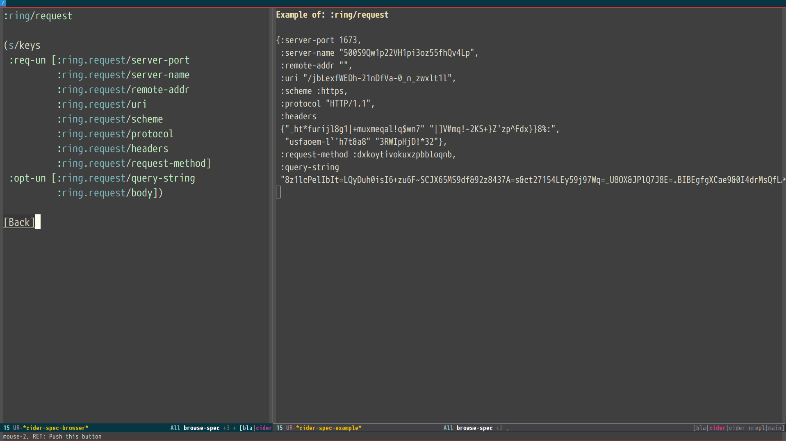

As the infomercials always say, "But wait, there's more!" If
simultaneous Clojure and ClojureScript REPLs, interactive programming,
code completion, stacktrace navigation, test running, and debugging
weren't enough for you, CIDER delivers several additional
features. 

## Evaluating Clojure Code in the Minibuffer

You can evaluate Clojure code in the minibuffer at almost any time
using <kbd>M-x</kbd> `cider-read-and-eval` (bound in `cider-mode` buffers to
<kbd>C-c M-:</kbd>).  <kbd>TAB</kbd> completion will work in the minibuffer,
just as in REPL and source buffers.

Typing <kbd>C-c C-v .</kbd> in a Clojure buffer will insert the defun
at point into the minibuffer for evaluation. This way you can pass arguments
to the function and evaluate it and see the result in the minibuffer.

You can also enable other convenient modes in the minibuffer. For
instance, you might want to have both `eldoc-mode` and `paredit-mode`
available to you:

```el
(add-hook 'eval-expression-minibuffer-setup-hook #'eldoc-mode)
(add-hook 'eval-expression-minibuffer-setup-hook #'paredit-mode)
```

## Using a Scratchpad

CIDER provides a simple way to create a Clojure scratchpad via the
<kbd>M-x</kbd> `cider-scratch` command. This is a great way to play
around with some code without having to create source files or pollute
the REPL buffer and is very similar to Emacs's own `*scratch*` buffer.

## Expanding Macros

Typing <kbd>C-c C-m</kbd> after some form in a source buffer or the
REPL will show you the macro expansion of the form in a new
buffer. You'll have access to additional keybindings in the macro
expansion buffer (which is internally using
`cider-macroexpansion-mode`):

Keyboard shortcut                 | Description
----------------------------------|-------------------------------
<kbd>m</kbd>                      | Invoke `macroexpand-1` on the form at point and replace the original form with its expansion.  If invoked with a prefix argument, `macroexpand` is used instead of `macroexpand-1`.
<kbd>a</kbd>                      | Invoke `clojure.walk/macroexpand-all` on the form at point and replace the original form with its expansion.
<kbd>g</kbd>                      | The prior macro expansion is performed again and the current contents of the macro expansion buffer are replaced with the new expansion.
<kbd>C-/</kbd> <br/> <kbd>u</kbd> | Undo the last in-place expansion performed in the macroexpansion buffer.

## Inspecting Values

Typing <kbd>C-c M-i</kbd> after some form in a source buffer or the
REPL will show you the structure for the result of the form in a new
buffer.  You can also use <kbd>C-u C-c M-i</kbd> to inspect the result
of the current top-level form and <kbd>C-u C-u C-c M-i</kbd> to read
an expression from the minibuffer and inspect its result. You'll have
access to additional keybindings in the inspector buffer (which is
internally using `cider-inspector-mode`):

Keyboard shortcut                       | Description
----------------------------------------|-------------------------------
<kbd>Tab</kbd> or <kbd>Shift-Tab</kbd>  | Navigate inspectable sub-objects
<kbd>Return</kbd>                       | Inspect sub-objects
<kbd>l</kbd>                            | Pop to the parent object
<kbd>g</kbd>                            | Refresh the inspector (e.g. if viewing an atom/ref/agent)
<kbd>SPC</kbd>                          | Jump to next page in paginated view
<kbd>M-SPC</kbd>                        | Jump to previous page in paginated view
<kbd>s</kbd>                            | Set a new page size in paginated view

## Displaying Local Values with Enlighten Mode

Enlighten Mode displays the value of locals in realtime, as your code
runs. This feature is somewhat similar to a feature in the Light Table
editor.

To turn it on, issue <kbd>M-x</kbd> `cider-enlighten-mode`. Then,
evaluate your functions one at a time using <kbd>C-M-x</kbd> or
<kbd>C-x  C-e</kbd>. Note that <kbd>C-c C-k</kbd> won't work.

That's it! Once your code executes, the regular old buffer on the left will turn
into the brilliant show of lights on the right.

Enlighten Mode Disabled                    | Enlighten Mode Enabled
-------------------------------------------|---------------------------------------
 | 

To stop displaying the locals you'll have to disable `cider-enlighten-mode`
and reevaluate the definitions you had instrumented previously.

You can also trigger this on specific functions (without having to turn on the
minor mode) by writing `#light` before the `(def` and re-evaluating
it.

## Reloading Code

While Clojure's and CIDER's interactive programming style means you'll
restart your application far less often than with other languages and
development environments, sometimes you'll want to clean everything up
and reload one or more namespaces to ensure that they are up to date
and there are no temporary definitions hanging around.

Typing <kbd>C-c M-n r</kbd> or <kbd>C-c M-n M-r</kbd> will invoke
`cider-ns-refresh` and reload all modified Clojure files on the
classpath.

Adding a prefix argument, <kbd>C-u C-c M-n n</kbd>, will reload all
the namespaces on the classpath unconditionally, regardless of their
modification status.

Adding a double prefix argument, <kbd>C-u C-u M-n n</kbd>, will first
clear the state of the namespace tracker before reloading. This is
useful for recovering from some classes of error that normal reloads
would otherwise not recover from. A good example is circular
dependencies. The trade-off is that stale code from any deleted files
may not be completely unloaded.

`cider-ns-refresh` wraps
[clojure.tools.namespace](https://github.com/clojure/tools.namespace), and as
such the same
[benefits](https://github.com/clojure/tools.namespace#reloading-code-motivation)
and
[caveats](https://github.com/clojure/tools.namespace#reloading-code-preparing-your-application)
regarding writing reloadable code also apply.

The above three operations are analogous to
[`clojure.tools.namespace.repl/refresh`](http://clojure.github.io/tools.namespace/#clojure.tools.namespace.repl/refresh),
[`clojure.tools.namespace.repl/refresh-all`](http://clojure.github.io/tools.namespace/#clojure.tools.namespace.repl/refresh-all)
and
[`clojure.tools.namespace.repl/clear`](http://clojure.github.io/tools.namespace/#clojure.tools.namespace.repl/clear)
(followed by a normal refresh), respectively.

You can define Clojure functions to be called before reloading, and after a
successful reload, when using `cider-ns-refresh`:

```el
(setq cider-ns-refresh-before-fn "user/stop-system!"
      cider-ns-refresh-after-fn "user/start-system!")
```

These must be set to the namespace-qualified names of vars bound to
functions of no arguments. The functions must be synchronous
(blocking), and are expected to be side-effecting - they will always
be executed serially, without retries.

By default, messages regarding the status of the in-progress reload
will be displayed in the echo area after you call
`cider-ns-refresh`. The same information will also be recorded in the
`*cider-ns-refresh-log*` buffer, along with anything printed to
`*out*` or `*err*` by `cider-ns-refresh-before-fn` and
`cider-ns-refresh-start-fn`.

You can make the `*cider-ns-refresh-log*` buffer display automatically
after you call `cider-ns-refresh` by setting the
`cider-ns-refresh-show-log-buffer` variable to a non-nil value. This
will also prevent any related messages from also being displayed in
the echo area.

```el
(setq cider-ns-refresh-show-log-buffer t)
```

By default, CIDER will prompt for whether to save all modified Clojure
buffers. You can customize this behavior with
`cider-ns-save-files-on-refresh`.

Sometimes, `cider-ns-refresh` may not work for you. If you're looking
for a bit more forceful reloading the `cider-ns-reload`
and `cider-ns-reload-all` commands can be used instead. These commands
invoke Clojure's `(require ... :reload)` and `(require
... :reload-all)` commands at the REPL.

## Tracing Function Execution

You can trace the arguments supplied to and the result values produced
by functions using <kbd>C-c M-t v</kbd>. CIDER will prompt you for the
name of the function you want to trace, defaulting to the previous
top-level definition.


Invoking <kbd>C-c M-t v</kbd> again for the same function will result
in the function being untraced.

You can also use <kbd>C-c M-t n</kbd> to toggle tracing on and off for
an entire namespace.

## Browsing the Classpath

You can easily browse the items on your classpath with the command
<kbd>M-x</kbd> `cider-classpath`.

Here you can see it in action:


Press <kbd>RET</kbd> on a classpath entry to navigate into it.

## Browsing Namespaces

You can browse the contents of any loaded namespace with the command
<kbd>M-x</kbd> `cider-browse-ns`. CIDER will prompt you for the namespace
to browse.


You can also browse all available namespaces with <kbd>M-x</kbd>
`cider-browse-ns-all`.

There are a bunch of useful keybindings that are defined in browser buffers.

Keyboard shortcut               | Description
--------------------------------|-------------------------------
<kbd>d</kbd>                    | Display documentation for item at point.
<kbd>RET</kbd>                  | Browse ns or display documentation for item at point.
<kbd>s</kbd>                    | Go to definition for item at point.
<kbd>^</kbd>                    | Browse all namespaces.
<kbd>n</kbd>                    | Go to next line.
<kbd>p</kbd>                    | Go to previous line.

## Browsing the Clojure Spec Registry

If you are using Clojure 1.9 or newer you can browse the Clojure spec registry.

If you already know which spec you're looking for, you can type
<kbd>M-x</kbd> `cider-browse-spec` and CIDER will prompt you for a
spec name and then drop you into the spec browser.


If you aren't quite sure which spec you want, you can type
<kbd>M-x</kbd> `cider-browse-spec-all`. CIDER will then prompt you for
a regex and will filter out all the spec names that don't match.


Once in the browser you can use your mouse or the keybindings below to
navigate deeper.

Keyboard shortcut               | Description
--------------------------------|-------------------------------
<kbd>RET</kbd>                  | Browse the spec at point.
<kbd>^</kbd>                    | Go up in the navigation stack.
<kbd>n</kbd>                    | Go to next spec.
<kbd>p</kbd>                    | Go to previous spec.
<kbd>e</kbd>                    | Generate an example for the current browser spec.

If your project includes the `org.clojure/test.check` library, you can
type <kbd>e</kbd> when browsing a spec to generate an example that
meets the spec.



## Generating Documentation Cross References

Sometimes in your documentation strings, you'd like to be able to
point other programmers at different definitions. If you specify the
name of a definition in backticks (`` ` ``), CIDER will convert these
references into live links when it displays the documentation string
in the documentation buffer. 

If the name is in another namespace, then you'll have to include the
fully qualified name in the docstring.

Example function with a docstring containing references:

```
(defn test-fn
  "Test function.
  Also see: `clojure.core/map`, `clojure.core/reduce`, `defn`.
  You can reference variables like `thor`, `kubaru.data.zookeeper/yoda`.
  Also works with references to java interop forms, `java.lang.String/.length`."
  []
  (+ 1 1))
```

You can change the delimiters that CIDER uses to find references if
you don't like using backticks.  Simply update the regexp in
`cider-doc-xref-regexp` to match your preferred format. The first
group of the regexp should always match the cross-reference name. For
example, if you want to want to use
[Codox's](https://github.com/weavejester/codox) delimiter style
(`[[...]]`) instead of backticks, the regexp would be:

```
(setq cider-doc-xref-regexp "\\[\\[\\(.*?\\)\\]\\]")
```


