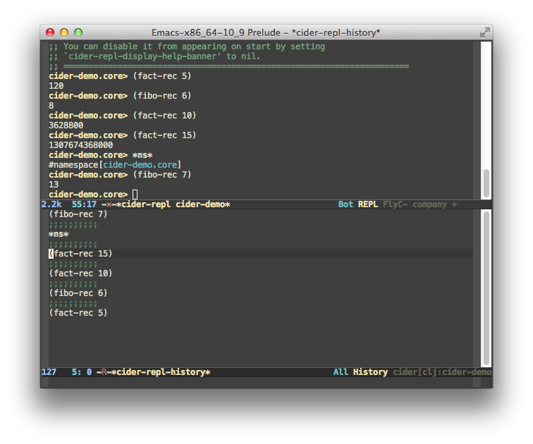

CIDER comes with a powerful REPL that complements the interactive
development functionality in `cider-mode`. Using the CIDER REPL you
can experiment with your running program, test functions, or just
explore a new library you're interested in using. The CIDER REPL offers a number of advanced features:

* auto-completion
* font-locking (the same as in `clojure-mode`)
* quick access to many CIDER commands (e.g. definition and documentation lookup, tracing, etc)
* (optional) pretty-printing of evaluation results
* eldoc support
* highly customizable REPL prompt

Here's a list of the keybindings that are available in CIDER's REPL:

Keyboard shortcut                    | Description
-------------------------------------|------------------------------
<kbd>RET</kbd>        | Evaluate the current input in Clojure if it is complete. If incomplete, open a new line and indent. If the current input is a blank string (containing only whitespace including newlines) then clear the input without evaluating and print a fresh prompt. If invoked with a prefix argument is given then the input is evaluated without checking for completeness.
<kbd>C-RET</kbd>      | Close any unmatched parenthesis and then evaluate the current input in Clojure.
<kbd>C-j</kbd>        | Open a new line and indent.
<kbd>C-c C-o</kbd>    | Remove the output of the previous evaluation from the REPL buffer. With a prefix argument it will clear the entire REPL buffer, leaving only a prompt.
<kbd>C-c M-o</kbd>    | Switch between the Clojure and ClojureScript REPLs for the current project.
<kbd>C-c C-u</kbd>    | Kill all text from the prompt to the current point.
<kbd>C-c C-b</kbd> <br/> <kbd>C-c C-c</kbd>| Interrupt any pending evaluations.
<kbd>C-up</kbd> <br/> <kbd>C-down</kbd> | Go to to previous/next input in history.
<kbd>M-p</kbd> <br/> <kbd>M-n</kbd> | Search the previous/next item in history using the current input as search pattern. If <kbd>M-p/M-n</kbd> is typed two times in a row, the second invocation uses the same search pattern (even if the current input has changed).
<kbd>M-s</kbd> <br/> <kbd>M-r</kbd> | Search forward/reverse through command history with regex.
<kbd>C-c C-n</kbd> <br/> <kbd>C-c C-p</kbd> | Move between the current and previous prompts in the REPL buffer. Pressing <kbd>RET</kbd> on a line with old input copies that line to the newest prompt.
<kbd>TAB</kbd> | Complete symbol at point.
<kbd>C-c C-d d</kbd> <br/> <kbd>C-c C-d C-d</kbd> | Display doc string for the symbol at point.  If invoked with a prefix argument, or no symbol is found at point, prompt for a symbol
<kbd>C-c C-d j</kbd> <br/> <kbd>C-c C-d C-j</kbd> | Display JavaDoc (in your default browser) for the symbol at point.  If invoked with a prefix argument, or no symbol is found at point, prompt for a symbol.
<kbd>C-c C-d r</kbd> <br/> <kbd>C-c C-d C-r</kbd> | Lookup symbol in Grimoire.
<kbd>C-c C-d a</kbd> <br/> <kbd>C-c C-d C-a</kbd> | Apropos search for functions/vars.
<kbd>C-c C-d f</kbd> <br/> <kbd>C-c C-d C-f</kbd> | Apropos search for documentation.
<kbd>C-c C-z</kbd> | Switch to the previous Clojure buffer. This complements <kbd>C-c C-z</kbd> used in cider-mode.
<kbd>C-c M-i</kbd> | Inspect expression. Will act on expression at point if present.
<kbd>C-c M-n</kbd> | Select a namespace and switch to it.
<kbd>C-c C-.</kbd> | Jump to some namespace on the classpath.
<kbd>C-c M-t v</kbd> | Toggle var tracing.
<kbd>C-c M-t n</kbd> | Toggle namespace tracing.
<kbd>C-c C-t t</kbd> <br/> <kbd>C-c C-t C-t</kbd> | Run test at point.
<kbd>C-c C-t g</kbd> <br/> <kbd>C-c C-t C-g</kbd> | Re-run the last test you ran.
<kbd>C-c C-t n</kbd> <br/> <kbd>C-c C-t C-n</kbd> | Run tests for current namespace.
<kbd>C-c C-t l</kbd> <br/> <kbd>C-c C-t C-l</kbd> | Run tests for all loaded namespaces.
<kbd>C-c C-t p</kbd> <br/> <kbd>C-c C-t C-p</kbd> | Run tests for all project namespaces. This loads the additional namespaces.
<kbd>C-c C-t r</kbd> <br/> <kbd>C-c C-t C-r</kbd> | Re-run test failures/errors.
<kbd>C-c C-t b</kbd> <br/> <kbd>C-c C-t C-b</kbd> | Show the test report buffer.
<kbd>C-c C-q</kbd>                   | Quit the current nREPL connection. With a prefix argument it will quit all connections.

There's no need to memorize this list. In any REPL buffer you'll have a `REPL`
menu available, which lists all the most important commands and their
keybindings. You can also invoke `C-h f RET cider-repl-mode` to get a list of the
keybindings for `cider-repl-mode`.

In the REPL you can also use "shortcut commands" by pressing `,` at the
beginning of a REPL line. You'll be presented with a list of commands you can
quickly run (like quitting, displaying some info, clearing the REPL, etc). The
character used to trigger the shortcuts is configurable via
`cider-repl-shortcut-dispatch-char`. Here's how you can change it to `;`:

```el
(setq cider-repl-shortcut-dispatch-char ?\;)
```

### REPL Configuration

#### Behavior on connect

Normally, when you first establish a REPL connection, the REPL buffer is
auto-displayed in a separate window. You can suppress this behaviour
like this:

```el
(setq cider-repl-pop-to-buffer-on-connect nil)
```

If you want the REPL buffer to be auto-displayed, but don't want it to be
focused, use this:

```el
(setq cider-repl-pop-to-buffer-on-connect 'display-only)
```

#### Behavior on switch

By default <kbd>C-c C-z</kbd> will display the REPL buffer in a
different window.  You can make <kbd>C-c C-z</kbd> switch to the CIDER
REPL buffer in the current window:

```el
(setq cider-repl-display-in-current-window t)
```

#### Eldoc

Eldoc displays function signatures in the minibuffer as you're typing.
It's extremely useful! Enable `eldoc` in REPL buffers like this:

```el
(add-hook 'cider-repl-mode-hook #'eldoc-mode)
```

#### Customizing the REPL prompt

You can customize the REPL buffer prompt by setting
`cider-repl-prompt-function` to a function that takes one
argument, a namespace name. For convenience, CIDER provides three
functions that implement common formats:

* `cider-repl-prompt-lastname`:

```
ssl>
```

* `cider-repl-prompt-abbreviated`:

```
l.c.ssl>
```

* `cider-repl-prompt-default`:

```
leiningen.core.ssl>
```

By default, CIDER uses `cider-repl-prompt-default`.

You may, of course, write your own function. For example, in `leiningen` there
are two namespaces with similar names - `leiningen.classpath` and
`leiningen.core.classpath`. To make them easily recognizable you can either
use the default value or you can opt to show only two segments of the
namespace and still be able to know which is the REPL's current
namespace. Here is an example function that will do exactly that:

```el
(defun cider-repl-prompt-show-two (namespace)
  "Return a prompt string with the last 2 segments of NAMESPACE."
  (let ((names (reverse (subseq (reverse (split-string namespace "\\.")) 0 2))))
    (concat (car names) "." (cadr names) "> ")))
```

#### TAB Completion

You can control the <kbd>TAB</kbd> key behavior in the REPL using the
`cider-repl-tab-command` variable.  While the default command
`cider-repl-indent-and-complete-symbol` should be an adequate choice for
most users, it's very easy to switch to another command if you wish
to. For instance if you'd like <kbd>TAB</kbd> to only indent (maybe
because you're used to completing with <kbd>M-TAB</kbd>) use the
following:

```el
(setq cider-repl-tab-command #'indent-for-tab-command)
```

#### Auto-scrolling the REPL on Output

By default, if the REPL buffer contains more lines than the size of the
(Emacs) window, the buffer is automatically re-centered upon
completion of evaluating an expression, so that the bottom line of
output is on the bottom line of the window.

The default has the nice advantage that you always see as much as you
can from your previous REPL interactions, but can be pretty annoying
if you're a heavy user of `C-l` (`M-x recenter-top-bottom`), as even
if you're at the top of the REPL buffer the next output will scroll it all
the way down.

If you don't like this re-centering you can disable it like this:

```el
(setq cider-repl-scroll-on-output nil)
```

#### Result Prefix

You can change the string used to prefix REPL results:

```el
(setq cider-repl-result-prefix ";; => ")
```

Which then results in the following REPL output:

```
user> (+ 1 2)
;; => 3
```

By default, REPL results have no prefix.

#### Customize the REPL Buffer's Name

The REPL buffer name has the format `*cider-repl project-name*`.  You
can change the separator from a space character to something else by
setting `nrepl-buffer-name-separator`.

```el
(setq nrepl-buffer-name-separator "-")
```

The REPL buffer name can also display the port on which the nREPL server is running.
The buffer name will look like `*cider-repl project-name:port*`.

```el
(setq nrepl-buffer-name-show-port t)
```

#### Font-locking

Normally, code in the REPL is font-locked the same way as in
`clojure-mode`. Before CIDER 0.10, by default, REPL input was
font-locked with `cider-repl-input-face` (after pressing
<kbd>Return</kbd>) and results were font-locked with
`cider-repl-result-face`. If you want to restore the old behaviour
use:

```el
(setq cider-repl-use-clojure-font-lock nil)
```

#### Pretty printing in the REPL

You can make the REPL always pretty-print the results of your
evaluations using <kbd>M-x cider-repl-toggle-pretty-printing</kbd>.

To make this behavior the default:

```el
(setq cider-repl-use-pretty-printing t)
```

#### Displaying images in the REPL

Starting with CIDER 0.17 (Andalucía) expressions that evaluate to
images will be rendered as images in the REPL. You can disable this
behavior if you don't like it.

```el
(setq cider-repl-use-content-types nil)
```

Alternatively, you can toggle this behaviour on and off using <kbd>M-x
cider-repl-toggle-content-types</kbd>.

Currently, the feature doesn't work well with pretty-printing in the REPL,
so we don't advise you to enable both features at the same time.

#### Limiting printed output in the REPL

Accidentally printing large objects can be detrimental to your
productivity. Clojure provides the `*print-length*` var which, if set,
controls how many items of each collection the printer will print. You
can supply a default value for REPL sessions via the `repl-options`
section of your Leiningen project's configuration.

```clojure
:repl-options {:init (set! *print-length* 50)}
```

You can also set `cider-repl-print-length` to an appropriate value (it
defaults to 100). If both `*print-length` and
`cider-repl-print-length` are set, CIDER's setting will take precedence
over the value set through Leiningen.

The preceeding discussion also applies to Clojure's `*print-level*`
variable. The corresponding CIDER variable is
`cider-repl-print-level`, set to `nil` by default.

#### Customizing the initial REPL namespace

Normally, the CIDER REPL will start in the `user` namespace.  You can
supply an initial namespace for REPL sessions in the `repl-options`
section of your Leiningen project configuration:

```clojure
:repl-options {:init-ns 'my-ns}
```

#### Customizing newline interaction

Ordinarily, <kbd>Return</kbd> immediate sends a form for
evaluation. If you want to insert a newline into the REPL buffer as
you're editing, you can do so using <kbd>C-j</kbd>. If you are
entering a lot of longer forms that span multiple lines, it may be
more convenient to change the keybindings:

``` el
(define-key cider-repl-mode-map (kbd "RET") #'cider-repl-newline-and-indent)
(define-key cider-repl-mode-map (kbd "C-<return>") #'cider-repl-return)
```

This will make <kbd>Return</kbd> insert a newline into the REPL buffer
and <kbd>C-<Return></kbd> send the form off for evaluation.

#### REPL history

* To make the REPL history wrap around when CIDER reaches the end:

```el
(setq cider-repl-wrap-history t)
```

* To adjust the maximum number of items kept in the REPL history:

```el
(setq cider-repl-history-size 1000) ; the default is 500
```

* To store the REPL history in a file:

```el
(setq cider-repl-history-file "path/to/file")
```

Note that CIDER writes the history to the file when you kill the REPL
buffer, which includes invoking `cider-quit`, or when you quit Emacs.

### REPL history browser

You can browse your REPL input history with the command <kbd>M-x</kbd>
`cider-repl-history`.  This command is bound to <kbd>C-c M-p</kbd> 
in `cider-repl-mode` buffers and is also available via the
`history` shortcut.

The history is displayed in reverse order, with the most recent input
at the top of the buffer, and the oldest input at the bottom.  You can
scroll through the history, and when you find the history item you
were looking for, you can insert it from the history buffer into your
REPL buffer.



#### Mode

The history buffer has its own major mode,
`cider-repl-history-mode`. This is derived from `clojure-mode`, so you
get fontification in the history buffer. This mode supports the
expected defcustom hook variable, `cider-repl-history-hook`.

#### Insertion

Where you use the history buffer to insert text into the REPL buffer,
the exact behavior depends on the location of the cursor in the buffer
prior to the insertion.

Typically, when you're actively using the REPL, your cursor will be at
the end of the REPL buffer (`point-max`). In this case, the text is
inserted at the end of the buffer and the point advances to the end of
the inserted text (as if point was pushed by along by the text as it
was inserted).

In the unusual case where you invoke the history browser when your
cursor is _not_ at the end of the REPL buffer, the inserted text will
still be inserted at the end of the buffer (`point-max`), but the
point is not modified.

CIDER inserts the text without a final newline, allowing you to edit
it. When you are ready, hit <kbd>Return</kbd> to have it evaluated by
the REPL.

#### Quitting

If you select an input, the text will be inserted into the REPL buffer
and the history buffer will automatically quit. If you decide you want
to quit without inserting any text at all, you can explicitly quit by
running `cider-repl-history-quit` (see keyboard shortcuts).  Because
of the initialization and cleanup that is done when using the history
buffer, it is better to quit properly rather than just switch away
from the history buffer.

When you quit the history buffer, CIDER can restore the buffer and
window configuration in a few different ways. The behavior is
controlled by `cider-repl-history-quit-action`, which can be assigned
one of several values:

- `quit-window` restores the window configuration to what it was before.
  This is the default.
- `delete-and-restore` restores the window configuration to what it was before,
  and kills the `*cider-repl-history*` buffer.
- `kill-and-delete-window` kills the `*cider-repl-history*` buffer, and
  deletes the window.
- `bury-buffer` simply buries the `*cider-repl-history*` buffer, but keeps the
  window.
- `bury-and-delete-window` buries the buffer, and deletes the window
  if there is more than one window.
- any other value is interpreted as the name of a function to call

#### Filtering

By invoking `cider-repl-history-occur` from the history buffer, you
will be prompted for a regular expression. The history buffer will be
filtered to only those inputs that match the regexp.

#### Preview and Highlight

When `cider-repl-history-show-preview` is non-nil, CIDER displays an [`overlay`]
(https://www.gnu.org/software/emacs/manual/html_node/elisp/Overlays.html)
of the currently selected history entry, in the REPL buffer.

If you do not properly quit from browsing the history (i.e., if you
just <kbd>C-x b</kbd> away from the buffer), you may be left with an
unwanted overlay in your REPL buffer. If this happens, you can clean
it up with <kbd>M-x</kbd> `cider-repl-history-clear-preview`.

By default, `cider-repl-history-show-preview` is nil (disabled).

There is a related feature to highlight the entry once it is actually
inserted into the REPL buffer, controlled by the variable
`cider-repl-history-highlight-inserted-item`, which can be set to the
following values:

- `solid` highlights the inserted text for a fixed period of time.
- `pulse` causes the highlighting to fade out gradually.
- `t` selects the default highlighting style, which is currently
  `pulse`.
- `nil` disables highlighting. This is the default value for
  `cider-repl-history-highlight-inserted-item`.

When `cider-repl-history-highlight-inserted-item` is non-nil, you
can customize the face used for the inserted text with the variable
`cider-repl-history-inserted-item-face`.

#### Additional Customization

There are quite a few customizations available, in addition to the ones
already mentioned.

- `cider-repl-history-display-duplicates` - when set to `nil`, will not display any
  duplicate entries in the history buffer.  Default is `t`.
- `cider-repl-history-display-duplicate-highest` - when not displaying duplicates,
  this controls where in the history the one instance of the duplicated text
  is displayed. When `t`, it displays the entry in the highest position
  applicable; when `nil`, it displays it in the lowest position.
- `cider-repl-history-display-style` - the history entries will often be more than
   one line. The package gives you two options for displaying the entries:
    - `separated` - a separator string is inserted between entries; entries
      may span multiple lines.  This is the default.
    - `one-line` - any newlines are replaced with literal `\n` strings, and
      therefore no separator is necessary. Each `\n` becomes a proper newline
      when the text is inserted into the REPL.
- `cider-repl-history-separator` - when `cider-repl-history-display-style` is `separated`,
  this gives the text to use as the separator. The default is a series of ten
  semicolons, which is, of course, a comment in Clojure. The separator could be
  anything, but it may screw up the fontification if you make it something weird.
- `cider-repl-history-separator-face` - specifies the face for the separator.
- `cider-repl-history-maximum-display-length` - when nil (the default), all history
  items are displayed in full. If you prefer to have long items abbreviated,
  you can set this variable to an integer, and each item will be limited to that
  many characters. (This variable does not affect the number of items displayed,
  only the maximum length of each item.)
- `cider-repl-history-recenter` - when non-nil, always keep the current entry at the
  top of the history window.  Default is nil.
- `cider-repl-history-resize-window` - whether to resize the history window to fit
  its contents.  Value is either t, meaning yes, or a cons pair of integers,
  (MAXIMUM . MINIMUM) for the size of the window. MAXIMUM defaults to the window
  size chosen by `pop-to-buffer`; MINIMUM defaults to `window-min-height`.
- `cider-repl-history-highlight-current-entry` - if non-nil, highlight the currently
  selected entry in the history buffer.  Default is nil.
- `cider-repl-history-current-entry-face` - specifies the face for the history-entry
  highlight.
- `cider-repl-history-text-properties` - when set to `t`, maintains Emacs text
  properties on the entry. Default is `nil`.

#### Key Bindings

There are a number of important keybindings in history buffers.

Keyboard shortcut                | Description
---------------------------------|-------------------------------
<kbd>n</kbd>                     | Go to next (lower, older) item in the history.
<kbd>p</kbd>                     | Go to previous (higher, more recent) item in the history.
<kbd>RET</kbd> or <kbd>SPC</kbd> | Insert history item (at point) at the end of the REPL buffer, and quit.
<kbd>l</kbd> (lower-case L)      | Filter the command history (see **Filtering**, above).
<kbd>s</kbd>                     | Regexp search forward.
<kbd>r</kbd>                     | Regexp search backward.
<kbd>q</kbd>                     | Quit (and take quit action).
<kbd>U</kbd>                     | Undo in the REPL buffer.
